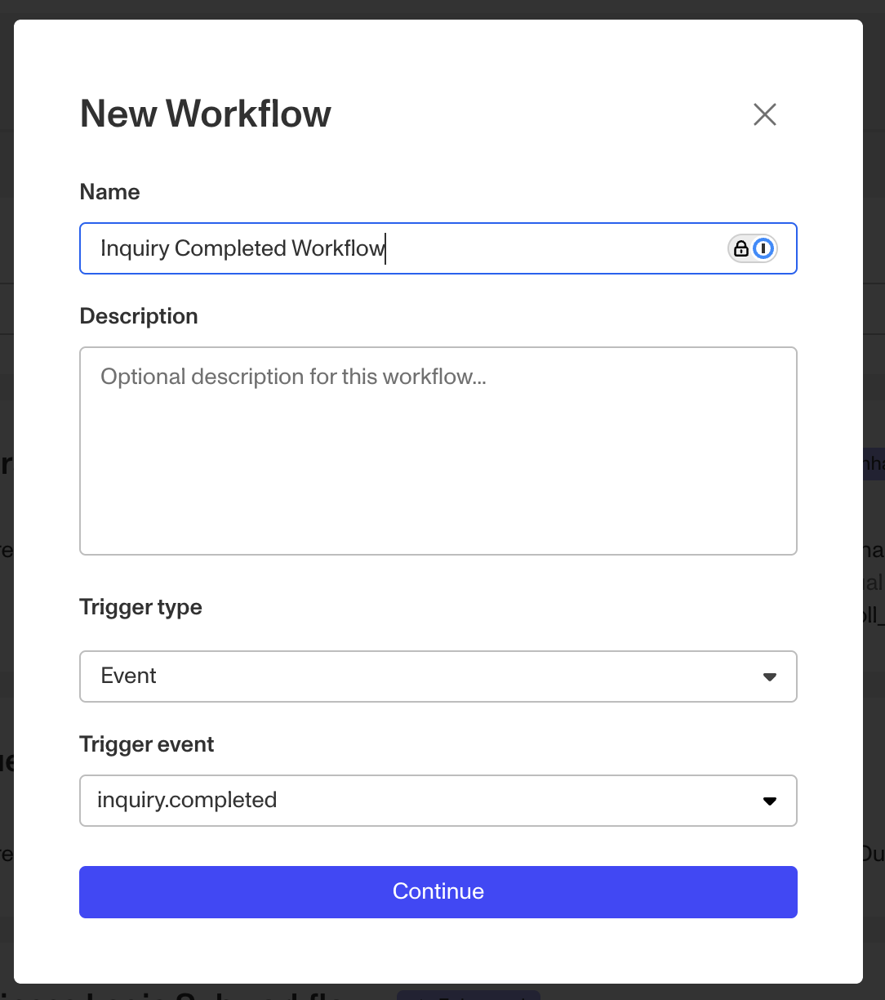
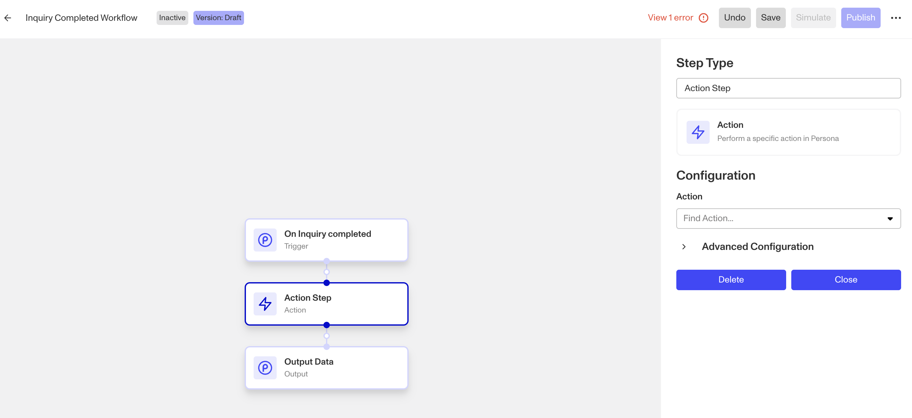
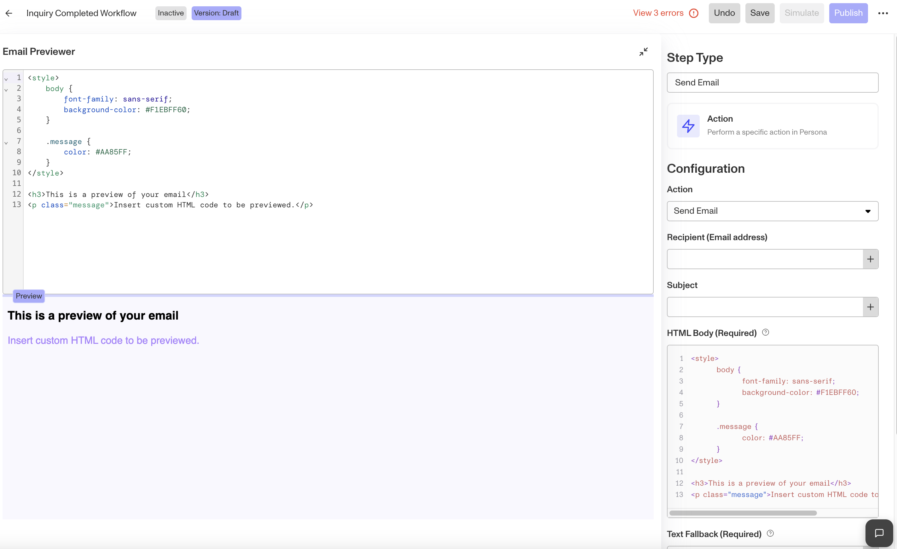
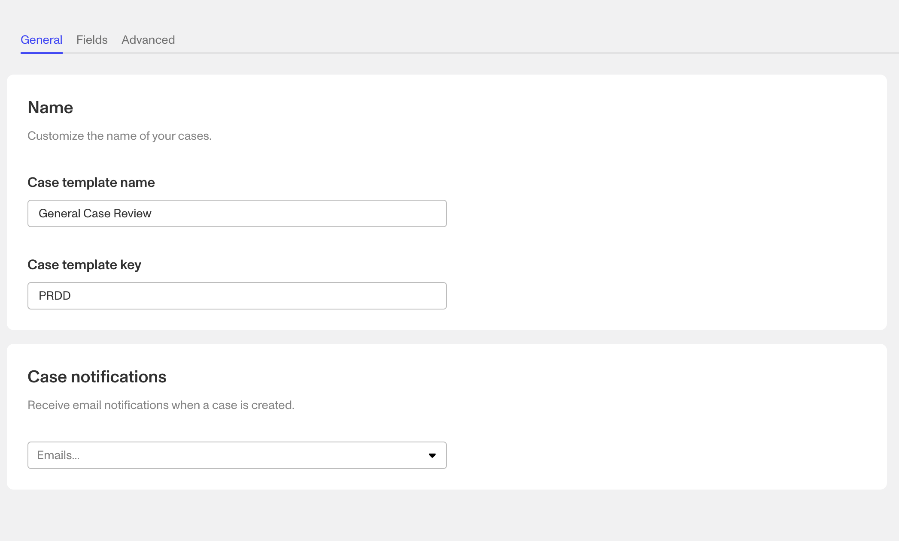
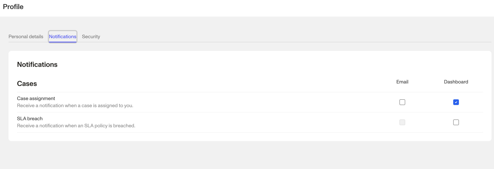

# Is it possible to receive an email when someone completes an Inquiry?

⚠️ This question came from a member of the Persona Community - an analyst working to set up their internal process for a business system. This question is useful for those looking to receive emails when an event happens within Persona.

# Question

Is it possible to receive an email when an Inquiry reaches `Completed` status? I want to be notified when someone has finished filling out an Inquiry.

# Answer

Hi there! Yes, it is possible to receive an email every time an Inquiry reaches `Completed` status (and most [events](../../docs/docs/events.md) that occurs within Persona). Some of these features are only available on certain plans, please refer to your plan for further details on your specific access. Here are a few of those methods as well as how to set them up:

## Email notification

### Option 1: Configuring a custom trigger and email

If you’d like to send a specific email when an event happens, you can utilize Workflows.

1.  Navigate to **Workflows > Click Create Workflow**
2.  When creating a Workflow you can select from a list of available trigger events such as `Inquiry.completed`

 3. Click Continue and you’ll be able to configure your workflow  4. Add an Action Step where and when you’d like the email to be sent  5. Configure the Action Step by searching for the `Send Email` action step for the Step Type 6. Update the HTML for you email and input the necessary variables such as Inquiry ID that you’d like to send in the email 7. It’s also a best practice to test your changes. Once you’re done making changes, Save and Publish your Workflow.

### Option 2: Leverage Cases-related email notifications

Cases is a product that helps teams create manual review processes. A common best practice is to have a Workflow create a Case when an Inquiry moves to `Completed` status. Since Cases is made for teams who are reviewing data often, there are native email notifications that are baked into the product. Some of these include:

**Case creation email notification settings per Case Template**

_This feature allows you to set an email or multiple emails of users within your Persona instance to receive an email when a Case is created for a specific Case Template. If you have multiple Case Templates then you can have the notification list differ depending on the type of manual review that might occur._

**Case assignment and SLA breach email notification settings per User**

_When a User in your Persona instance is actively using Cases, they have the ability to update their personal case notifications when a Case is assigned to them or when an SLA is breached (another useful Case template feature). This can be accessed by clicking on your profile in the bottom left of the Dashboard and clicking the Notifications tab._

## Other ways to get notified

There are also other ways for your business (or you, specifically, as opposed to all users) to be notified when an event happens. These include:

-   [Webhooks](../../docs/docs/webhooks.md) - Webhooks allow you to configure for which events you’d like our system or service to receive notification and the related information about that event.
-   [Slack](./7FlnOvBKFu6k7sunbzQH0K.md) - Persona’s integration with Slack is leveragable through Workflows in a similar manner to the Send Email action step.

📌 This answer was last updated on October 30, 2024 by Justin Sayarath, a product manager at Persona. FAQs, unlike other articles, are written to provide Persona Community members more specific answers to common questions. While we periodically review responses and answers, please note when this FAQ was last updated as information may have changed since then.

## Related articles

[Using the Send Email Action Step](./5t1l1MtN0gqHnLcqpPWMGp.md)

[Setting up an Inquiry review process using Workflows](./88I8H0eKR6qEh3O2OyXPl.md)

[What are Case Notifications?](./1YbMMKFxQ7iWKtg2J4AZ6M.md)
