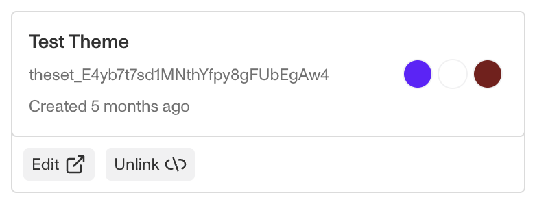
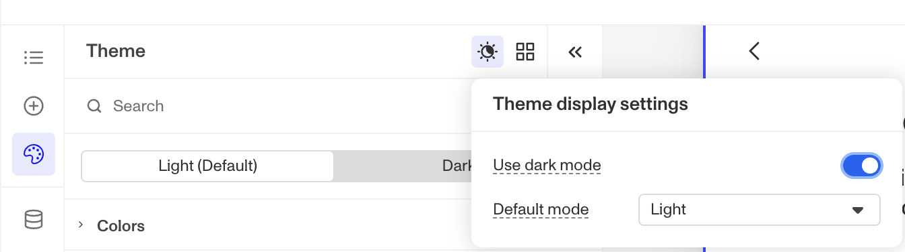

# How do I change the colors, fonts, logo, and other styles of an Inquiry?

⚠️ This question came from multiple members of the Persona Community. This question is useful for those looking to change the look and feel of their Inquiry Templates.

To customize the styling of an Inquiry, navigate to the `Theme` section in the left navigation (look for the color palette icon). Here you can modify various visual elements including colors, buttons, and fonts. If you have theme sets available, you can also apply them to your current inquiry template.

Here are your options for styling an Inquiry:

-   Customize styling through the theme configuration section of your current inquiry template. You can also save these customizations as a theme set for future use.
-   Apply an existing theme set directly to your current inquiry template.
-   Use an existing theme set as a starting point, then unlink it to make custom modifications for your current inquiry template.

Once you're done making your changes, remember to save them.

### Dark mode

To create a dark mode, toggle on the "Use dark mode" setting. This will reveal options to configure Dark mode styling and specify which mode will be the default. Dark mode activates automatically when a user's device is set to dark mode.

Read the more [complete guide on Theme Sets](./6SIHupp847yaEuVMucKAff/%20%22Configure%20a%20Theme%20with%20Theme%20Editor%22.md) for more information.

## Related articles

[Configuring a Theme with Theme Editor](./6SIHupp847yaEuVMucKAff.md)
