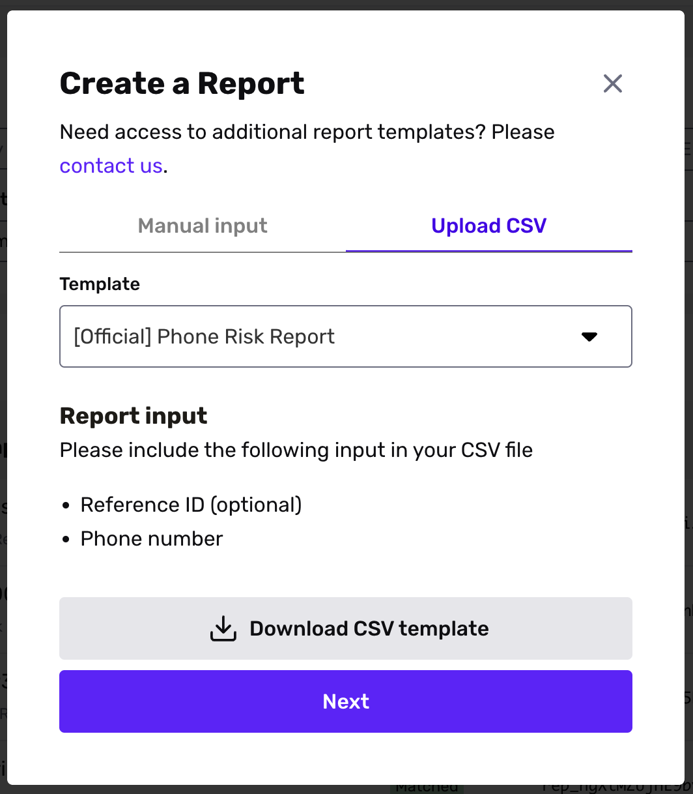

# Bulk create a Report

_Bulk Report creation is available on paid plans. If you don’t see the option to create reports on the All Reports page, please contact your Customer Success Manager or [contact the Persona support team](https://app.withpersona.com/dashboard/contact-us)._

## Overview

You can create reports in bulk by uploading a CSV of information (individual names, business names, email addresses, phone numbers, etc.). To learn more about different ways to run Reports, read [here](./042goubhldtkoKAA6AmiZ.md).

## Steps

To create a Report in bulk:

-   First, download a CSV template from the Dashboard.
-   Then fill out the CSV template with your data, on your computer.
-   Then upload the completed CSV to the Dashboard.

Below, we cover each step in more detail.

### Step 1: Download the CSV template

In the Dashboard:

1.  Navigate to **Reports** > **All Reports**.
2.  In the upper corner, click **+Create report**.
3.  In the Create a Report modal:
    1.  Select the **Upload CSV** tab.
    2.  Choose the Report Template you want to run.  
        
    3.  Click **Download CSV template**.

### Step 2: Fill in the CSV with your data

On your computer:

1.  Open the downloaded CSV template.
2.  Input the records you want to run the Report Template on. See the _Creating the CSV template_ section for guidance.
3.  Save your changes.

### Step 3: Upload the completed CSV

Return to where you left off in the Dashboard. In the Create a Report modal:

1.  Click **Next**.
2.  Upload the CSV template you just edited.
3.  Click **Create Reports**.

## Creating the CSV template

For a successful upload:

-   Please do not change, add, remove, or move the header names in the CSV template.
-   Provide the required input(s) for each record.
-   Ensure each CSV has no more than 10,000 rows.
    -   If you would like to bulk create reports for more than 10,000 rows, break them into multiple smaller CSVs that meet the size requirement. Then, upload each of the smaller CSVs.
