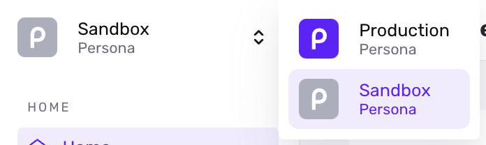
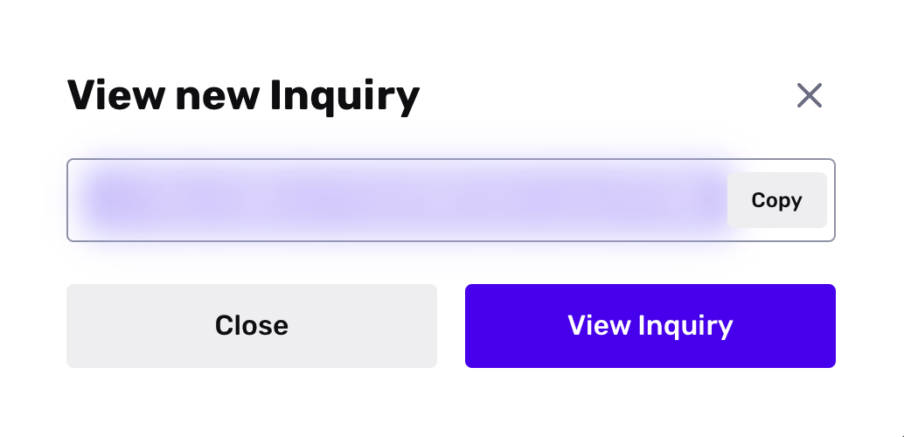

# Creating a test Inquiry

## Overview

This tutorial explains how to create an Inquiry for testing purposes. You can use this Inquiry to test what your end users see in your identity verification flow.

We will create an Inquiry in your [Sandbox environment](./6I2kGhfPvSuUjYq4z6tpmB.md) using the [Hosted Flow](./4pZBZYAFLkKMyXycGeAMV2.md) integration method.

### Prerequisites

This tutorial will be most helpful if you first review:

-   [Key concepts: Inquiry, Verification, and other terms](./14hgKH7lZo9b6ja7tRJobW.md)

## Start in Sandbox

When you want to do any testing in Persona, we recommend you switch to your Sandbox environment.

Toggle the environment to Sandbox in the upper left corner of the Persona Dashboard:

## Manually create an Inquiry

Follow the steps below to manually create an Inquiry:

1.  Select **Inquiries > All Inquiries** from the navigation bar. This opens the [All Inquiries](../../landing/dashboard/inquiries.md) view.
2.  Click on the **+Create Inquiry** button at the upper-right hand corner of the All Inquiries view. This opens a modal.
3.  Within the modal:
    1.  Add an optional Reference ID.
    2.  Optionally, select the checkbox to "Send email to recipient". If you select this checkbox, you can customize the email's subject line, copy, and call to action in the next step.
4.  Click **Create Inquiry**.
5.  Copy the URL for this Inquiry and open it in your browser.   
    
6.  Run through every step to complete the Inquiry flow.
7.  Once you have completed the Inquiry flow, return to the [All Inquiries](https://app.withpersona.com/dashboard/inquiries) view in the Persona Dashboard. Click on the completed Inquiry to view its details.
    -   To understand how information is laid out on this details page, see: [Where to find Inquiry details in the Dashboard](./nqBDRxxIjiIvnOwsCpri6.md)
