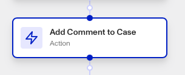

# Workflows: Add Comment To Case step

# What is the Add Comment To Case step?

**Add Comment To Case** is a Workflow Action step that adds a comment to a case, visible to other organization team members.

Cases are Persona products that collect together data on an end user to allow for manual investigation and decisioning on. Your organization may need to investigate this user for a variety of reasons:

-   **Onboarding**: Should this user be allowed to onboard to the platform?
-   **Account takeover investigation**: If a user is claiming that their account has been taken over, is there enough information to validate their claim?
-   **Fraudulent activity**: Are there suspicious signals associated with this user that require further action (e.g. account freezing, sending a follow-up inquiry for verification, etc.)?
-   **Transaction monitoring review**: Are there suspicious transactions associated with this user that require further investigation?

Case comments are useful for providing additional context or notes related to the case. They help in maintaining a record of discussions or decisions made during the case review process. The Add Comment To Case step lets you automate some of those communications.

# How do you add an Add Comment To Case step?

1.  Navigate to the Dashboard, and click on **Workflows** > **All Workflows**.
2.  Find and click on the workflow you want to edit, or **Create** a new workflow.
3.  Click on **+** when hovering over a circle to add an **Action**.

4.  Use the **Find Action** select box to click on **Case** > **Add Comment To Case**.
5.  Click the **Case** box to choose the case you want to add a comment to.
6.  Write your comment in the **Comment** box. You can alternatively pull a comment’s content from another Workflow step by clicking the **+** button.
7.  (Optional) In ‘Advanced Configuration’, click the **Continue on error** box if you want the workflow to continue running even if this step raises an error.
8.  **Close** the step. You’ll have to **Save** and **Publish** the workflow to begin using it.

# Plans Explained

## Add Comment To Case step by plan

|  | Startup Program | Essential Plan | Growth Plan | Enterprise Plan |
| --- | --- | --- | --- | --- |
| Add Comment To Case step | Not Available | Available | Available | Available |

[Learn more about pricing and plans](./6oZbzp7jb7AWGClF5vpY3K.md).

# Learn more

Learn more about Cases [here](../../docs/v2022-09-01/docs/cases.md).
