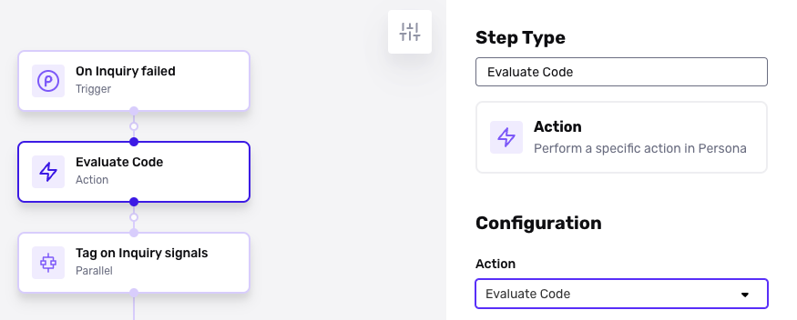
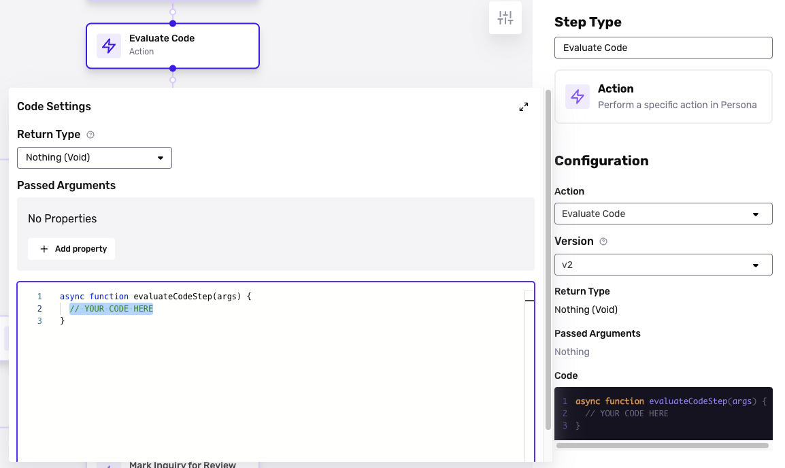

# What are some example use cases of custom code in Workflows?

⚠️ This question came from a member of the Persona Community - a developer from a fintech company. It is useful for those looking to understand some ways that the Workflows Evaluate Code step (often called Custom Code) can be used.

# Question

What are some example use cases of custom code in Workflows?

_You can find the Evaluate Code Step within Workflows when configuring a new action step._

# Answer

### Example use cases

With Evaluate Code, you can:

-   Pull in outside data sources to help in decisioning.
-   Integrate Persona with any SaaS vendor that has an API.
-   Implement any bespoke logic you want on the Persona platform.

As a concrete example, lets say your organization relies on Sift scores for decisioning. Rather than having your team jump between the Persona and Sift dashboards, a Workflow can run custom code to pull in a user's Sift scores via the Sift API, make a decision based on Persona and non-Persona data, and decline or approve an Inquiry—all in one place.

Persona can work with you to configure a custom code implementation based on your needs.

_When configuring the Evaluate Code step, your can use objects or values from preceeding Workflows step within your custom Javascript. Your Javascript can be used within the Evaluate Code Step's editor view._

### Just one source of flexibility

Custom code provides additional functionality and flexibility on top of an already powerful foundation. In many cases, you don't need custom code—you can find what you need in the product, or via our [Marketplace](../../landing/solutions/persona-marketplace.md).

📌 This answer was last updated on April 23, 2025, by Justin Sayarath, a product manager at Persona. FAQs, unlike other articles, are written to provide Persona Community members with specific answers to common questions. While we periodically review responses and answers, please note when this FAQ was last updated as information may have changed since then.

## Related articles

[Workflows: Evaluate Code Step](./7eNHMEGyHPLu35oakfyo79.md)
