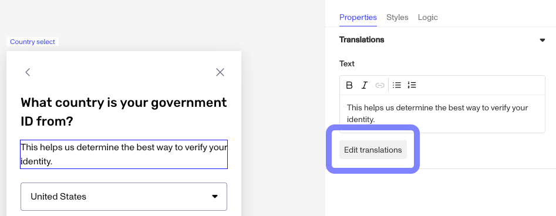
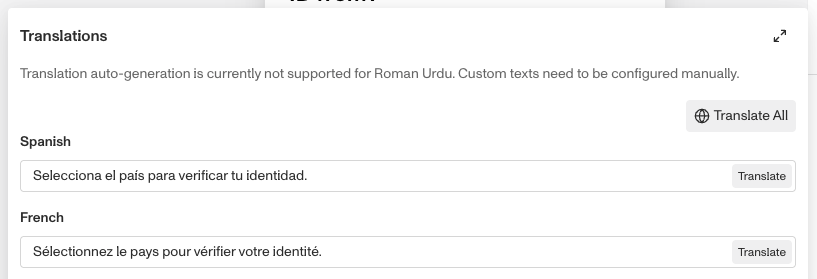

# Editing translations for your Inquiry

# **Editing translations for your Inquiry**[](#editing-translations-for-your-inquiry)

## Overview[](#overview)

Persona provides default translations for the default text in each step of an Inquiry. You can edit these translations using the [Flow Editor](./ETA0GIS8K60DSoiFRpA9z.md).

To learn more about the translation feature, see [Translations / Localizations](./hoxMwpVc5bnYFbiNDen7R.md).

## Steps[](#steps)

To edit the translations for an Inquiry:

1.  In the Persona Dashboard, select **Inquiries** > **Template** in the navigation bar. Select the Template you want to edit.
2.  In the Flow Editor, hover your mouse over the screen you want to edit, and click the pencil icon.
3.  In the sidebar of the Screen Editor, select the text component you want to edit.
    -   For example, it might be a Title or Text component.
4.  In the settings for the component, click the **Edit translations** button.

 5. In the Translations modal, you can edit the translation for each language. 

```
- You can also use the auto translate feature by clicking the “Translate All” button at the top right, or you can trigger that by individual country.
```

6.  Click **Save** in the top right corner of the Flow Editor.

As usual, you must publish your Inquiry Template for your end users to see your latest changes. Learn what it means to publish [here](./ETA0GIS8K60DSoiFRpA9z.md).

## Related articles

[Inquiry flow](./6CiQpUM6lROr10QmRXAqrP.md)
