# Notify on stuck workflows

## Set a workflow to notify if another workflow doesn’t finish in 5 mins.

Occasionally workflows get stuck or take longer than expected to complete. And if a workflow is stuck, then having a step inside of that workflow to notify you is also never going to trigger because it’s stuck. So what we’re going to outline here is how to set up a separate workflow that notifies you if the first workflow get stuck.

## Name our Objects

Let’s refer to the triggering inquiry as “Original inquiry” and the workflow that occasionally gets stuck as “Review inquiry workflow”. The review inquiry workflow is triggered to run off of the original inquiry entering the `Completed` status. We don’t need to change anything with those two objects.

The “Notification Workflow” will be our new workflow and it will do the following:

-   Also trigger off the original inquiry entering the `Completed` statues
-   Wait for any of 3 Events: Inquiry approved, Inquiry declined, Inquiry marked for review.
-   Conditional branch off of those same inquiry statues and send a notification if none of them are met (because the Review Inquiry workflow got stuck)

## Step by Step

Let’s walkthrough the process for building this workflow from creation to published.

### Create Workflow

-   From the Workflows page, click the **Create workflow** button at the top right.

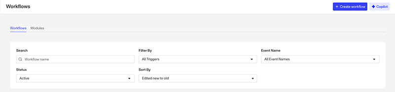

-   In the New Workflow widget:

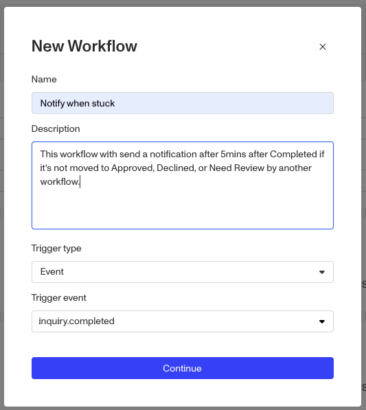

-   Enter a descriptive name
-   Optionally fill out the description field
-   Leave the Trigger Type on Event
-   Leave the Trigger event on `inquiry.completed`

⚠️ We want this new workflow to start at the same time as the Review Workflow so we can base the wait step on the same starting point.

-   Click the **Continue** button.

### Set Trigger Criteria

⚠️ Unless you set a Trigger Criteria, every single inquiry that gets set to `inquiry.completed` will trigger this workflow. Let’s use the trigger criteria to narrow the scope.

-   Select the On Inquiry completed step at the top of the flow.

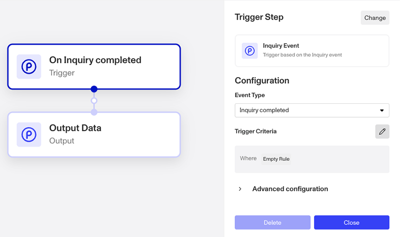

-   Click the **Edit** icon to the right of **Trigger Criteria**.

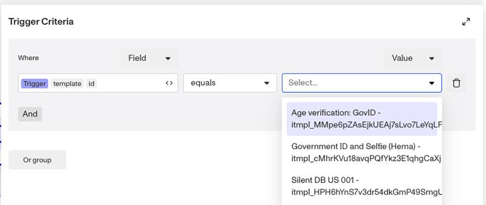

-   In the where field, set it to Trigger template id.
-   Then from the value drop down on the right, scroll and select the specific inquiry template you want this workflow to trigger from.
-   Click the **Close** button.

## Wait Step

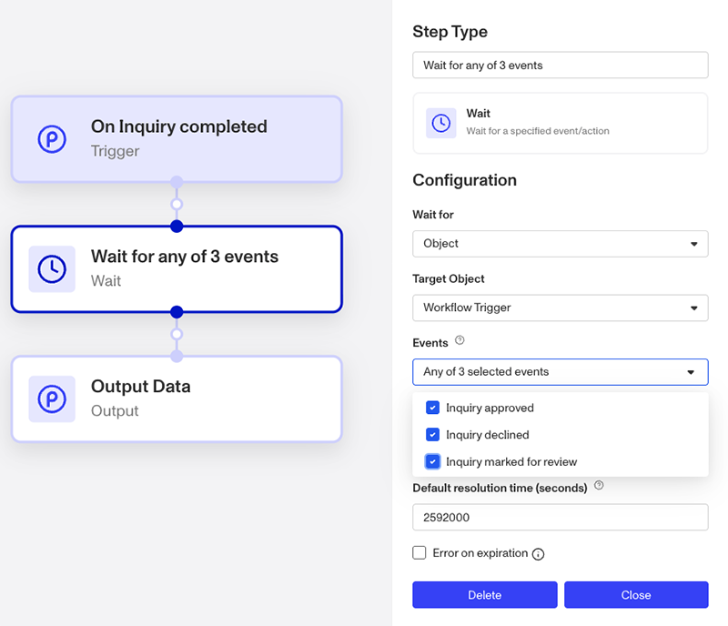

-   Click the empty node between On Inquiry Completed and Output Data.
-   From the list on the right, click **Wait**.
-   Leave the Wait for field on `Object`.
-   Set Target Object to Workflow Trigger, which is the original inquiry.

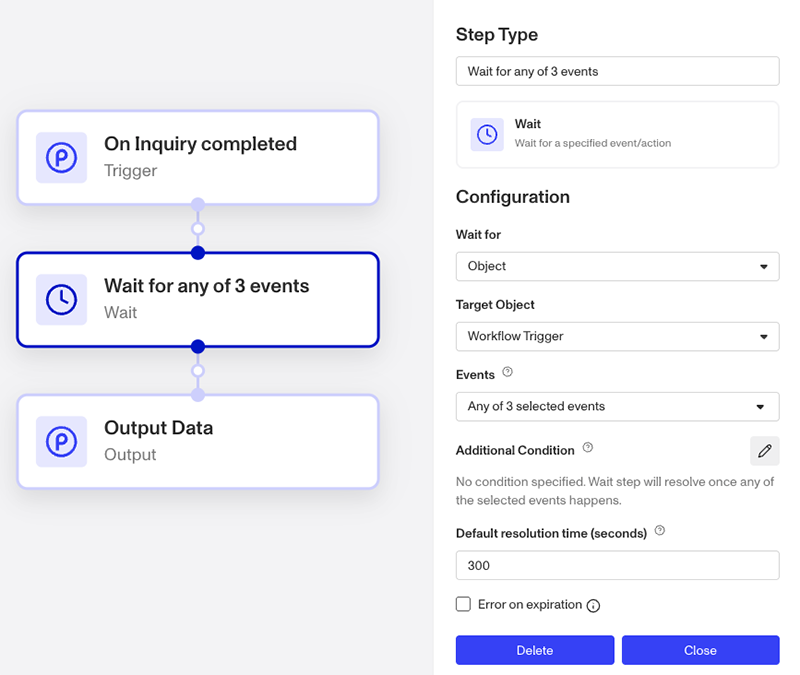

-   For events, set all three of the options: Inquiry approved, Inquiry declined, & Inquiry marked for review
-   Set the time to `300s` for 5min.

❓Why 5 mins? Most workflows with reports and database verifications complete well before five mins. So if it’s taking it longer than 5min, that’s a good time to investigate.

-   Click the **Close** button.

### Conditional Step

-   Add a new step after the Wait Step, and select `Conditional` from the list on the right.

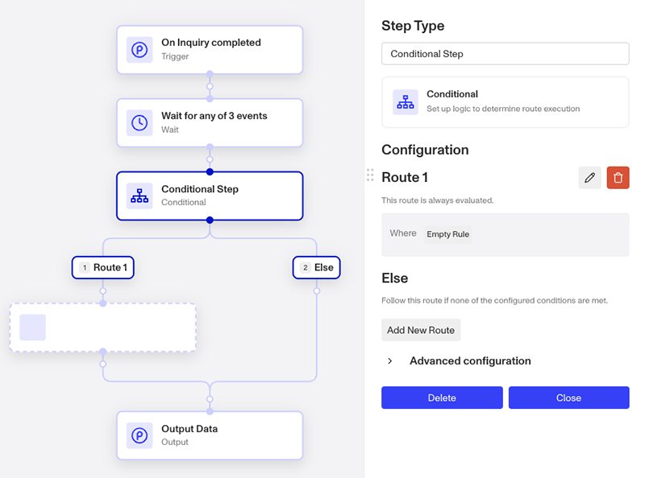

-   For Route 1, click the **Edit** icon to the right.

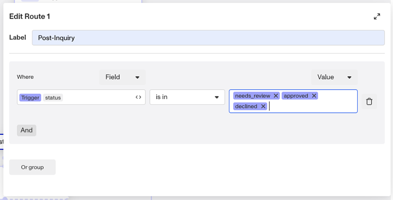

-   Update the Label to `Post-Inquiry` since we want to indicate a route for runs where the trigger object, the original inquiry, has moved into one of the Post-Inquiry statues.
-   In the Condition:
    -   Set Where to Trigger status
    -   Set the Operator (in the middle) to `is in`
    -   Set the value to `approved`, `declined`, & `needs_review`
-   Click back to the flow.

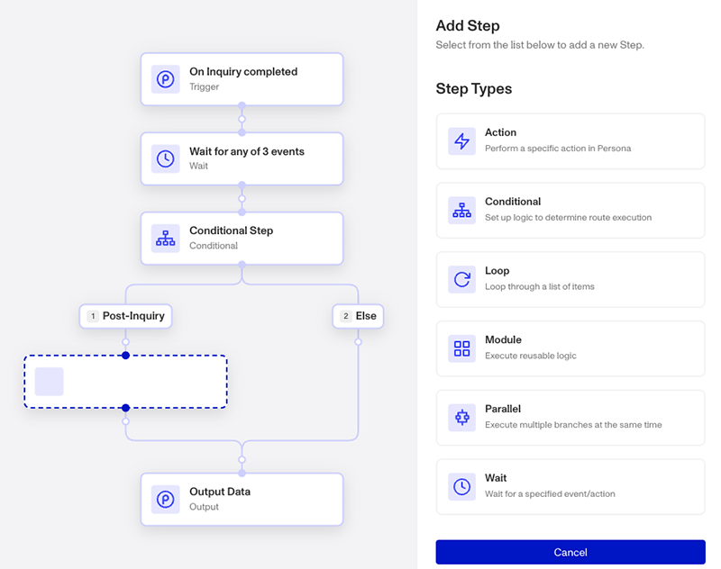

⚠️ The point of the condition is to check that after five minutes if the original inquiry is still in the Completed status, and needs to send a notification, or it’s in one of the Post-Inquiry statues. Depending on how you set up your condition, you’ll need to adjust where you place the notification step. Since we’re checking in Route 1 if it’s in Post-Inquiry (which we don’t need a notification for) we need to place the notification in the Else route instead.

-   Select the blank step in Route one and cancel it via the **Cancel** button at the bottom right.

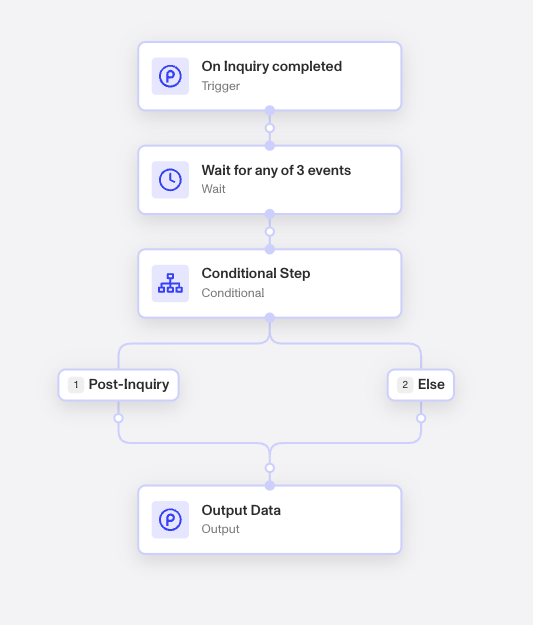

-   Click the new step node under the Else Route.
-   Select Action step, and then search for “Send”. This will bring up a number of notification options. Select a configure the one you’d prefer.

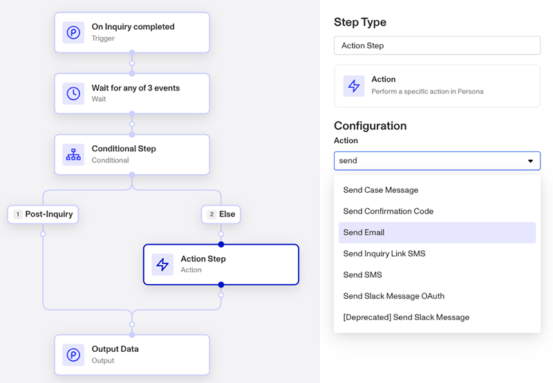

-   OR select Action, step and then search for “HTTP”. This will bring up the Make HTTPS Request Action step, allowing you to configure a HTTPS request to your system.

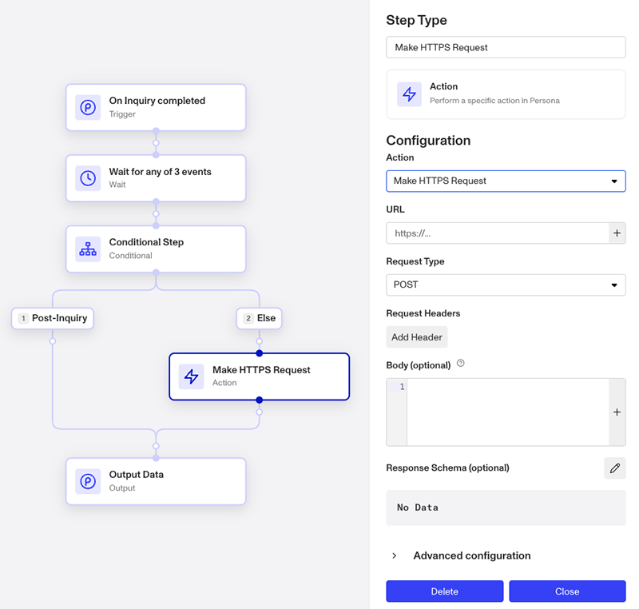

-   Lastly, review and Publish the workflow.
