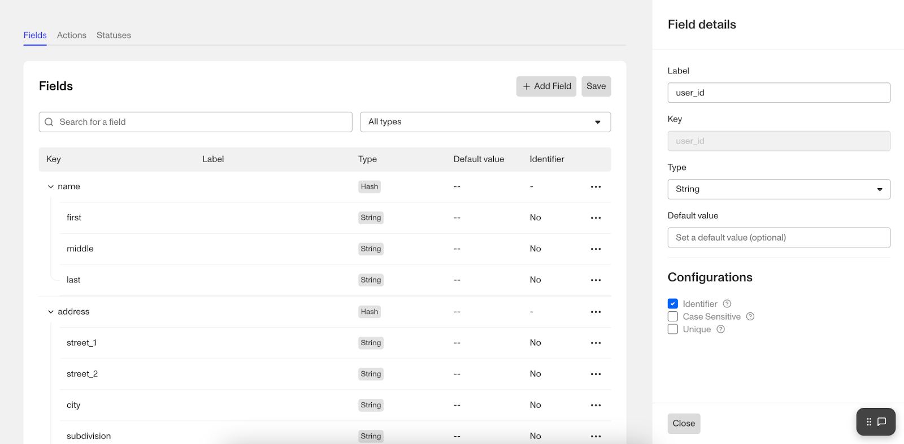

# Accounts Field Editor

# Overview

To ensure that your organization has all the relevant data you need for Accounts, add or edit fields via Accounts Field Editor. Accounts Field Editor is available only if the organization has Account Types enabled.

This unlocks a more seamless experience that enables you to:

-   Create, edit, deactivate, or delete fields
-   Specify Identifiers
-   Inform and replace with system fields if a system field key is typed
-   Create a [Relation](./1aMbe1XEyhiAHgFz1oOjDj.md)
-   Set default field values and display them in the table view
-   Search by name and key and filter by field type

## **Where can you find the Accounts Field Editor?**

1.  In the Dashboard, click **Accounts** > **Types** in the navigation bar.
2.  After [adding an Account Type or selecting an existing one](./NrM9W6KETzMbzQXgdU3cV.md), click on the Fields tab.

## **How to add or configure Account fields?**

1.  Navigate to the Accounts Field Editor.
2.  Click into an existing field or click + Add Field
3.  Update Field Details:
    -   Label: the name of the field (displayed within the dashboard)
    -   Key: a unique identifier for the field (used when retrieving or updating via API or via other products within the dashboard)
    -   Type: describes the type of field value allowed, such as an array, date, integer, string, etc.
4.  Update Field Configurations:
    -   There are additional configuration options that are available per type
        
        -   Default Value: String, Boolean, Multiple Choices, Choices, Float, Integer types
        -   Max length (char): String type
        -   Min & Max file size (bytes): File type
    -   [\*\*Identifier](./6Iz6sufWpRG5uVSEwoOPJT.md):\*\* A unique field defined by a customer organization that can be used to look up an exact match quickly (user IDs, email address, etc.). _Identifiers can only be set on fields where the field type is string. Identifiers are not supported in nested string fields like hashes._ There are 2 additional options for an identifier.
        
        -   **Case Sensitive:** field setting that treats “ABC” and “abc” as not the same value.
        -   **Unique:** field setting that prevents the same value from being used in multiple records for this field within the same account type.
        
        ⚠️ \*If you want an account within Persona to have 1:1 mapping with an account within your system, you should set a field to be an identifier and force uniqueness.\*
        

## How to make changes to fields

⚠️ Once the field is saved, you will no longer be able to edit the key and the type. You can rename the label or make edits to the additional configuration.

To delete the field while drafting it, click Cancel or click the ••• button on the field, then click Delete. Once you save the field, you can deactivate the field. Deactivating will retain the values that were saved in the field but prevent it from further update. Since the field key is still used, you cannot create a new field with the same key of an inactive field.

## How to access fields in Workflows

In Workflows, you may want to access and condition off of a field value for a given account. You can access using `account.fields.<key>`.

# Plans Explained

### Accounts Field Editor by plan

|  | Startup Program | Essential Plan | Growth Plan | Enterprise Plan |
| --- | --- | --- | --- | --- |
| Accounts Field Editor | Not Available | Not Available | Available | Available |
| Adding fields | Available | Not Available | Not Available | Available |
| Configuring Account Identifiers | Not Available | Not Available | Limited | Available |

[Learn more about pricing and plans](./6oZbzp7jb7AWGClF5vpY3K.md).
