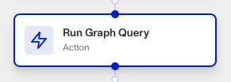
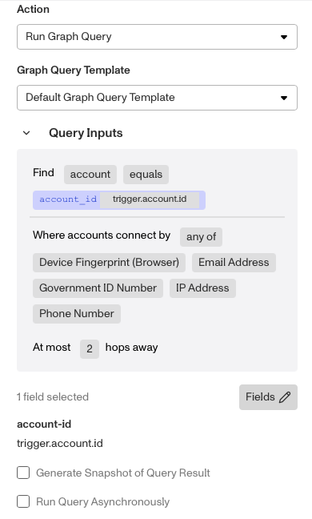

# Workflows: Run Graph Query step

# What is the Run Graph Query step?

**Run Graph Query** is a Workflow Action step that searches all accounts for a matching value to a property you specify. This helps you identify and combat fraud.

Graph is a link analysis tool that lets you visualize, explore, and uncover patterns in your customer network. You can use Graph to find patterns in your network that may indicate fraud.

💡 For example, you can identify clusters of customers that share the same IP address, device fingerprint, or browser fingerprint.

You can then leverage other Persona objects, such as Cases, to take action based on Graph-identified patterns.

You can use the Run Graph Query step proactively and reactively:

-   **Proactive example**: After an end user completes their inquiry, you can run a graph query to find linked accounts. Depending on the results, you may opt to create a case or decline the user outright.
-   **Reactive example**: After you detect a fraudulent user on your platform, you might use Graph to search for accounts linked to their Persona account and determine if the extent of the fraud.

# How do you add a Run Graph Query step?

1.  Navigate to the Dashboard, and click on **Workflows** > **All Workflows**.
2.  Find and click on the workflow you want to edit, or **Create** a new workflow.
3.  Click on **+** when hovering over a circle to add an **Action**.

4.  Use the **Find Action** select box to click on **Graph** > **Run Graph Query**.
5.  Choose which **Graph Query Template** to use.
    1.  You can view the template’s query details under the **Query Inputs** heading.
    2.  Choose which information **Fields** to query for.

6.  (Optional) Click **Generate Snapshot of Query Result** to generate a static record of the data at the time the query is executed. This is useful for later analysis or reporting, even if the underlying data changes over time.
7.  (Optional) Click **Run Query Asynchronously** to perform the query in the background, and let the Workflow continue running in the meantime. This is useful when dealing with large datasets that are time consuming to query.
8.  (Optional) In ‘Advanced Configuration’, click the **Continue on error** box if you want the workflow to continue running even if this step raises an error.
9.  **Close** the step. You’ll have to **Save** and **Publish** the workflow to begin using it.

# Plans Explained

## Run Graph Query step by plan

|  | Startup Program | Essential Plan | Growth Plan | Enterprise Plan |
| --- | --- | --- | --- | --- |
| Run Graph Query step | Not Available | Not Available | Available | Available |

[Learn more about pricing and plans.](./6oZbzp7jb7AWGClF5vpY3K.md)

# Learn more

[Learn more about Graphs.](./6atsHmQOjAswNrwMR8NY0R/index.html.md)
