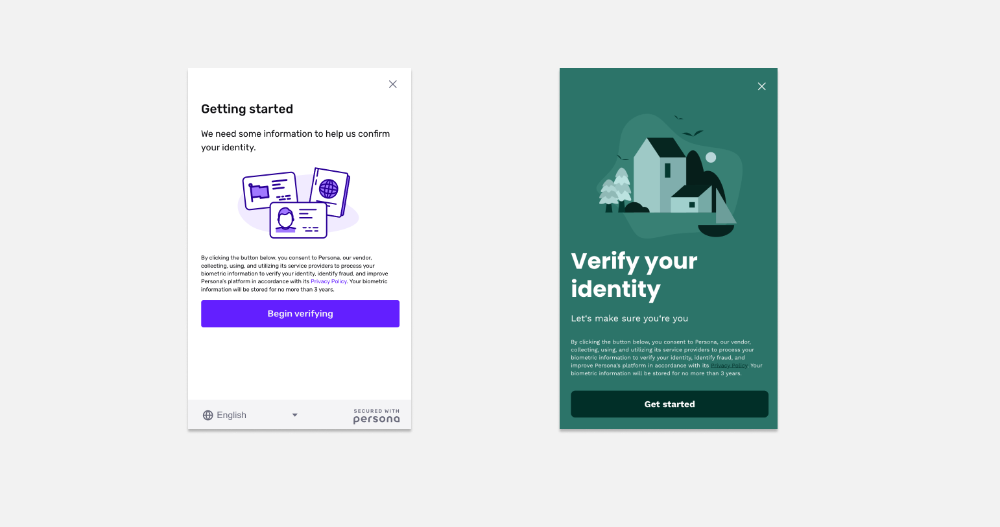
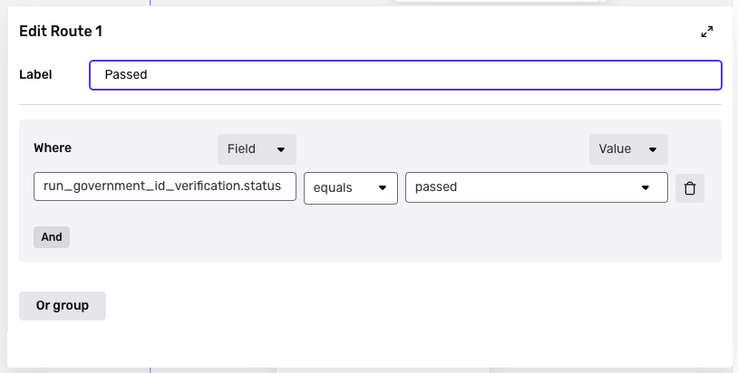
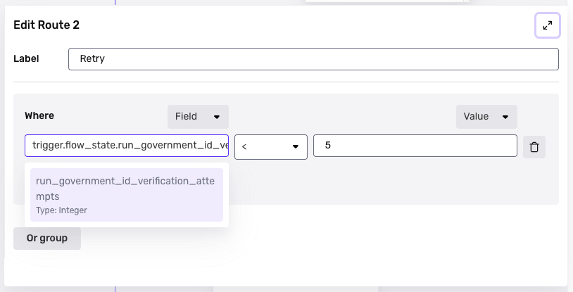
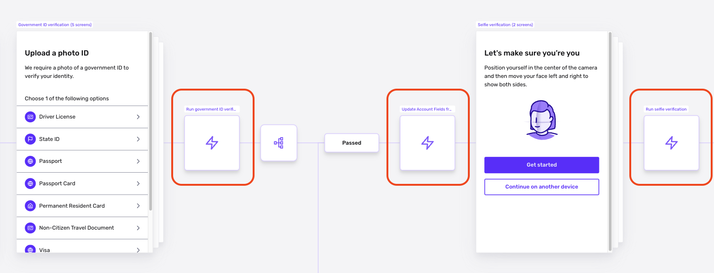

# Inquiry Template Steps

# Overview

Steps are the primary building block within Inquiries and define the logic and actions that occur between screens of an Inquiry Flow.

## Types of Steps

There are four different types of Steps:

1.  **Screen Steps** are a single page that a user will see within the Inquiry Flow.
2.  **Branching Steps** express a desired conditional or business logic within a user experience.
3.  **Action Steps** take an action or series of actions.
4.  **Connector Steps** route from one part of the Inquiry Flow to any existing screen in the Inquiry Flow.

### Screen Steps

A Screen Step is a single page that an end user sees within the Inquiry Flow.

In the Screen Editor for a particular screen, you configure, drag/drop, and add configurable elements called components. There are two types of components:

1.  **Basic Components** like text, title, or spacer that allow you to visually style or give context to users
2.  **Form Components** like text input, URL, or address that allow you to collect information from users

**Screen Editor**

Screen Steps allow further customizability enabling customers to express their visual brand and build a seamless user experience no matter where in the user journey Persona is integrated. This includes:

-   Tying Form Components to specific Inquiry fields such that any information collected is stored to specific custom fields
-   Setting country-specific translations for any language (i.e. copy, placeholder text, or question headings) in Basic or Form Components
-   Styling or overriding the template's associated Theme Set for color, font, alignment, and more

 _The screen on the left is an example of a default Start Screen without any customization (often seen when adding a Solution or Inquiry Template from the Solution Library or Inquiry Template Library) and on the right is an example of a Start Screen with advanced styling configurations utilized. The same level of detailed visual polish and attention to look & feel can also be applied to other Screen Steps throughout an Inquiry Template._

### Branching Steps

A Branching Step lets you express custom conditonal or business logic.

For example, you can use a Branching Step to define multiple retries for a Verification, or to ask higher-risk individuals to go through an additional type of Verification or input additional information on a Screen Step.

**Routes** A route is a singular branch of a Branching Step. The logic for each route can be customized based on business logic and/or risk signals (i.e. country, Inquiry fields/inputted data, Verification results) to then have different segments of users receive tailored user experiences based on that dynamic business logic.

Each route is processed in order. For example, if there are three routes, Route 1 is processed first, then Route 2, then Route 3.

**Example** You can place a Branching Step in your Inquiry flow right after a Government ID Verification module. The Branching step could have the following three routes that depend on the outcome of the Verification:

-   Route 1: The Verification attempt passed.
    -   This route might be followed by another type of Verification, or by a Success screen.

-   Route 2: The Verification attempt did not pass (i.e. it did not go through Route 1), and the number of Verification attempts is below an allowed number.
    
    -   This route might be followed by a screen that asks the end user to retry, then a connector that connects the flow back to the start of the Government ID Verification module. 
-   Route 3: For everything else (i.e. the Verification attempt did not go through Route 1 or Route 2).
    
    -   This route might be followed by a Failed screen, or a connector that connects to a Failed screen.

### Action Steps

An action step, as the name suggests, takes action.

**You can define multiple action steps to run one after another.** Multiple actions in a row form an action sequence, similar to the Workflows product.

To illustrate, here's an example of a simple action sequence that occurs in Persona's standard Government ID Verification module:

1.  Run an Government ID Verification using a specific Verification Template
2.  Update Fields on Inquiry from the Government ID Verification

**There are many types of action steps.** For example, action steps can:

-   **Run Verifications.** For example, a step can run a Selfie Verification.
-   **Act on other parts of or objects within Persona.** For example, a step can update the fields of an Account.
-   **Take custom action beyond Persona.** For example, a step can run custom JavaScript code, or make an HTTPS request.

_In the Flow Editor, an action step is represented as a square with a lightning bolt symbol._

### Connector Steps

Connector Steps offer a way to jump from one part of a flow to any screen in the flow.

This functionality is useful, allowing you to:

-   Reuse specific parts of your Inquiry Flow without having to recreate all the detailed Steps from scratch.
-   Send users or a segment of users (when used in combination with Branching Step) back to a Verification or another part of the Inquiry Flow when they have yet to meet a minimum level of risk assurance.

## Adding Steps to an Inquiry Template

Steps can be:

1.  Automatically created as part of a larger Solution or Inquiry Template from the Solution Library or Inquiry Template Library,
2.  Added from scratch to an existing Inquiry Template in the Flow Editor by clicking + in where you'd like the Step to be added in the flow, or
3.  Added to an existing Inquiry Template in the Flow Editor when you add a drop-in Module

### Modules with prebuilt Steps

A common way to add Steps to a flow within an existing Inquiry Template is by adding a Module. You can consider Modules to be preconfigured building blocks within the Persona Platform, offering you an easy way to get started with some of Persona's most trusted collection and verification services.

Persona offers a number of useful Modules. For example, the Government ID Verification, Selfie Verification, and Document collection and verification experiences are packaged as Modules or your convenience and you can drop them into your flow with a click of a button.

**To add a Module:**

1.  Go to **Inquiries > Templates**
2.  Select an Inquiry Template for which you'd like to add a Module.
3.  Click **+** within the Flow Editor wherever you'd like to add the Module.

## Related articles

[Branching Steps in Inquiries](./6NyDb8wHpzSCVW5fnV3iHi.md)

[Screen Steps in Inquiries](./2WWzr0d6rEOIlyXjtHSCgC.md)

[Action Steps in Inquiries](./aBe34oNwaa0YskUd5U5HZ.md)

[Connector Steps in Inquiries](./1aLUyDUK4ZGuupSgscqd6P.md)
