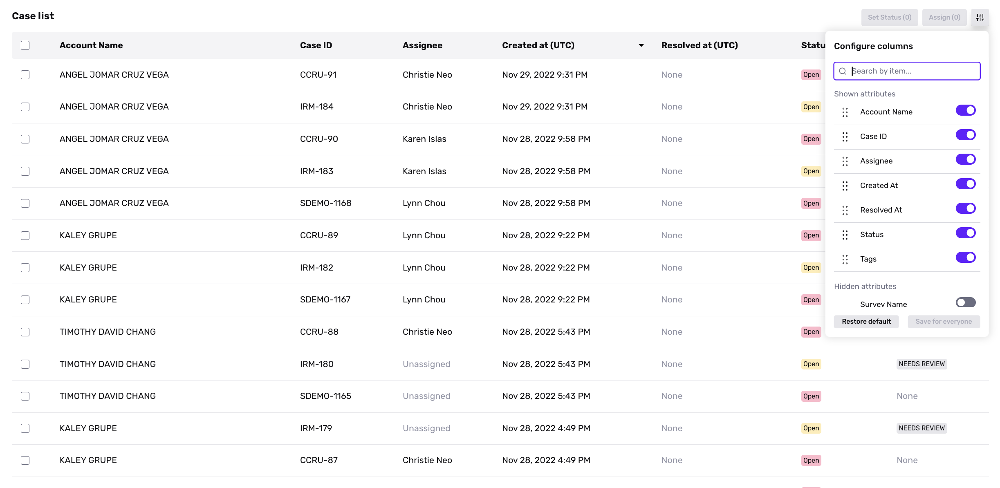

# Showing, hiding, and rearranging columns in your Case list

## Overview

By default, the Case list shows columns such as “Status” and “Case ID.” You can further configure the columns in this table to best meet your needs.

You can display additional columns, hide columns, and rearrange columns to put the most relevant ones first.

Note that configurations alter the Case list for _all_ users in your organization.

## Access

To configure the Case list, you must:

-   Hold the “Admin” _role_ in your organization, OR
-   Be granted the “Dashboard page layout” _permission_ in your organization. If you hold the "Admin" role, you can grant this permission to other users.

## How to configure columns

Click on the _Config_ button at the top right of the table view. This opens the configuration modal, which is split into two sections:

-   **Shown attributes**: columns currently displayed in the Case list. Columns are listed in the same order as they appear in the Case list.
-   **Hidden attributes:** columns not displayed, that can be added to your Case list.

### Show or hide columns

Use the toggle next to each column name to show or hide the column. Then click **Save for Everyone**.

### Rearrange columns

Click and drag columns in the modal to rearrange them. Then click **Save for Everyone**.

### Reset all configurations

To reset to the default Case list, click **Restore default**. This will undo any configurations you have made.

## Example use case

Let’s imagine a team has the following preferences:

-   They find the "Status" and "Case ID" columns most useful and want these columns to appear first.
-   They rarely refer to the "Created At" column, so they want it to appear at the end of the table.
-   They never use the "Tags" column and want to hide it.

To make these changes, they would: 

-   Open the **Configure Columns** modal.
-   Click and drag the "Status" and "Case ID" columns to the _top_ of the **Shown attributes** section.
-   Click and drag the "Created At" column to the _bottom_ of the **Shown attributes** section.
-   Click the toggle next to the "Tags" column to move it to the **Hidden attributes** section.
