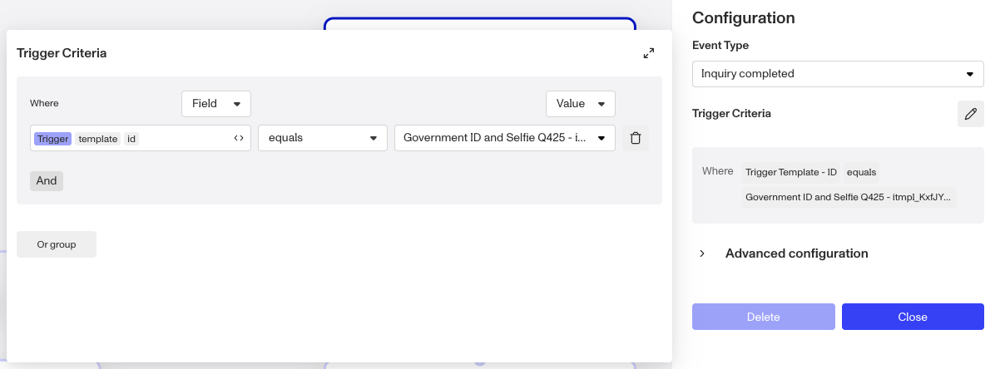

# Creating Workflows

## Overview

Get a first look at the steps to create a Workflow.

## Create a new Workflow

To create a Workflow:

1.  In the Dashboard, select **Workflows** in the navigation bar.
2.  On the Workflows page, click **\+ Create workflow** in the upper corner.

## Select a Trigger

For each new Workflow, choose a trigger type. A trigger is what starts a Workflow run.

Trigger types include:

-   Event
-   API _(enhanced feature)_
-   Schedule _(enhanced feature)_

One common configuration is an Event trigger type that runs on the event `inquiry.completed`. This means the Workflow runs whenever an Inquiry's status changes to `completed`. Events can also come from objects like Accounts, Cases, and even other Workflows.

Each time a workflow is triggered, a run of that workflow is started. These individuals runs can be tracked and reviewed later if there are issues with it's execution or halts due to an error.

💡 Workflows can also be manually triggered in the dashboard. This can be used to rerun previous workflow runs that errored, or to run entirely new runs with a selected trigger object.

### Trigger criteria

 You can set additional criteria on the trigger event. For example, if you want to your Workflow to trigger on inquiry.completed, but only when an end user completes a specific Inquiry Template, you can set the criteria to trigger.template.token = the template ID token. If no trigger criteria is set, the Workflow will run on all Inquiries that are completed. You can also set the criteria to include multiple templates instead of just one or all.

## Add Steps

A Workflow is built with a series of steps. To add a step:

1.  Hover your mouse between two steps and click the **"+"** sign.
2.  In the side panel, choose your desired Step Type.

The different Step Types are:

-   **Action**: Action steps take action on an object.
-   **Wait**: A Wait step pauses the Workflow until a specified event or action, or for a set amount of time.
-   **Parallel**: A Parallel step creates multiple branches in the Workflow that run simultaneously.
-   **Conditional:** A Conditional step lets you express `if/then/else` logic that create several possible branches in the Workflow. The logic can refer to objects in earlier parts of the Workflow, including the event that triggered the Workflow. It can reference properties of an Inquiry, Account, preceding Report actions, Case statuses, and more.

For more details on Trigger Events and Step types, head over to [this article](./4q44atlPvZvBNZAbYJzi3f.md).

## Save and Publish

You can save your changes as your edit your Workflow. Changes are saved to a new draft of your Workflow. Publish your Workflow when you want your draft to go live.

Learn about drafts, publishing, and Workflow state: [Workflows: Manage versions and state](./4cM7g2XVmqM6hicxsy9Js3.md).

## Learn more

-   [Set up an Inquiry review process using Workflows](./88I8H0eKR6qEh3O2OyXPl.md)
-   [Using Workflows and Cases to run Reports and review Report Matches](./042goubhldtkoKAA6AmiZ.md)
-   [Workflows FAQs](./1UNQQ1f6RKFlV0pfSplEKp.md)

## Get help

To get help building out your Workflows, [contact the Persona support team](https://app.withpersona.com/dashboard/contact-us).

## Related articles

[Rerun, Resume, or Run New Workflows with Manual Triggers](./59bQ0AVwLaOTr9TGHTyEzb.md)
