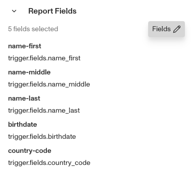
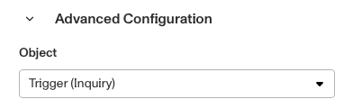

# Workflows: Run Report step

# What is the Run Report step?

**Run Report** is a Workflow Action step that generates (’runs’) a Report, which pulls information from external data sources to provide analysis and insights about a user undergoing a verification process. For example, you could run a Report on an individual to see if they appear on any national watchlists.

Contrary to an Inquiry, a Report pulls information from authoritative and non-authoritative data sources to conduct its analysis, rather than simply using the information submitted by an individual. Because of this, they are useful in cases such as KYC/AML compliance and fraud prevention.

💡 Since the Run Report step uses a Report Template to generate insights, you need to create a relevant Template beforehand. You can do that in Dashboard > Reports > Templates.

Some common Reports to run include:

-   Whether an individual appears on a national on a watchlist.
-   Whether an individual is a politically exposed person.
-   Whether an individual is associated with adverse media.

The Run Report step is useful for automating the reporting process as part of a verification workflow.

# How do you add a Run Report step?

1.  Navigate to the Dashboard, and click on **Workflows** > **All Workflows**.
2.  Find and click on the workflow you want to edit, or **Create** a new workflow.
3.  Click on **+** when hovering over a circle to add an **Action**.

4.  Use the **Find Action** select box to click on **Report** > **Run Report**.
5.  Choose the **Report Template** you want to use. The template determines what analysis is being conducted.
6.  (Optional) When you choose a template, it will show you all the **Report Fields** being searched by default. You can edit or remove those fields for this step using the **Edit Fields** button.

7.  In ‘Advanced Configuration’, choose the **Object** this Report should run against, such as an Inquiry or Account. This is what the Report will match external data against to conduct its analysis.

8.  (Optional) In ‘Advanced Configuration’, click the **Continue on error** box if you want the workflow to continue running even if this step raises an error.
9.  **Close** the step. You’ll have to **Save** and **Publish** the workflow to begin using it.

# Plans Explained

## Run Report step by plan

|  | Startup Program | Essential Plan | Growth Plan | Enterprise Plan |
| --- | --- | --- | --- | --- |
| Run Report step | Not Available | Available | Available | Available |

[Learn more about pricing and plans.](./6oZbzp7jb7AWGClF5vpY3K.md)

# Learn more

[Learn more about Reports here.](../reports/introduction.md)
