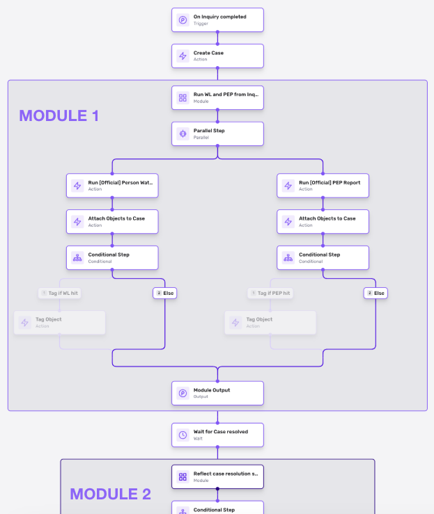
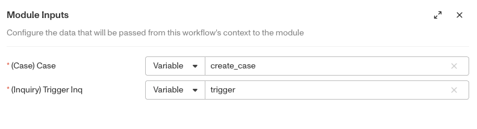
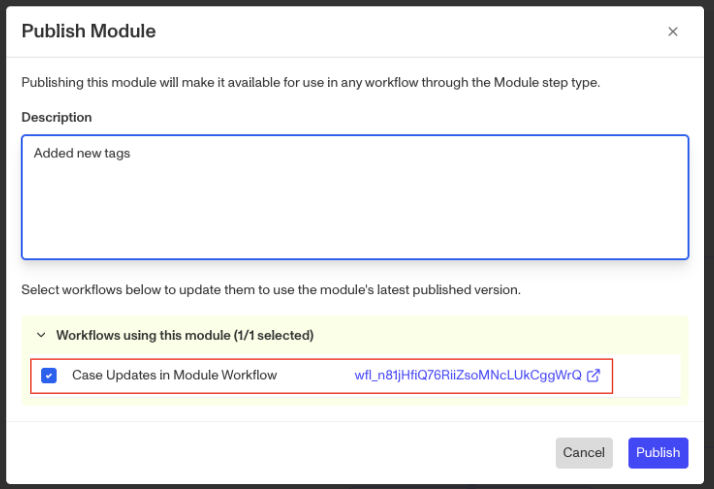
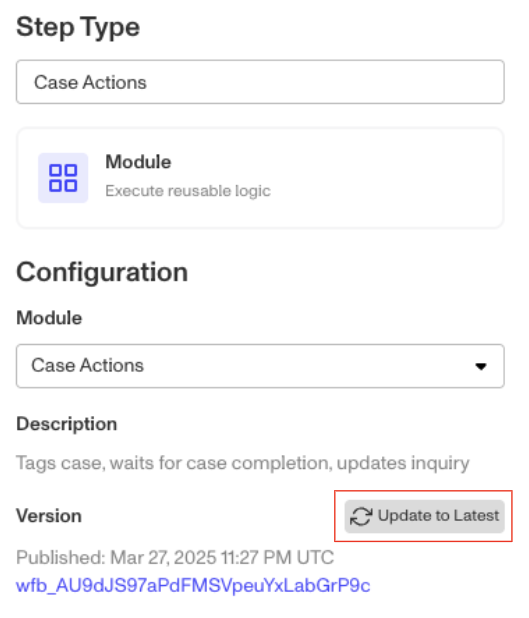

# Workflows: Module step

# What are Workflow Modules?

Modules are set of workflows steps with defined inputs that can be called/ inserted into multiple other workflows. Modules can never run on their own, they only run when called by a parent workflow.

# How do you create Workflow Modules?

1.  In the left side navigation click **Workflows**!
2.  Navigate to Modules and click **Create module**

[Modules tab within Workflows](//images.ctfassets.net/7fn0srsqjxkr/saKOCeGLd0itD126M5brf/eb0064124b5fda2156621e7ca4d00dc9/Screenshot_2025-03-25_at_1.23.37_PM.png)

3.  After naming your module, define your inputs in the Input Data step. Inputs allow data to be passed from a workflow to a workflow module, enabling steps within the module to interact with that data.

4.  Add the rest of your module workflow steps and save and publish the module.
5.  Next, add a Module action step to the workflow you’d like to call the module. Select the module you just created in the module dropdown, then finish configuring the inputs by specifying what data from the parent workflow you would like to pass into the module.

Adding the module action step means that when you run the parent workflow, it will execute all the steps in the module as part of that parent workflow run. Note that the module run will count as part of the parent workflow run (i.e., module runs are not double counted against their parent workflow run).

6.  When making changes to modules, all workflows that call that module will be shown and you can propagate the latest module version to its parent workflows.

You can also update to the latest module version in parent workflow (in module action step itself) with the Update to Latest button.

## What can you do with Workflow Modules?

### Simplify complex workflows

Workflows can get complex! By utilizing modules, workflow logic can be more easily organized and compartmentalized. You can also collapse modules, making it easier to visually manage workflows.

### Minimize redundancy of maintaining

Some customers have workflow steps that need to happen in multiple workflows. By using workflow modules to handle these common steps, builders can make it easier to build and maintain workflows. Instead of having to update multiple workflows for changes to common steps (an error prone process), edits can happen in one workflow module and get propagated seamlessly.

## Limitations

-   Nested modules are not currently supported (i.e., you cannot create a module within a module).
-   Modules are not currently supported in embedded workflows in Inquiry template editor or in Actions (i.e., only supported by Event, API, Recurring and Schedule triggered workflows).
-   Note that workflow modules are distinct from workflows (i.e. you should not assume every feature of workflows is inherited by modules). For instance:
    -   Modules’ runs never happen on their own. Every module’s run will only happen as part of the parent workflow that calls it, and is counted as part of that parent workflow run (i.e. a parent workflow run with a module run within it is still counted as 1 run). This is also what makes workflow modules different from scheduled workflows, as scheduled workflows maintain separate workflow runs for the scheduling workflow and the executed workflow.
    -   Modules themselves cannot be published through a staged rollout; however, a module can be called by a parent workflow that is published in a phased rollout.

## Examples

### Module to update and tag Cases

Customers want case assignees to have all the information they need in their case. This means many customers have multiple steps to update information from related objects to the Case and add relevant tags for organizational purposes. Creating a module to run those steps is useful because any changes in field mapping or tagging can be maintained and updated in a central module, rather than having to update / manage mappings in multiple workflows when new data is introduced or tag logic changes.

### Module for common workflow steps

Many customers have common business process steps that repeat across different use cases, which can lead to multiple workflows with repeated steps. For instance, given a trigger inquiry and a case created off of it, a customer may want to run a Watchlist and Politically Exposed Person report, attach the results to the case and apply a specific tag if there is a hit on either report. Putting these steps into a module can help reduce redundant steps across multiple workflows.

### Module to manage pushing data to external systems

Many customers have external systems that need to be kept up to date. For instance, updating an external system with inquiry status is important for business continuity but may have to happen across multiple workflows, in multiple places. Modules can help manage this by centralizing https requests and logic. This not only eliminates redundant steps across workflows, but also makes it easier to manage volume and troubleshoot any issues from external systems.

# Plans Explained

## Workflow Modules by plan

|  | Startup Program | Essential Plan | Growth Plan | Enterprise Plan |
| --- | --- | --- | --- | --- |
| Workflow Modules | Not Available | Limited | Available | Available |

[Learn more about pricing and plans](./6oZbzp7jb7AWGClF5vpY3K.md).
