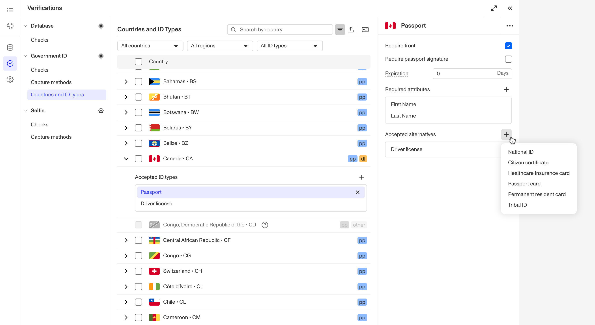
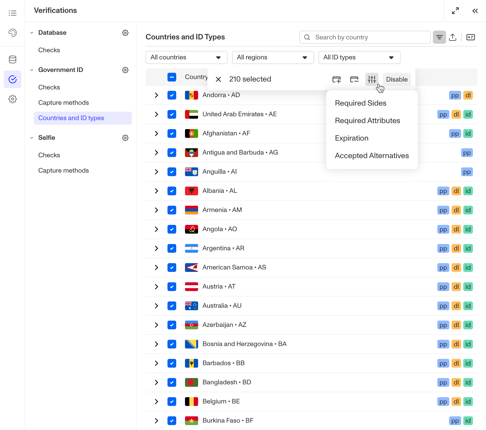
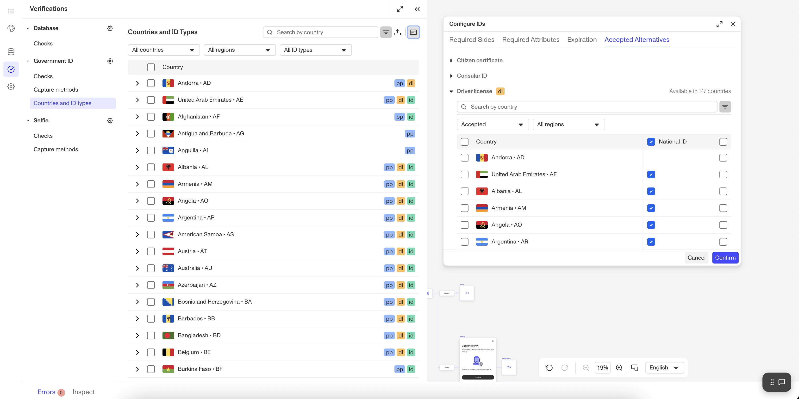
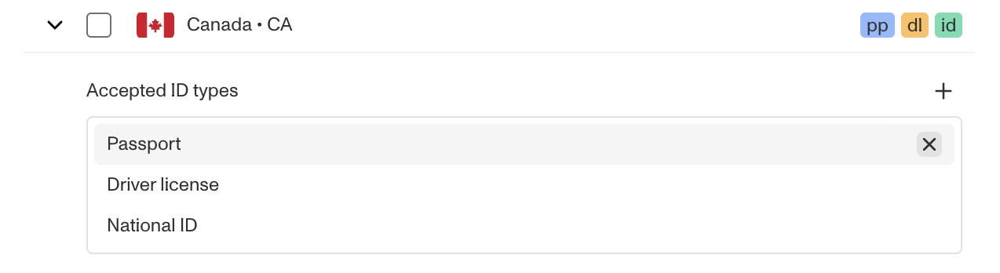
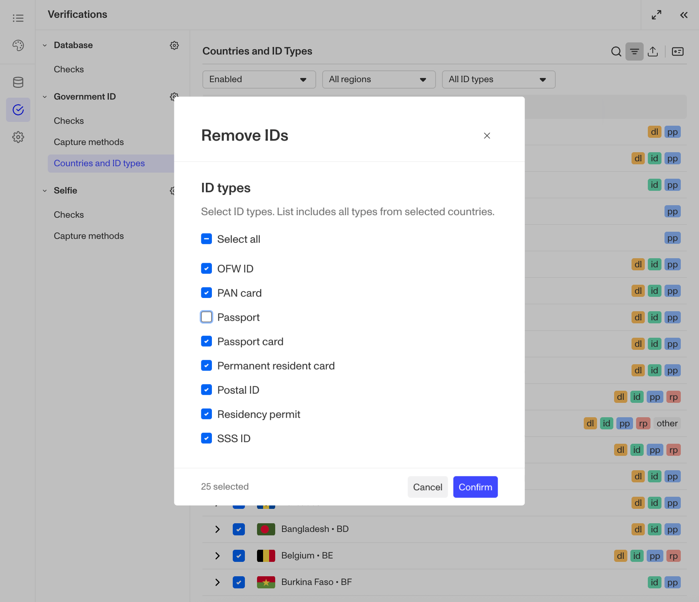
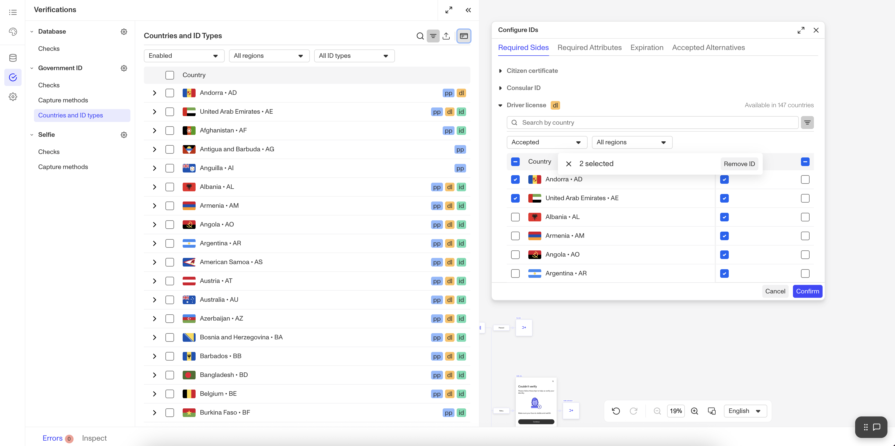

# Government ID Verification: Setting allowed ID types

# Overview

For a Government ID Verification, you can [set the accepted ID types](./21vQsGuteiH2m05oM297f3.md). For each accepted ID type, you can configure one or more alternatives to serve as fallback options.

Accepted alternatives are useful when end users confuse one ID type for another. For example, users might select Driver's License but inadvertently submit Passports, causing verification attempts to fail. This is an advanced configuration that should only be used in specific scenarios where you understand your users' behavior patterns.

To configure accepted alternatives:

## Step 1: Navigate to the Government ID Verification Template configurations

### For Government ID Verification Templates within an Inquiry Template

1.  In the Persona Dashboard, navigate to Inquiries > Templates. Select a template that uses Government ID Verification.
2.  Once you are in the Flow Editor, use the Left Panel to head to Verifications.
3.  Select the Government ID Verification template.
4.  Navigate to Countries and ID types.

### For Government ID Verification Templates used alongside a Transaction, Workflow, or via API

1.  In the Persona Dashboard, navigate to Verifications > Templates.
2.  Select the desired Government ID Verification Template that you'd like to change.

## Step 2: Configure Accepted Alternatives

You can configure accepted alternatives using three different methods depending on your needs:

### Method 1: Configure for an individual country

1.  Locate the country you want to configure in the Countries and ID types table.
2.  Click the chevron next to the country's name to view its accepted ID types.
3.  Select the ID type you want to configure alternatives for.
4.  In the ID configuration pane that appears:
    -   To add an alternative: Click the **+** button above the list of accepted alternatives and select an ID type from the dropdown.

-   To remove an alternative: Click the X next to the alternative ID type's name.

### Method 2: Bulk configure for multiple countries/ID types

1.  Select multiple countries using the checkboxes to the left of the table.
2.  From the floating action bar that appears, select the ID configuration icon.
3.  From the dropdown, select **Accepted alternatives**.

4.  In the Accepted Alternatives Overrides modal:
    -   Select the ID types you want to set alternatives for.
    -   Use the checkboxes to select the accepted alternatives from the available ID types.
    -   Note that any alternatives not selected will be removed from the selected ID types, as changes in this modal are applied as an override.

5.  Click **Confirm** to apply your changes.

### Method 3: View and edit alternatives across countries

1.  Click the **ID** button in the table actions to open the Bulk ID Configuration Panel.
2.  Navigate to the **Accepted alternatives** tab.
3.  This tab displays all accepted alternatives for each ID type across all countries, organized by ID type.
4.  Use the checkboxes to make your changes as needed.
5.  Click **Confirm** to save your configurations.

## Step 3: Save your changes

In the upper corner of the Flow Editor, click **Save**.

### Method 1: Configure IDs for an individual country

1.  Locate the country you want to configure in the Countries and ID types tab.
2.  Click the chevron next to the country's name to view its accepted ID types.
3.  To add an ID, click the + button above the list of accepted ID types. Select an ID type from the dropdown. The dropdown will show all available ID types for the selected country that haven't yet been added to your accepted list.

4.  To remove an ID, hover on an accepted ID type and click the X button.

### Method 2: Bulk Configure IDs for Multiple Countries/ID Types

1.  Select multiple countries using the checkboxes to the left of the table.
2.  From the floating action bar that appears, select the **Remove ID** button.

3.  In the Remove IDs modal:
    -   Select the ID types you want to remove using the checkboxes.
    -   The modal shows all ID types available in at least one of your selected countries. (Note that availability varies by country.)
    -   When you click **Confirm**, the selected ID types will only be removed from the countries where they're supported.
4.  Click **Confirm** to apply your changes.

5.  To add IDs, follow the same process but select the **Add ID** button instead.

### Method 3: View and Configure IDs Across Countries

1.  Click the **ID** button in the table actions to open the Bulk ID Configuration Panel.
2.  View the complete list of ID types from any tab. Click an ID type to see which countries offer it and whether it's currently accepted in your Verification.
3.  To add or remove an ID from a country in this view, select the country using the checkbox to its left. In the floating action bar that appears, click either Add ID or Remove ID.

4.  Click **Confirm** to apply your changes.

## Step 4: Save your changes

In the upper corner of the Flow Editor, click **Save**.

Important Note: When configuring accepted alternatives, the main ID type must always be included in the list of accepted ID types. If you remove the main ID type, the ID type check will fail even when the end user submits the correct ID type.

As usual, you will need to publish your changes for them to go live.

## Allowed ID types by Plan

|  | Startup Program | Essential Plan | Growth Plan | Enterprise Plan |
| --- | --- | --- | --- | --- |
| Government ID Verification allowed ID type/class configurations | Available | Available | Available | Available |

[Learn more about pricing and plans](./6oZbzp7jb7AWGClF5vpY3K.md)

## Learn more

-   You can also [set accepted fallback ID types for Government ID Verification](./PF0H0WuZaInkYNun8GTMg.md).

## Related articles

[Understanding Government ID Verification](./425G1MJXb8d9w6hTr7Huwg.md)

[Government ID Verification: Setting accepted fallback ID types](./PF0H0WuZaInkYNun8GTMg.md)

[Government ID Verification](./5vXD7S7pQCq8Q9Z4RztxLw.md)

[Configuring Government ID Verification checks](./3WnqX7N26sshPLKPQbuW4O.md)
