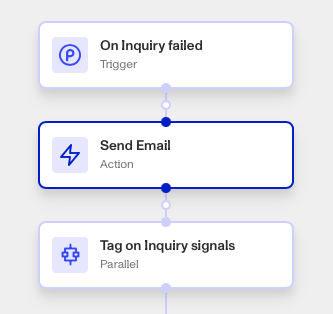

# Workflows: Send Email step

# What is Send Email?

**Send Email** is a Workflow Action step that sends a message to a user in an email.

Email addresses and messages can be pulled from other Workflow steps, triggers, or hardcoded to a specific value. This lets you automate communications such as updates and notifications to your users, as part of a Workflow.

The Send Email step is particularly useful when you need your user to take action, or when they should know that a critical process has completed or failed. It will often get a recipients attention slower than the Send Email step will (which should therefore be used more sparingly).

It's important to use the Send Email only when proper consents from users are collected.

# Formatting the Send Email step’s email content

The Send Email step also includes HTML formatting, so your communications can follow a particular layout or styling, such as font and background color. Persona recommends taking advantage of this feature to make communications appear professional and consistent.

⚠️ We recommend writing your email content for clarity. For example, use brief and precise language, and include any action needed from the user.

Some email clients do not support HTML. The Send Email step includes a Text Fallback entry box for these situations.

# Where do you add a **Send Email step**?

1.  Navigate to the Dashboard, and click on **Workflows** > **All Workflows**.
2.  Find and click on the workflow you want to edit, or **Create** a new workflow.
3.  Click on **+** when hovering over a circle to add an **Action**.

4.  Use the **Find Action** select box to click on **Communicate** > **Send Email**.
5.  Add a recipient email address, either manually or from another Persona object by clicking **+**.
6.  Add a subject line content, either manually or from another Persona object by clicking **+**.
7.  Add or edit the message to be sent along with the link, either manually or from another **Object** by clicking **+.**
8.  (Optional) In ‘Advanced Configuration’, click the **Continue on error** box if you want the Workflow to continue running even if this Action raises an error.
9.  **Close** the Action. You’ll have to **Save** and **Publish** the workflow to begin using it.

# Plans Explained

## Send Email step by plan

|  | Startup Program | Essential Plan | Growth Plan | Enterprise Plan |
| --- | --- | --- | --- | --- |
| Send Email step | Not Available | Not Available | Available | Available |

[Learn more about pricing and plans.](./6oZbzp7jb7AWGClF5vpY3K.md)

# Learn more

Emails can be sent using the Send Email step instead. There are also designated Workflow action steps for sending links via SMS, such as Send Inquiry Link SMS.
