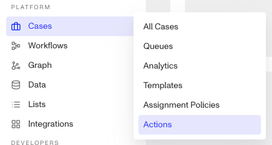
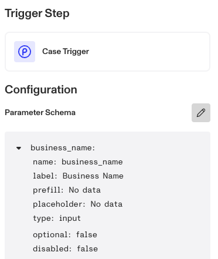
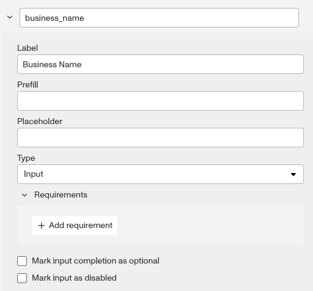
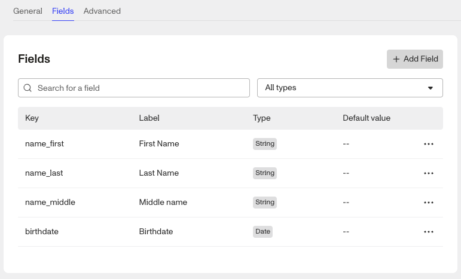
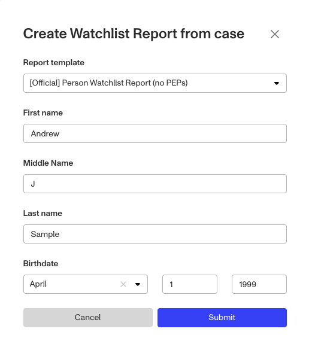

# How to Prefill Case Actions?

⚠️ This question came from a member of the Persona Community - a customer that wanted to auto fill, or prefill, the fields from a case template into a Case Action running a Watchlist Report.

## What is Prefill?

When creating an Inquiry for a specific end user, you can populate end user data into inquiry fields before sharing the inquiry link with the end user. This is known as [Prefilling an inquiry](./79Y8gi2c0QnOzDax63LfDF.md). You can also do the same with [Case Actions](./3QokSTOfV7ZC7hNDPQ5HnT.md), but instead of providing the required data via the dashboard or via api you can configure the Case Action to pull the data from the Case itself.

The Case Action can also be configured to populate the data from the attached inquiry and/or account and we’ll outline those steps below.

### Steps

1.  Go to the **Cases > Actions** page.

2.  Click and open the **Cases > Action** you want to set for Prefill. To learn how to create a Case Action, look [here](./3QokSTOfV7ZC7hNDPQ5HnT.md).
3.  Click the trigger Step at the top of the workflow called **On Click**. This will open a side panel with the Parameter Scheme.

4.  Click the pencil edit icon to open the edit modal. Within the modal, each field has a dropdown listing each of the field attributes: `Name`, `Label`, `PREFILL`, `Placeholder`, `Type`, `Optional`, `Disabled`. Also within the model you’ll see a preview input screen with the relevant input components.
5.  Select a field, click it’s drop down.

6.  In the Prefill field, enter `case.fields.<field name>`. So for the example of Business Name above, `case.fields.business-name` . Be sure to check that the field name matches the field name from the object. For example, you can go to the Settings of a case template to check how the fields are key’d. You can do the same if you’re populating the values from an inquiry or account.
    
    -   If you’re populating the values from an inquiry or account, you’ll need to modify the object path in the Prefill field to either, `inquiry.fields.<field name>` or `account.fields.<field name>`.
    
    
    
7.  Once you’ve added all the Prefills required for the Case Action, you’ll need to Save & Publish the Case Action workflow.
    

## Testing

To ensure the Case Action has been configured to prefill correctly, open an existing case using the case template with the case action.

Open the Case Action model using either:

-   Clicking the three dots at the top right of the case, and select the case action
-   Click the button linked to the case action.

Once you’ve opened and selected the case action, you should see the configured fields populated with the relevant values from the case.

📌 This answer was last updated on April 29th 2025 by Ryan Cole, a Growth Content Manager at Persona. FAQs, unlike other articles, are written to provide Persona Community members more specific answers to common questions. While we periodically review responses and answers, please note when this FAQ was last updated as information may have changed since then.

## Related articles

[Cases Actions](./3QokSTOfV7ZC7hNDPQ5HnT.md)

[Using Inquiry Prefill](./79Y8gi2c0QnOzDax63LfDF.md)
