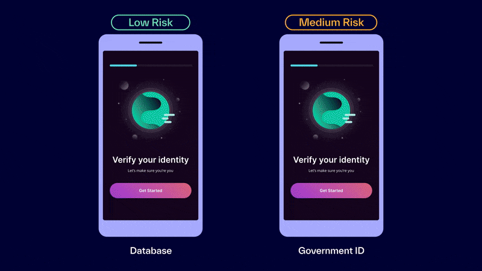
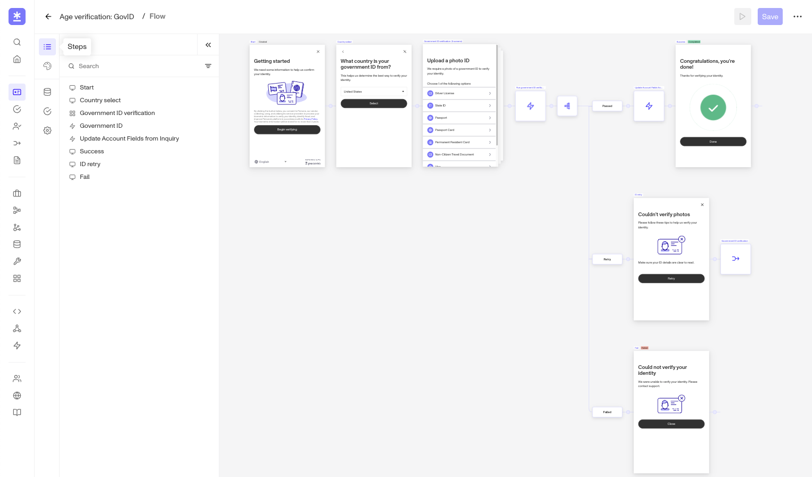
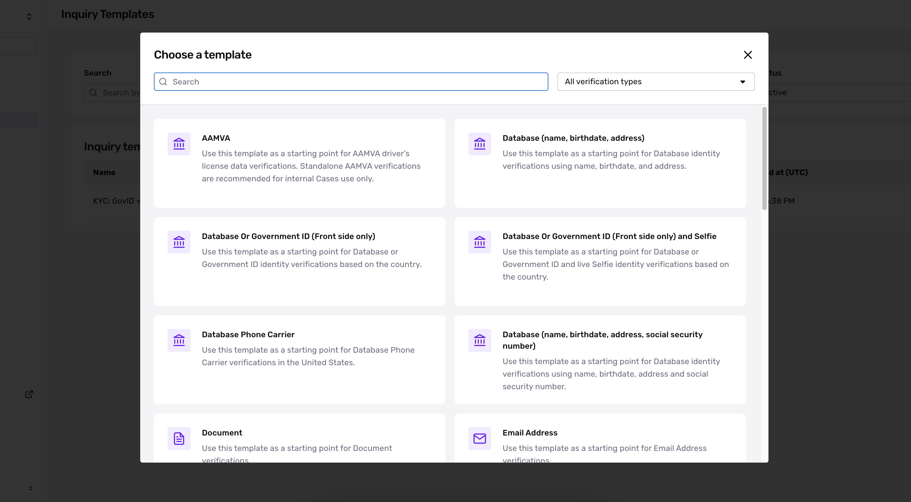

# What are Inquiries/Dynamic Flow?

**Inquiries** (also referred to as Dynamic Flow) is Persona’s product for securely collecting PII (personally identifiable information), such as IDs, passports, selfies, SSNs, birthdays, and phone numbers. You can use it to build Flows that maximize conversion for real users, while stepping up friction to keep bad actors out.

People often ask, “What’s dynamic about Dynamic Flow?” It refers to the ability to set conditional logic that adjusts an Inquiry’s level of friction. This essentially means that you can design Inquiries to force riskier users to submit more information. All Inquiries now use Dynamic Flow by default.

## What can you do with Inquiries?

1.  **Collect information securely across platforms**
    -   Inquiries lets you securely collect a wide array of user information—such as IDs, documents, and more—and choose which data to verify.
    -   It provides a customizable UI for users to upload their information. Persona provides the UI to ensure that information is handled securely and minimize user error via built-in live guidance, auto-capture, and seamless device hand-offs. You can present this UI to your end users on web or on mobile. It can be embedded in your app, or be shared as a simple URL.
2.  **Deter fraud dynamically without hurting conversion**
    -   Behind the scenes, you can configure the logic of your collection flow. You can set the template to dynamically adjust friction—helping good users convert faster, while requiring riskier users to provide more information and flagging bad actors for review.
3.  **Create custom flows without custom code**
    -   You can customize your entire collection flow with a visual no-code editor—from the branding and copy of each screen to the decision logic that powers the user experience.

## What role does Inquiries play in identity management?

As the first step in most Persona solutions, Inquiries perform two important functions:

1.  Inquiries configure conditional, rule-based logic that automatically adjust end-user friction to force riskier users to share more information.
2.  Although it can be strictly used for collecting information, it can also prompt Persona to run [**Verifications**](../verifications.md), Persona’s product for authenticating user information.
3.  By default, Inquiries generate a Persona Account for every end user who starts the flow to track their verification attempts over time, support user reverification, and improve your chances of detecting fraud.

---

# Key terms for Inquiries

-   **Inquiry**
    -   Every individual instance of requesting information from users is called an **Inquiry**. You can think of an Inquiry as “a single instance of an individual undergoing identity verification,” since this is the role that the Inquiry plays in the identity management process.
    -   Inquiries are not identity verification. Together, Inquiries and Verifications can make up a basic KYC process—you can think of them as two acts of a play. Inquiries and Verifications require each other to work, but are not the same thing: Inquiries collect PII, while Verifications authenticate that information. [More on Verifications →](../verifications.md)
-   **Run**
    -   A **run** is a single instance of a product or feature being triggered.
-   **Flow**
    -   A **Flow** is the actual collection UI that your end users see in your product. [Learn more about Flows →](./6CiQpUM6lROr10QmRXAqrP.md)
-   **Inquiry**
    -   **Inquiry Template** is the sum of everything a user sees while going through an Inquiry. While it _includes_ the Flow, it also encompasses its visual theme, required Verifications, additional configurations, and built-in logic.
    -   ⚠️ For the purposes of this article, it’s safe to just refer to this as a **Template**, but note that you may see the word Template elsewhere in Persona’s platform, where it may mean something different.
-   **Flow Editor**
    -   **Flow Editor** is the no-code tool in the dashboard that you can use to quickly build, style, and launch an Inquiry Flow to serve your users a smooth, branded experience.
    -   You can find the Flow Editor by clicking into any Templates listed under Inquiry in your Dashboard.

## Check your understanding of Dynamic Flow

Now that you’ve learned all the terms, let’s put them together.

📖 Here’s how someone might confidently explain Dynamic Flow to their team:

> -   Every time someone signs up for Elephant Credit, Persona runs an **Inquiry** to collect their PII.
> -   When the **Inquiry** runs, Elephant Credit’s new user begins a **Flow** that was configured by Elephant Credit’s compliance team in **Flow Editor**.
> -   With the custom colors, logos, and copy, the overall **Template** makes users feel like they’ve never left the Elephant Credit app. But behind the scenes, the **Inquiry** does two more things:
>     1.  It prompts **Verifications** to check the user’s PII.
>     2.  It either creates a new Persona account for this user or adds to their existing Persona account within Elephant Credit’s Persona dashboard.Both actions enable Persona’s other products to track multiple verification attempts, deter bad actors, generate Reports, provide additional context on individual identities, and detect fraud.

# Inquiry Templates

In your dashboard, Inquiries are organized into Templates. Templates dictate the entire end-user experience of an Inquiry, from the structure of the Flow to its appearance, Verification types, and underlying logic.

You can create Templates from scratch or find and build upon preconfigured Inquiry Templates, which have been designed for specific use cases and verification types.

To see Inquiry Templates in your Sandbox or Production dashboard, navigate to your sidebar and click **Inquiries → Templates.**

# Integration methods

You can choose from several options for integrating Inquiries into your user journey, depending on your engineering capacity and preferences for UX.

-   [Hosted](./4pZBZYAFLkKMyXycGeAMV2.md) (no-code) - Send users a link to your Flow (hosted by Persona).
-   [Embedded](./Jx6UeQzh5tVSkoynev7bt.md) - Seamlessly verify individuals via a fully embedded Flow within your website.
-   [Mobile SDK](./ac6Uc0xr5PsLoqKB0CHPr.md) - Implement Persona directly within your native Android or iOS app
