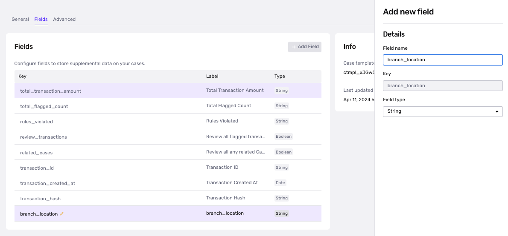

# Create Alert and SAR Cases

A Case represents a collection of data about an end user that needs to be investigated and requires a decision from your organization. You may need to investigate this end user for a variety of reasons:

-   **Transaction monitoring review**: Are there suspicious transactions associated with this user that require further investigation?
-   **Fraudulent activity**: Are there suspicious signals associated with this user that require further action (e.g. account freezing, sending a follow-up inquiry for verification, etc.)?
-   **Account takeover investigation**: If a user is claiming that their account has been taken over, is there enough information to validate their claim?

Case creation is commonly used alongside Transactions. Within Persona, Transactions represent a distinct user journey or significant event in your product. Oftentimes, high-risk transactions may require additional investigation and serve as a trigger to create a case. Please refer to Persona [developer documentation](../../docs/docs/cases.md) for more details on the case API endpoints.

# Creating an Alert or SAR Case

You can use the [`Create Case`](../../docs/reference/create-a-case.md) API endpoint to trigger the creation of a new case whenever there is a transaction monitoring alert within your internal or third-party transaction monitoring solution.

When creating a case, specify the Alert and SAR case template IDs that have been configured for your organization (e.g. `ctmpl_abc123`).

# Updating Case Data

Case data can be updated via API through Persona Transactions **or** by directly updating case fields.

# Using Transactions

Persona [Transactions](./5mzXj1PHBXtX5UlYbfZyvx.md) represent significant interactions or events (e.g. a transaction monitoring alert is triggered). Transactions enables flexible modeling via custom field schemas and custom statuses and sit alongside Accounts as foundational objects within Persona.

When an alert is triggered within your transaction monitoring system, you can create a Persona Transaction to pass in information such as the transaction data, amount, currency, and rules violated.

Once you’ve defined your transaction type and field schema, we will work with you to configure your Workflow such that an Alert case is created whenever a new Persona Transaction is created.

Using Persona Transactions enables you to auto-fill capabilities for the SAR form. Auto-fill functionality may be limited when solely relying on case fields.

# Using Case Fields

When creating a case via API, you can pass in your external transaction data via the case fields enabled for your case templates. These fields are entirely configurable.

## Add additional fields to your template

-   In the dashboard left-side navigation bar, click on **Cases > Templates**.
-   Click on the template whose fields you want to update, then go to **Settings > Fields**. Here, you’ll be able to define new fields for your template.

These fields can be populated or updated via API at case creation or using the [`Update a Case`](../../docs/reference/update-a-case.md) endpoint.

