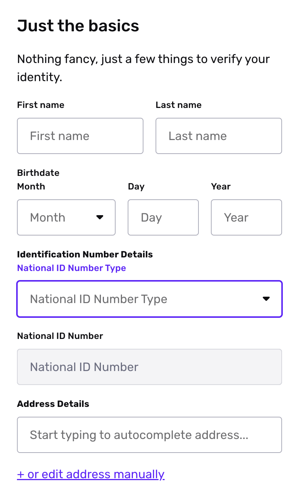
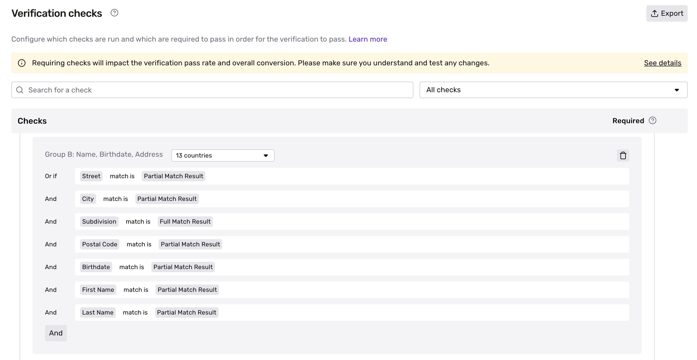

# Database Verification (Canada)

_The ability to use the pre-built Database Verification (CA) solution is available on select plans. Customers can contact your Customer Success Manager or [Customer Support](https://app.withpersona.com/dashboard/contact-us) for more information._

## Database Verification (CA) Features

Persona's Database Verification product offers the ability to verify attributes of an individual against authoritative Canadian databases. This helps your business gain an understanding of users associated with Canada. Using the out-of-the-box Canadian Database Verification, you can verify attributes like name, date of birth, address, and certain national identification numbers against known matches in authoritative databases.

Learn more about [Database Verification](./7dcdaIsMttmPUZ2ZelRbZD.md).

### Inputs

Using the default set up for Canada Database Verification, users are asked to provide their details through an Inquiry flow. There are 4 required inputs for Database Verification (CA):

1.  Name of the individual
2.  Birthdate
3.  National ID - Social Insurance Number (SIN)
4.  Address details

_An Inquiry template's Screen Step that is used in the default solution for Database Verification (CA) to collect the necessary attributes to run the Verification._

### Outputs

The Database Verification checks whether the information above presents a sufficient match in our Canadian databases. To learn how to understand Database Verification results, check out [this article](./7Lh9MkK1DUczNlAe4EB6oW.md).

📌 These are the required inputs in our off-the-shelf solution for Database Verification from this country. More attributes, such as country-specific national IDs, are verifiable. Active customers can view our complete coverage map in the **[Persona Dashboard > Documentation > Coverage Map.](https://app.withpersona.com/dashboard/resources/coverage-map/database)**

## Configuration Options

The default attributes and match configurations on the out-of-the-box Database Verification (CA) solution are recommended settings suitable for most businesses seeking a balance of high assurance and user conversion.

Advanced configurations such as type of authoritative database matched against, options for matching against issuing databases, additional attribute verification (phone number, email address, etc), and per attribute advanced match requirement configs are available on our Enterprise plan.

### Match Requirements

The Database Verification configurations and checks specify what it means for a user’s information to “match” against a known database.

The match requirements rules for Database Verification (CA) can be viewed and adjusted under the **Identity Comparison** check when viewing your specific Verification Template in the dashboard. It is recommended to proceed with caution when deviating from the default match requirements for Database Verification (CA) as it can directly impact your user's ability to proceed through the Inquiry flow.

_An example of match requirement configurations for a Database Verification._

## Plans Explained

|  | **Startup Program** | **Essential Plan** | **Growth Plan** | **Enterprise Plan** |
| --- | --- | --- | --- | --- |
| Database Verification (CA) | Not Available | Not Available | Available | Available |

[Learn more about pricing and plans](./6oZbzp7jb7AWGClF5vpY3K.md)
