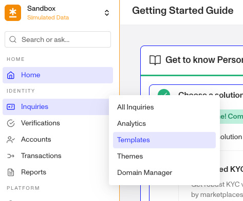
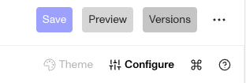
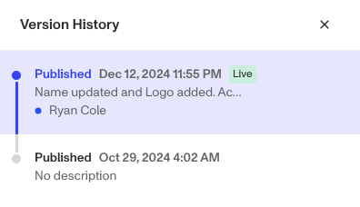

# Inquiry Template Versions and Change Management

# Overview

nquiry Templates in Persona support version management, allowing you to draft, publish, and maintain multiple versions over time. This enables safe iteration, controlled releases of changes, and the ability to audit or revert prior configurations as needed.

| **Persona Object** | **Object ID syntax** | **Object ID versioning syntax** |
| --- | --- | --- |
| Inquiry Template | Begins with `itmpl_` | Begins with `itmplv_` |

# Draft and publish

When you update an Inquiry Template, Persona creates a **draft** version. Drafts allow you to make incremental changes and save progress before committing those changes live. You can edit a draft multiple times. Once you are satisfied with your changes, publishing the draft will create a new version of the Inquiry Template.

After publishing, the new version becomes the live version used to generate any new Inquiries. Published versions are locked from further editing. To make additional changes, you must create a new draft based on any existing version.

💡 Inquiry Templates can reference and embed Verification Templates. When you edit an Inquiry Template that includes embedded Verification Templates, any configuration changes to those embedded templates are automatically captured as part of the Inquiry Template's draft.

In this way, an Inquiry Template can have many Inquiry Template versions associated to it. For a given Inquiry Template, only one version is currently live and in a published state , and there may be one that you are actively editing and is in a draft state.

## Live version behavior

Once published, an Inquiry Template version is considered **live**. Any new Inquiry created after publication uses the latest live version.

-   Each Inquiry is permanently linked to the version of the Inquiry Template that was live when it was generated.
-   When you publish additional versions, any new Inquiries will use the latest live version, while previously generated Inquiries will continue to reference the version from which they were originally created.
-   This ensures that existing Inquiries maintain their integrity and are not affected by changes made to newer template versions.

# Version history

All published versions of an Inquiry Template are recorded in **Version History**. This provides a full audit trail of changes over time.

### How do you view Version History?

1.  Navigate to the Dashboard, and click on **Inquiries > Templates.**

2.  Select the **Inquiry Template** you want to review.
3.  Click **···** to access the Overflow Menu and click the **Versions** button.

4.  The **Version History** will show in the overflow menu on the right.

### Reverting to a previous version

-   If you need to undo changes or roll back to a stable configuration, you can revert to any prior version in Version History.
-   Reverting publishes the selected version as the new live version without altering the content of prior versions. Existing Inquiries already linked to earlier versions remain unaffected.
