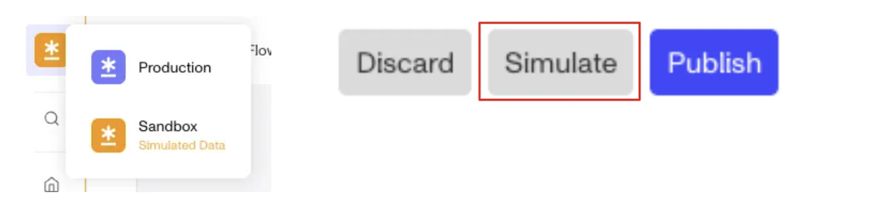
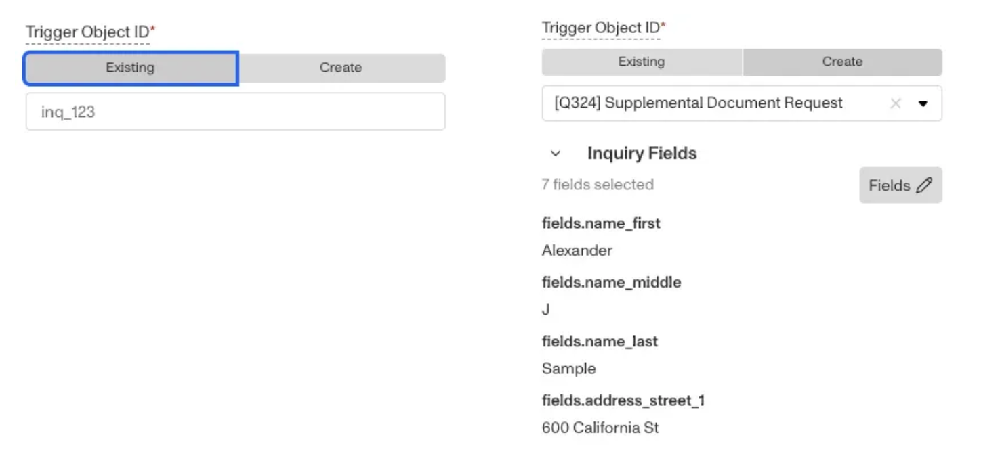
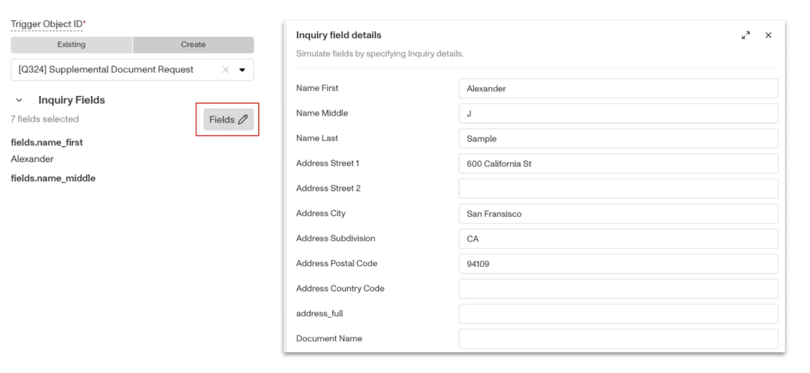
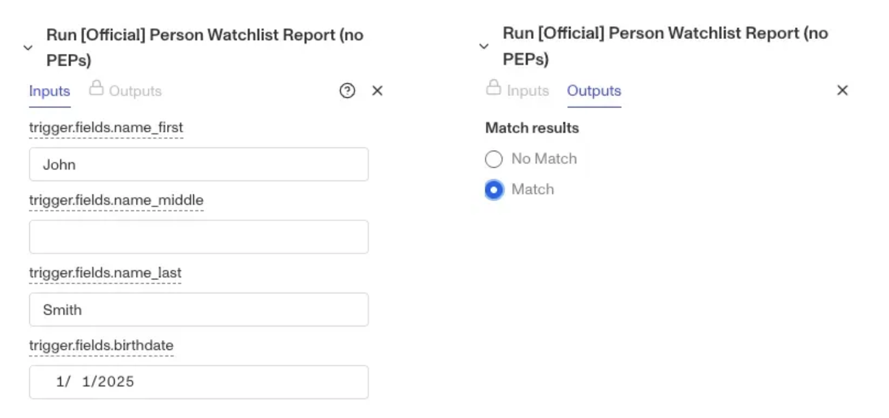
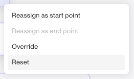
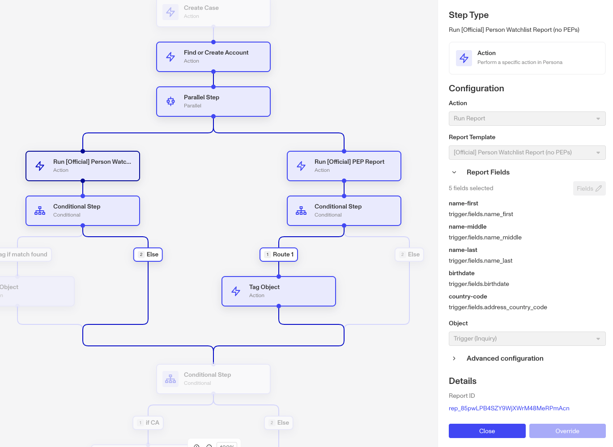
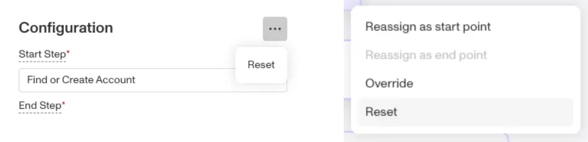

# Test Workflows with Simulate

# What is Simulate?

**Simulate** is a feature within the Sandbox environment that allows builders to test workflow outcomes and safely debug changes. It’s a powerful tool for validating logic without impacting production data.

With **Simulate**, you can:

-   Make changes more confidently by simulating workflow runs safely in a sandbox environment. You can use existing trigger objects or create new ones easily.
-   Simulate the full flow or pick your start and end points to simulate only the workflow segment you care about.
-   Override step inputs (i.e. field values) or outputs (i.e. report match results)—to easily test every branch of your workflow.

# How to Use Simulate

1.  Switch to a Sandbox environment and click **Simulate**.

2.  To start a simulation, indicate the start and end steps in the Configuration panel or right-click a step to re-assign it as a start or end point. You can simulate an entire workflow or just a portion of your workflow.

When selecting start and end points, they must share an execution path at the same level. This means for steps that have children (i.e., parallel and conditional steps), you cannot start a simulation at a parent level and end at a child level. When you select a parent step as an end point, the simulation will include all its children.

3.  Provide a trigger object for your simulation; this is the object that will provide the inputs for the simulation. You can either select an existing trigger object by providing an ID or create a new one by simply specifying the template. You can also choose to not provide a trigger object and manually configure overrides to provide the inputs required for your simulation.

When creating a new object, you can also click into the collapsed field section to update field values on the record, otherwise defaults will be used.

4.  The overrides section allows you to manually provide step inputs or outputs. Overriding a step input lets you stub in information to be used by the step (e.g., providing name and address values for a run report step). Overriding an output means specifying the result you want from a step (e.g., report match found).

Required overrides are shown by default (i.e., in the case you opted to not provide a trigger object), but you can add additional overrides by right-clicking on a step. This can be helpful in testing every branch of your workflow.

5.  To run the simulation, click the **Run** button in the top right. After the simulation runs, you will be able to see the run path and step details, including links to records created (i.e., report IDs).

Please note that the **Run** button becomes available once all configuration errors are resolved. If you’re not able to click **Run**, check the Diagnostics panel to view outstanding errors.

6.  Clicking the **Clear Run Path** button on the top right will clear the run path but retain your simulation configuration.

Clicking **Reset** will clear both the run path and all configurations. You can Reset in the Configuration menu or by right clicking a step.

# Limitations

-   Simulate is only available in Sandbox environments, you cannot simulate in production
-   Simulate is only available for Inquiry, Case and Transaction event trigger workflows. API, Recurring, Scheduled and other event triggered workflows are not currently supported.
-   Simulate is not available for Workflow Modules. To simulate changes to a Module, you must simulate it from its parent workflow. Start and end step selection is also not supported within a module. A module step must be run its entirety.

## Related articles

[Sandbox vs. Production Environments](./6I2kGhfPvSuUjYq4z6tpmB.md)
