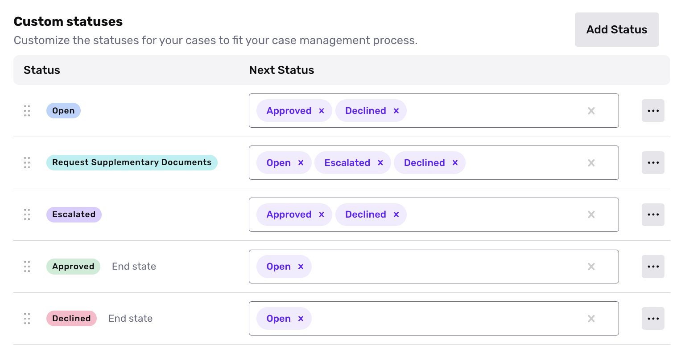
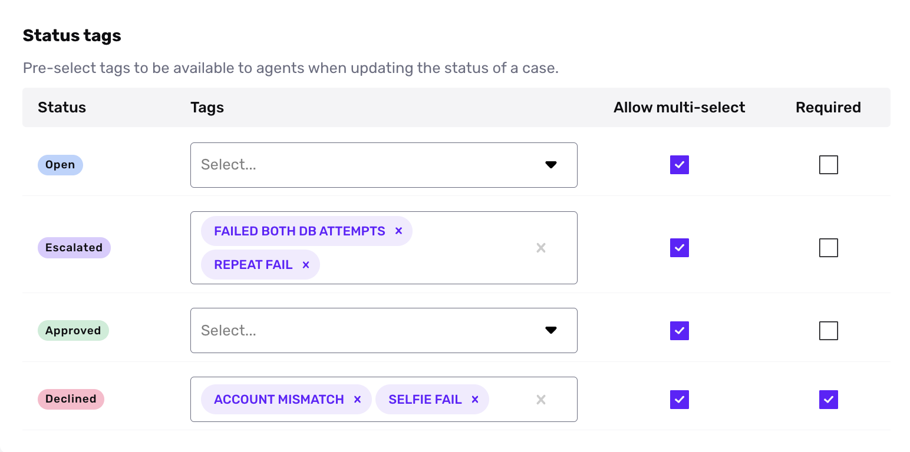

# Case Status

_The ability to add custom Case Status and Status Tag is available on the Growth plan. If you want to upgrade, please contact us [here](https://app.withpersona.com/dashboard/contact-us)._

## Overview

Case Statuses can be used to mirror your preferred workflow or your case management process. You can use default statuses or create your own so that your case flow reflects the way your team operates. You can also run analytics against your statuses to understand a breakdown of all the cases by case status and understand where bottlenecks for your cases are occurring. 

## When to use Custom Case Statuses

While Cases come with default statuses, you may want to use custom statuses to map to your exact workflow. For instance, some common use cases for statuses include: 

-   Tracking stages within your operational process 
    
    -   E.g. _new request → transfer initiated → ready to order → ordered_
-   Coordinating review between two manual review teams
    
    -   E.g. _Open → Approved by Team 1 → Declined by Team 1_
    -   E.g. _Open → Approved by Team 1 → Approved by Team 2 / Declined by Team 2_
-   Reflecting steps in your team’s review process
    
    -   E.g. _Open → Review in Progress → Awaiting Documentation → Approved or Declined_

## How to add a custom status

Each Case template has its own set of custom statuses.

To add a new status to a Case template:

1.  In the Dashboard, select **Cases** > **Templates** in the navigation bar.
2.  Select the Template you want to edit.
3.  On the top right, select **Settings** > **Advanced**.
4.  In the Statuses section, click **Add Status**.

## Status tags

You may want to more granularly understand metrics behind why cases are being manually approved or declined.

To help you with this goal, you can configure status tags. The status tags feature lets you specify a set of tags for each status in a Case template. Tags appear as choices that agents can select as a “reason for status change” when they approve, decline, or change the status of a case.

For each status, select "Required" if you want to require agents to select a status tag as a “reason” when they change the status of a case to that status.

