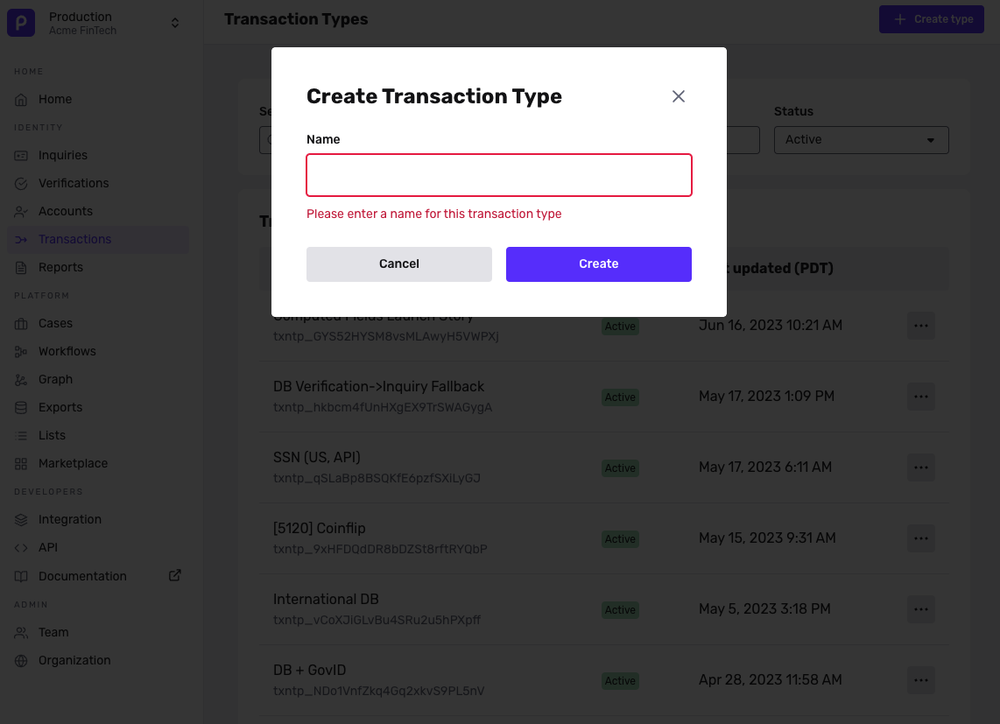
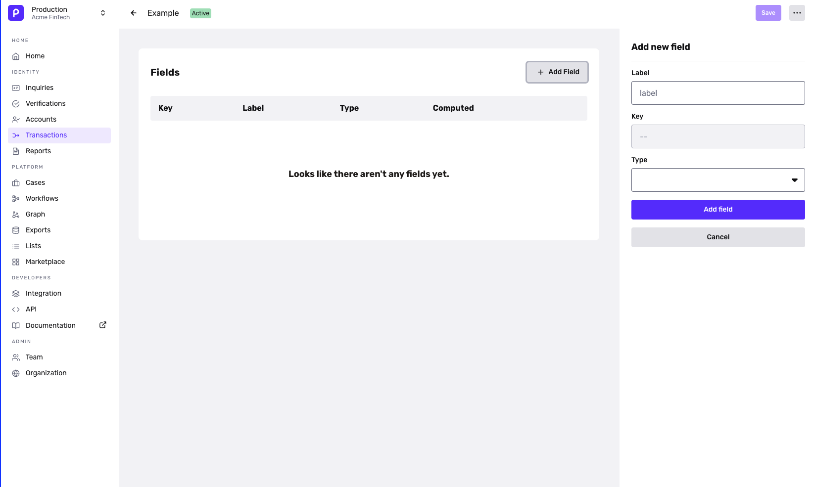

# Transaction types and fields

# Transaction Types and Fields

Transactions represent any type of event or interaction within your user lifecycle. Customers define the Type and the field schema for the Transaction object

## Create Transaction Type and Associated Fields

For each Transaction Type we can define a schema of what information will be passed in during creation. Each type will have a transaction type ID.

1.  Create your Transaction Type and name it.

2.  You'll then set your fields, which represents the information you expect to be passed in each Transaction. You can see the supported Transaction types [here](../../docs/docs/transaction-types.md). **Keep in mind the key for each Transaction field can be referenced in Workflows for future use.**

