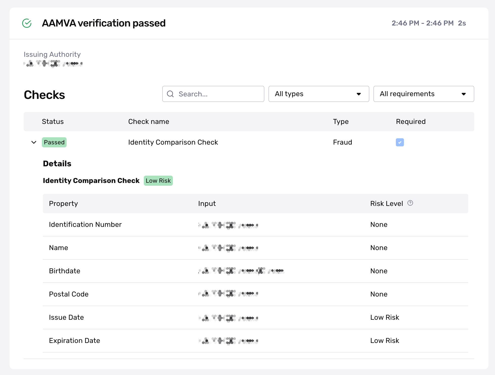
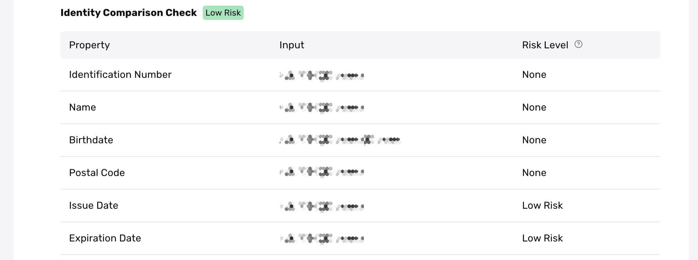
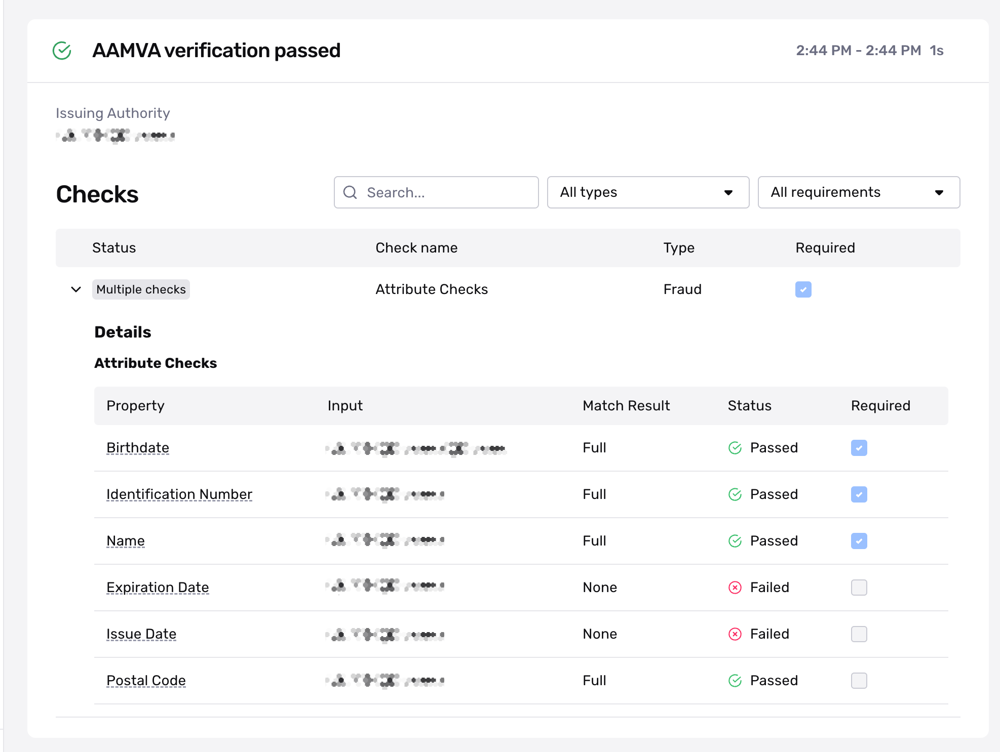
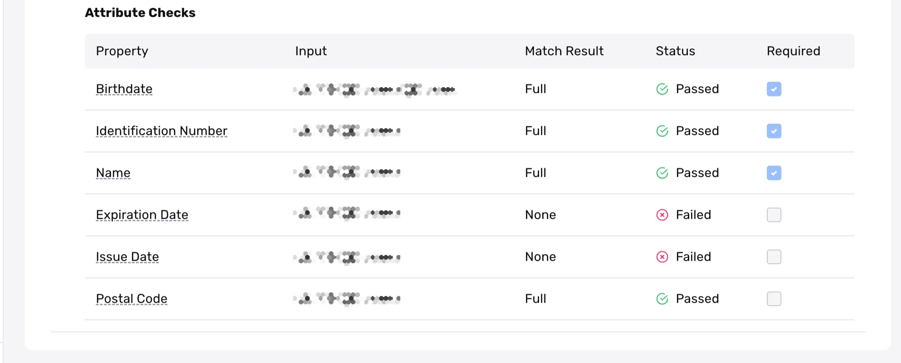
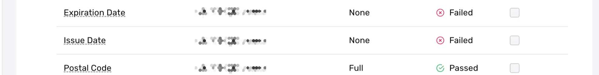

# Understanding AAMVA Verification results

# Overview

American Association of Motor Vehicle Administrators (AAMVA) Verification validates identity by comparing data from U.S. driver's licenses and state ID cards against official Department of Motor Vehicles (DMV) database records. For more details, see the [AAMVA Verification overview](./1wiQ7wAhmnKh6mesCGopKl.md).

This page examines an example of an AAMVA Verification and guides you through the results. You'll learn how to interpret Verification checks and understand why they **passed** or **failed**.

ℹ️ Note: A Verification run represents a single attempt to verify specific information. Within an Inquiry, users may get multiple Verification results due to user error, network issues, or other configureable factors in Persona. For this reason, we recommend reviewing, listening, or retrieving the status of the parent Inquiry or Transaction rather than individual Verifications. This approach allows you to use Inquiry Templates or Workflows to better evaluate approval conditions, declines, and cases needing additional review.

# Example AAMVA Verification run result

As an example, we'll look at a AAMVA Verification that checks whether the submitted information matches AAMVA databases. We'll walk through the example Verification below, section by section.

Note: Input field in these screenshots is intentionally blurred for privacy, but represent the actual data submitted during verification.

# Overall Verification run result

When viewing an AAMVA Verification run, you’ll first see the overall Verification result. In this example, the AAMVA Verification **passed**.

This top-level status is commonly in a “**passed**” or “**failed**” state. The information below explains why it “**passed**” and shows the Verification Template configurations that led to that “**passed**” status.

Here’s how to understand Verification results and their status:

## A note on Inquiry status vs. Verification status

A common best practice for solutions within Persona is to rely on statuses. For example, when integrating via Inquiries (Hosted, Embedded, or Mobile SDK), businesses typically listen for the status of an Inquiry to decide whether a user should proceed within a user experience or not—if **passed**, otherwise it may require additional review. That additional review allows you to automatically or manually review the different verification attempts by conditioning on or reviewing the statuses of those verifications. You can also go one level deeper and review the statuses of the verification checks within a Verification to further understand the exact reasons for Verification failures.

These different statuses, let you quickly determine if an identity meets your Verification threshold and which ones don't. It gives you the ability to automate the attempts you feel most confident about, while leaving a pathway open for the longer tail, more complicated situations. For those complicated situations that need review—such as higher-risk, failed, or declined identities—you can drill down into specific details based on what you need to investigate further.

## Issuing Authority

AAMVA Verification is an issuing data source. Issuing data sources (such as the Department of Motor Vehicles (DMV) and Social Security Administration (SSA)) provide enhanced verification and higher levels of assurance against fraud by validating inputs against official records. For details about checks performed against the Issuing Authority database, refer to the Identity Comparison Checks section.

# Verification checks

## What are Verification checks?

Verification checks evaluate specific aspects of the submitted information. Each Verification type has its own set of Verification checks that run instantly during the Verification run. A check can result in one of three statuses: "**passed**,” "**failed,**" or "**not applicable (N/A).”** The following section explains these statuses in detail.

## What does each Verification Check mean?

Every Verification Type has it's own Verification Checks, as each type verifies different pieces of information. For a complete look at the definition of Verification Checks per Verification Type, active customers can view a complete list of Verification Checks and associated failure reasons by going to **Documentation > [Verification Checks](https://app.withpersona.com/dashboard/resources/verification-checks)** in your Persona Dashboard.

## What do Verification check results look like?

Let's zoom in on all the checks.

Here's what each column means at a high level:

-   **Status**: This is a high-level result of the check. Possible values are:
    -   `Passed`: The check passed in the Verification attempt and meets the check’s configuration.
    -   `Failed`: The check failed in the Verification attempt and does not meet the check’s configuration.
    -   `N/A`: Not applicable. The check was not evaluated in the Verification attempt. This may happen because this check’s configuration depends on a piece of information that was not collected as part of the Inquiry and the check can not be performed.
-   **Check Name**: The name of the Verification check.
-   **Type**: If a Verification check falls into the `Fraud` or `User behavior` category.
    -   `Fraud`: Checks in this category are designed to help catch fraudulent submissions. If a check in this category fails, there may be a higher chance the submission is fraudulent.
    -   `User behavior`: Checks in this category are designed to flag instances when a user submits information that does not meet the quality bar Persona requires. If a check in this category fails, it does not necessarily indicate a higher chance that the submission is fraudulent. Note: You may see this as `user action required` in the API response.
-   **Required**: The Verification checks required to pass in order for the AAMVA Verification to successfully complete.

### How do I know if a Verification check is required?

In this example, we see that one Verification check was [required](./7IAy61dAMRDQ1Q77ugwpcA.md) (indicated by the blue checkmark in the Required column). The check **passed.** While reviewing non-required Verification checks is common practice, consider updating your Verification Template to require any check whose failure would be unacceptable. This ensures future Verification runs will properly evaluate these critical checks.

## Verification check details

Some Verification checks offer deeper levels of information allowing you gain an even granular view of what information was checked or verified. In this example, we'll take a look at the Identity Comparison Check or Attribute Checks, which is a main feature of the AAMVA Verification.

You may see AAMVA Verification Check results displayed either as an expandable Identity Comparison Check or combined Attribute Checks. We'll go over both below.

### Identity Comparison Check for AAMVA Verification

The Identity Comparison Check details are expanded by default. This check provides a detailed view of the inputted attribute's match quality and its associated risk level relative to the data source

Here's what each column means at a high level:

-   **Property**: The type of information about the user—also known as the field.
-   **Input:** The information the end user inputted or was extracted from the Government ID.
-   **Risk Level**: The risk level
    -   `High Risk`
    -   `Medium Risk`
    -   `Low Risk`
    -   `None`

### Attribute Checks for AAMVA Verification

The Attribute Check will show when the Identity Comparison Check is not configured for AAMVA checks.

Here's what each column means at a high level:

-   **Property**: The type of information about the user—also known as the field.
-   **Input:** The information the end user input.
-   **Match Result:** How closely the submitted information matched a known database record. The options are: `Full`, `Partial`, `None`, or `Missing`. Below, we'll explain what each option means.
-   **Status**: This is a high-level result of the check. Possible values are:
    -   `Passed`: The check passed in the Verification attempt and meets the check’s configuration.
    -   `Failed`: The check failed in the Verification attempt and does not meet the check’s configuration.
    -   `N/A`: Not applicable. The check was not evaluated in the Verification attempt. This may happen because this check’s configuration depends on a piece of information that was not collected as part of the Inquiry and the check can not be performed.
-   **Required**: The Verification checks required to pass in order for the Attribute Check to successfully complete.

#### Fields that matched

In the **Status** column, fields that matched will have **passed**. This means they **passed**—i.e. the value the user submitted sufficiently matched what was in a known database.

In the Match Result column, we see these fields varied in how closely they matched a known database record.

-   **Match result = `Full`**: Birthdate, Identification Number, Name, Postal code all were a `Full` match. This means the value the user submitted matched exactly what was in a known database.

A match could also result in a `Partial` match. This means the submitted value was close to the value in a known database, but not exactly the same.

#### Fields that did not match

Fields that fail will have `Failed`. This means they did not match—i.e. the value the user submitted did NOT sufficiently match what was in a known database.

-   **Match result = `None`**: Expiration Date, Issue Date. This means the value the user submitted didn’t match exactly what was in a known database.

A match result that did not pass could return `None` or `Missing`. This means the information the user submitted did not sufficiently match what is in a known database or Persona was unable to find information about this field from a known database.

That Match Requirements can be further configured on the AAMVA Verification Template.

## Related articles

[Government ID + AAMVA Solution](./76IuZmA7MC9tdemWcSb49M.md)

[AAMVA Verification](./1wiQ7wAhmnKh6mesCGopKl.md)
