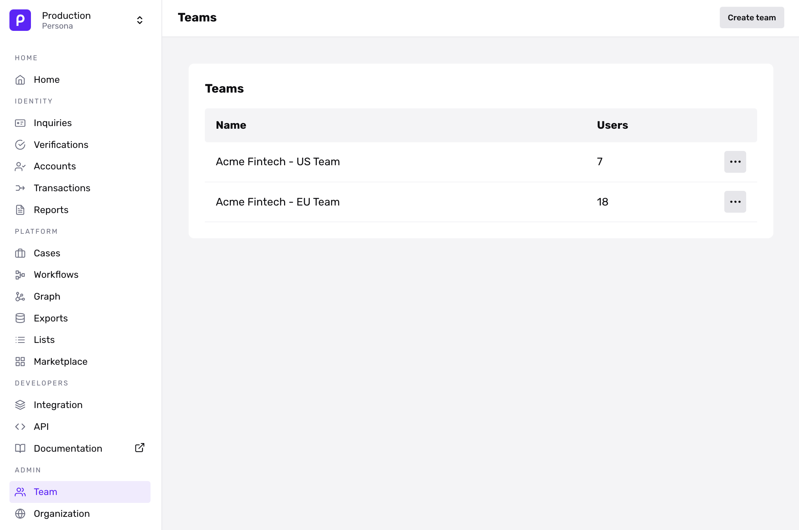

# Teams in Cases

## Overview

You can group multiple users into a Team. Doing this can help you streamline how you view and manage Cases. Specifically, you can:

-   Distribute Case assignments among the members of a Team, using an assignment policy you choose (such as round robin).
-   Filter data within Cases Analytics and the Case list by Team.

A User can be part of multiple Teams, and a Team may contain Users who hold different roles.

## Access

To create or configure a Team, you must:

-   Hold the “Admin” _role_ in your organization, OR
-   Be granted both of the following _permissions_ in your organization:
    -   “View member list and team groupings within Teams”
    -   “Update team member groupings within Teams”

## Where you can use Teams

-   Cases Templates: When configuring a [Cases Template](./5WFMyVPjzgXQNljqg2xf4h.md), you can choose to assign Cases to one or more Teams.
-   Cases Analytics: In [Cases Analytics](./7BOHplbhL1eCKfX45iJgva.md), you can filter the "Assignee" and "Resolvers" fields by Team.
-   In the Case list, you can filter the "Assigned to" field by Team.

## Configuring Teams

You can create, edit, and delete Teams from the _Teams_ page. To find this page, look in the sidebar of the Dashboard, and click on **Team** (under the **Admin** section) > [**Teams**](https://app.withpersona.com/dashboard/teams). 

Here, you can:

-   **Create a Team**. Click the **Create team** button in the top right.
-   **Edit a Team**. In the **Teams** list, click on the team you want to edit. This opens a page where you can add members, remove members, and rename the Team.
-   **Delete a Team**. Click on the three dots (“...”) next to the team in the **Teams** list, and select “Delete.” You can also delete a team from the Edit page.
