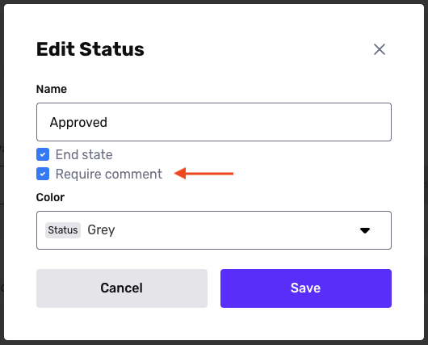

# Requiring Case comments

_The ability to customize Case comments is available on a Cases Enhanced plan. Reach out to your Customer Success Manager or [contact the Persona support team](https://app.withpersona.com/dashboard/contact-us) if you’d like to get started._

## Overview

When using Cases for manual review, reviewers and other team members can help explain why a decision was made by leaving comments. Comments may be key for audit purposes. You may want to require that reviewers leave a comment on each Case at key moments, such as when they approve or decline a Case.

You can edit a Case Template to require comments on any Case that uses that Template. Specifically, you can require a Comment during a transition to a specific Case status—such as Approved or Declined.

## Steps

To require a comment during a transition to a specific Case status:

1.  In the Dashboard, go to **Cases** > **Templates**. Select the Case Template you want to edit.
2.  Click **Settings** in the upper corner.
3.  Select the **Advanced** tab.
4.  In the Statuses section, find the status for which you want to require a comment when transitioning to it. Select **“…”** > **Edit**.
5.  In the edit modal, check the **Require comment** checkbox. Click **Save**.  
    
6.  In the upper corner of the Case editor, click **Save**.
