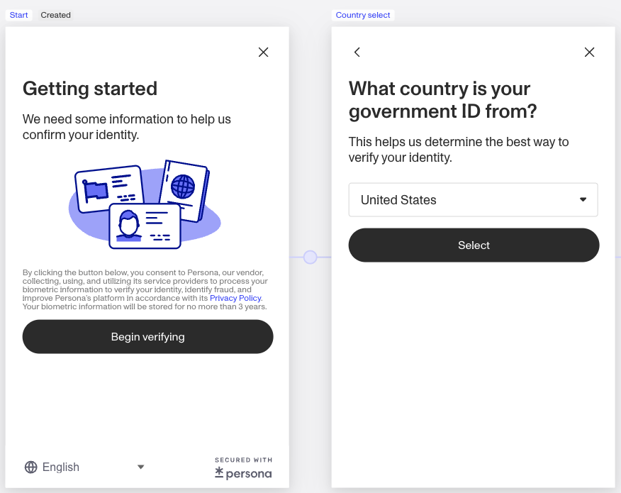
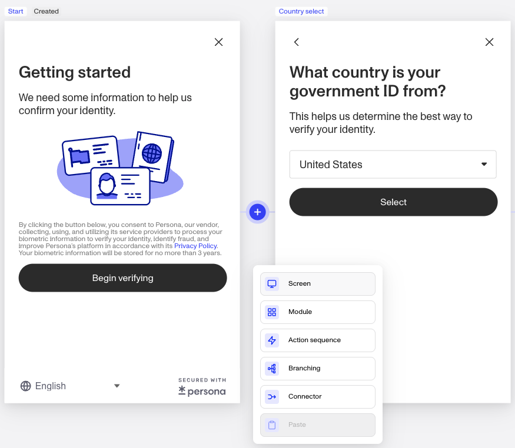
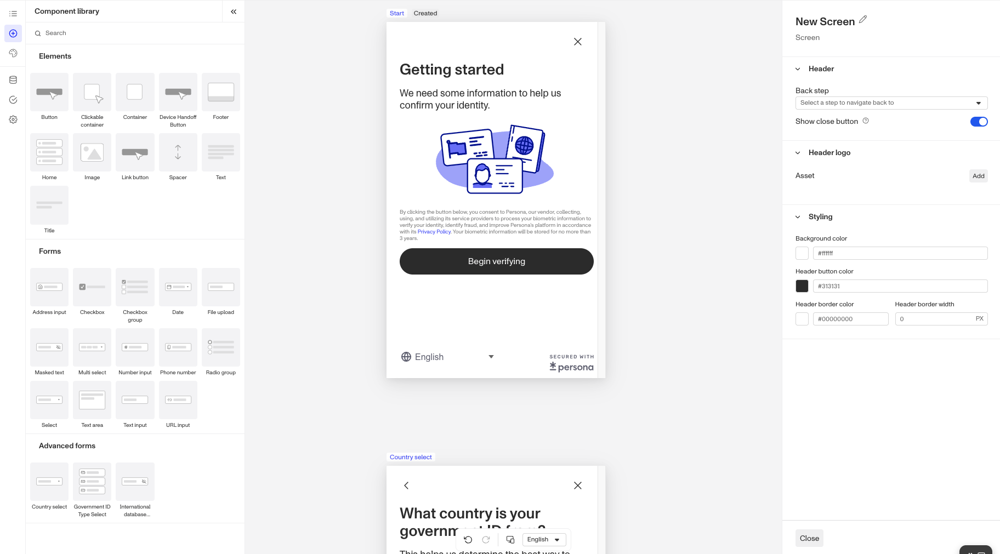
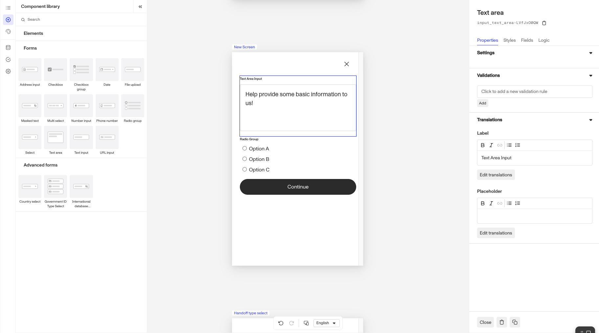

# Screen Steps in Inquiries

# What is a Screen Step?

Screen Step is a single page that an end user sees in an Inquiry Flow. It allows for fully configurable elements such as text, spacing, images, and custom logic.

 _The Start Screen and Country Select Screen are examples of Screen Steps. Some Screen Steps, like these two, are pre-built while others can be created or added to further customize the user experience._

## Where do you add a Screen Step?

1.  To access this feature, navigate to `Inquiries` —> `Templates` from the left nav and select any Inquiry template.
2.  A Screen step can be added by clicking the plus sign located between screens or by double clicking any existing screens. Some pre-built screens are available as modules.

## What can you do with Screen Steps?

### Tailor UI elements to your needs

The Screen Step allows you to personalize the user interface by adding and arranging text, images, and additional components, to create the precise layout and visual theme you desire for each step. You can style your screen steps with a selection of colors, fonts, and margins to match your company’s branding and design guidelines.

### Customized user experiences

Go beyond the limitations of pre-configured modules by embedding custom logic into your screen steps. Display dynamic content that changes based on user interactions and input, and enrich the user journey with personalized touch points.

### Pre-built Screen Steps

To help you get started, some screens are available as drop-in Modules within Flow Editor. These screens include the Standard Success Step, Standard Failed Step, and both customizable & non-configurable screens that are part of a collection & verification flow for a specific type of Verification (like Government ID or Selfie).

# Plans Explained

## Screen Step access by plans

|  | **Startup Program** | **Essential Plan** | **Growth and Enterprise Plans** |
| --- | --- | --- | --- |
| Screen steps allowed per Inquiry Template | Limited to pre-configured solutions allowed within Program | ≤20 overall steps (Screen, Action, Branching, or Connector) per Inquiry Template | Unlimited |
| Screen step components and styling | Limited to pre-configured solutions allowed within Program | Limited component access within Component Library | Complete component access within Component Library, screen-level styling, and component-level dynamic logic |

[Learn more about pricing and plans](./6oZbzp7jb7AWGClF5vpY3K.md)

## Examples

### Screen Step on the Essential plan

Essential plan customers can choose from all Basic Components and select Form Components in the Component Library. Available components include Title, Text, Spacer, Text Input, Text Area, Phone Number, Country Select, Masked Text, and URL Input.

 _Essential plan customers can explore a wide variety of components from within the Component Library and edit some component-level configurations using the Screen Editor. Translation and localization features are also available to further personalize the user experience. Teal star or limited badges indicate limited access within the plan._

### Screen Step on the Growth plan

Growth plan customers have access to all features on the Essential plan, all basic and form components in the Component Library, style components, add screen-level dynamic logic, and advanced components used to store complex PII-related data type fields used in Persona Verification and Report products.

Growth Plan customers have access to near-complete configurability available within the Screen Editor. From adding & tweaking components to incorporating intended dynamic logic like risk signals or known data into what a user will see or must input on a screen, the plan allows you to tailor the flow to meet business and user needs.

# Plans Explained

## Screen Step access by plans

|  | Startup Program | Essential Plan | Growth Plan | Enterprise Plan |
| --- | --- | --- | --- | --- |
| Screen steps allowed per Inquiry Template | Limited to pre-configured solutions allowed within Program | ≤20 overall steps (Screen, Action, Branching, or Connector) per Inquiry Template | Unlimited | Unlimited |
| Screen step components and styling | Limited to pre-configured solutions allowed within Program | Limited component access within Component Library | Complete component access within Component Library, screen-level styling, and component-level dynamic logic | Complete component access within Component Library, screen-level styling, and component-level dynamic logic |

[Learn more about pricing and plans](./6oZbzp7jb7AWGClF5vpY3K%20%22Pricing%20Overview%22.md)

## Related articles

[Inquiry Template Steps](./1z8F1l9Q28qNxQFtKoMfY3.md)

[Branching Steps in Inquiries](./6NyDb8wHpzSCVW5fnV3iHi.md)

[Connector Steps in Inquiries](./1aLUyDUK4ZGuupSgscqd6P.md)

[Action Steps in Inquiries](./aBe34oNwaa0YskUd5U5HZ.md)
