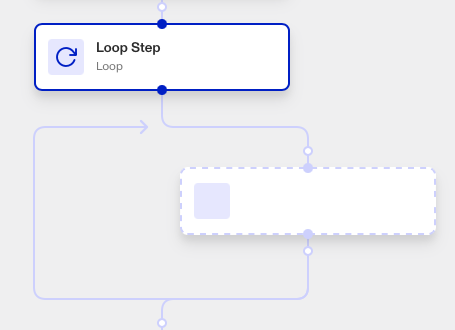
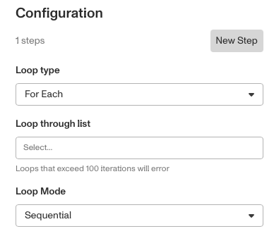
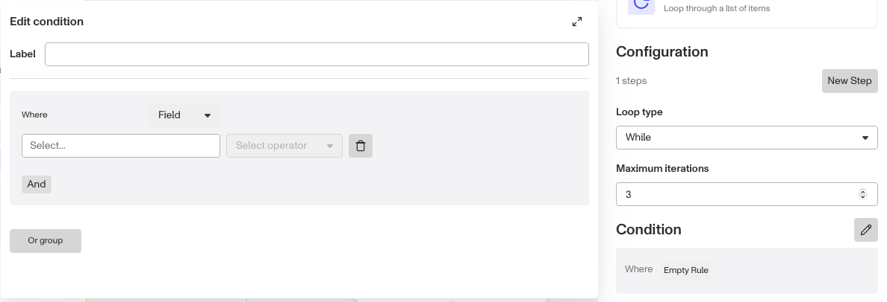
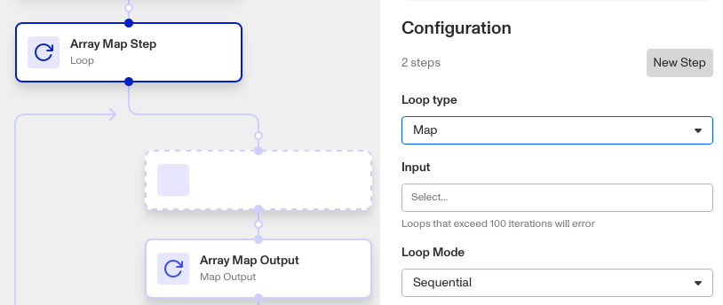

# Workflows: Loop step

# What is the Loop step?

**Loop** is a Workflow step that allows you to repeatedly loop through the same steps until a certain condition is met. You can have as many steps as you want, and as many iterations up to a maximum of 100.

There are three types of Loop step you can set up:

1.  **For each** iterates through a collection of items, applying its steps to each item in turn. It is ideal for executing a sequence of tasks for each item in a list, such as verifying a list of documents.
2.  **While** loops through its steps while a certain condition is met, up to a maximum number of iterations. It is ideal for scenarios where the number of iterations is not known beforehand and depends on dynamic conditions.
3.  **Map** transforms a collection of items into a new collection by applying the same steps to each item, resulting in a mapped output.
    1.  For example, it could fetch or process data for a collection of user IDs, and return a collection of created user profiles.
    2.  A ‘Map’ loop type always includes an **Array Map Output** step at the end of each loop, where you can configure what data to return after each loop.
    3.  The ‘Map’ loop type is similar to the ‘For each’ loop type, except it produces a transformed collection of data at the end and is typically used for data transformation or preparation.

Loops can be configured for two **modes** of iteration:

1.  **Sequential** loops run the loops one after the other. This is useful if the effects of one loop should transfer to a later loop.
2.  **Parallel** loops run all the loops concurrently. This is useful if each loop should occur independently from other loops.

# How do you add a Loop step?

1.  Navigate to the Dashboard, and click on **Workflows** > **All Workflows**.
2.  Find and click on the workflow you want to edit, or **Create** a new workflow.
3.  Click on **+** when hovering over a circle to add a **Loop** step.

4.  Configure the Loop type with either **For each**, **While**, or **Map**.
5.  If the Loop type is **For each:**
    1.  Choose the **List** that the loop step should iterate through. Remember that the list should contain 100 items or less, otherwise the loop will return an error.

6.  If the Loop type is **While:**
    1.  Choose the **Maximum iterations** (up to 100) to loop for, and the loop **Condition**.
    2.  Click the Condition’s **Edit** button to open an edit box and change its conditions. Within the edit box, you can edit:
        1.  (Optional) Change the route **Label** to a more intuitive name.
        2.  Add an evaluation condition. Choose the type of information to be evaluated (set to **Field** by default), the specific information to be evaluated, and the criteria (either **is blank** or **is not blank**).
        3.  (Optional) Click **And** to add another evaluation condition to be evaluated in addition to the first, where both must pass for the group of conditions to pass. You can add as many And conditions as you want.
        4.  (Optional) Click **Or group** to add another group of evaluation conditions to be evaluated in parallel to the first group, where either group must pass for the loop to end. You can add as many Or groups as you want.

7.  If the Loop type is **Map:**
    1.  Choose the **Input** collection of information that the loop step should iterate through. Remember that the collection should contain 100 items or less, otherwise the loop will return an error.
    2.  **Map** will create an **Array Map Output** at the end of your loop in the Workflow. Click on it to edit the **Result** it should output at the end of each loop.

8.  (Optional) Click **New Step** to add additional steps within your loop. Delete a step by clicking on it in the Workflow, then clicking **Delete** on your keyboard.
9.  (Optional) In ‘Advanced Configuration’, click the **Continue on error** box if you want the Workflow to continue running even if this Step raises an error.
10.  **Close** the Step, then edit steps within your loop by clicking on the dashed-outline boxes in your Workflow. You’ll have to **Save** and **Publish** the workflow to begin using it.

# Plans Explained

## Loop step by plan

|  | Startup Program | Essential Plan | Growth Plan | Enterprise Plan |
| --- | --- | --- | --- | --- |
| Loop step | Limited | Limited | Available | Available |

[Learn more about pricing and plans.](./6oZbzp7jb7AWGClF5vpY3K.md)
