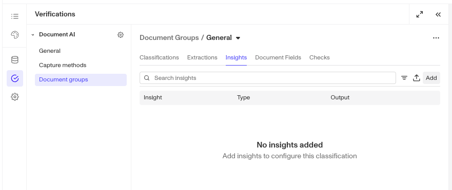
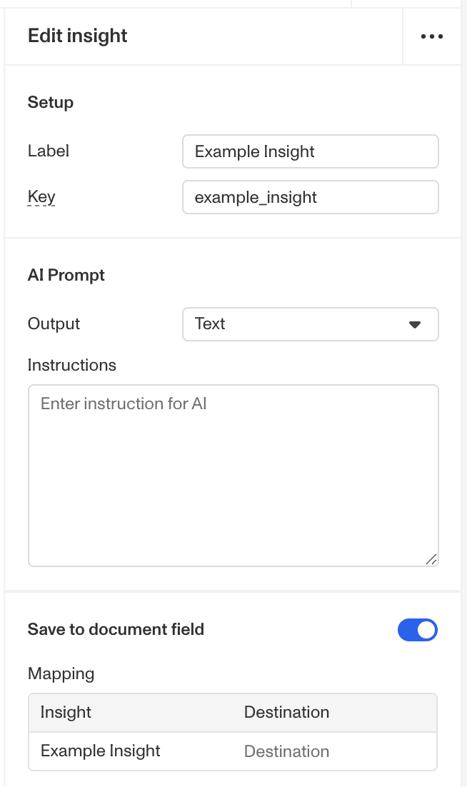

# Document AI: Insights Configurations

# Overview

Insight configurations on Document Verification Templates allow you leverage custom AI-powered custom extraction, analysis, and evaluation to gain meaningful insight from a document. Use of Insights requires you to configure prompts to automate your desired analyses with possible outputs being:

-   String for open-ended, unstructured responses
-   Multiple choice for constrained, predefined options

This flexibility helps you automate decision-making, enrich document metadata, or flag documents for manual review based on your specific compliance and business requirements.

## Configuring Insights

1.  Navigate to the Dashboard, and click on **Inquiries > Templates** (or **Verifications > Templates**).
2.  Find and select an Inquiry template with Document AI, or **Create** a new template.
3.  In the left panel, click **Verifications**.

4.  In the left navigation, click **Document Groups**, and select the document group you wish to configure. _(Learn more about document groups [in this article](./2tUC2D9VeLsyPtgBo5KYzX.md).)_
5.  In the document group configuration panel, click on Insights.

1.  To add a new insight, click the **Add** button.
2.  In the right panel, fill out the following fields\*\*:\*\*
    1.  **Label** (required): A label or name for this insight that provides context to the AI for what the insight should be.
    2.  **Key** (required): Auto-generated from the label. Used in API responses and as a way to reference the resulting insight from a Document Verification run within other Persona products such as Workflow Conditional Steps.
3.  Under AI Prompt, choose a prompt output type:
    1.  **Text:** Document AI will provide a conversational or unstructured answer
    2.  **Text + Choices:** Document AI will pick from a set of choices you provide
4.  Configure your selected prompt output type as detailed below.

## Configure Text Prompt Outputs

1.  Under **AI Prompt**, set **Output** to Text.
2.  In the **Instructions** text box, enter a prompt that guides or instructs Document AI to extract your desired insight. For example, to get a summary of the document's main points, use: "Summarize the document's main points." Note that the more detailed your instructions, the more accurate the insight.
3.  Choose if you want to “Save to document field.” (Recommended)
4.  Click Save in the upper right hand corner to save all changes to your template.

## Configure Multiple Choice Prompt Outputs

1.  Under **AI Prompt**, set **Output** to Text + Choices.
2.  In the **Instructions** text box, enter a prompt that guides or instructs Document AI to extract your desired insight. For example, "From the below list, choose the primary language this document is written in." Note that the more detailed your instructions, the more accurate the insight.
3.  Under **Output choices**, add the choices that the AI will select from.
    1.  Set a **Default response**. This will be returned if the prompt doesn’t match any listed option. It is recommended to consider this option as your fallback for when the instructions and options are insufficient to choose a high confidence option.
4.  If you want to allow the AI to pick multiple options, flip the “Return all choices that match” to on.
5.  Choose if you want to “Save to document field.” (Recommended)
6.  Click Save in the upper right hand corner to save all changes to your template.

### Why Insight Configurations are important

Insight Configurations enable you to extract structured meaning from documents using Persona’s AI technology, turning unstructured data into actionable insights that support automated decisioning.

They’re especially useful when you need to:

-   Evaluate document content against internal or compliance criteria without manual review.
-   Enrich document data with standardized fields for downstream use in APIs, Reports, or Workflows.
-   Detect key patterns or attributes that inform identity, eligibility, or risk decisions.
-   Streamline review processes by surfacing only documents that require human attention.

By integrating AI-driven analysis directly into your verification flows, Insight Configurations help your team make faster, more consistent decisions while maintaining accuracy and compliance across every document type.

## Access by plan

We're here to chat through your specific needs. Feel free to reach out to your Customer Success Manager or [contact the Persona support team](https://app.withpersona.com/dashboard/contact-us).

|  | **Startup Program** | **Essential Plan** | **Growth Plan** | **Enterprise Plan** |
| --- | --- | --- | --- | --- |
| Insight Configurations | Not Available | Not Available | Limited | Available |

## Related articles

[Document AI: Document Fields Configurations](./5l5OxysTOoxtbizpSe3nyP.md)
