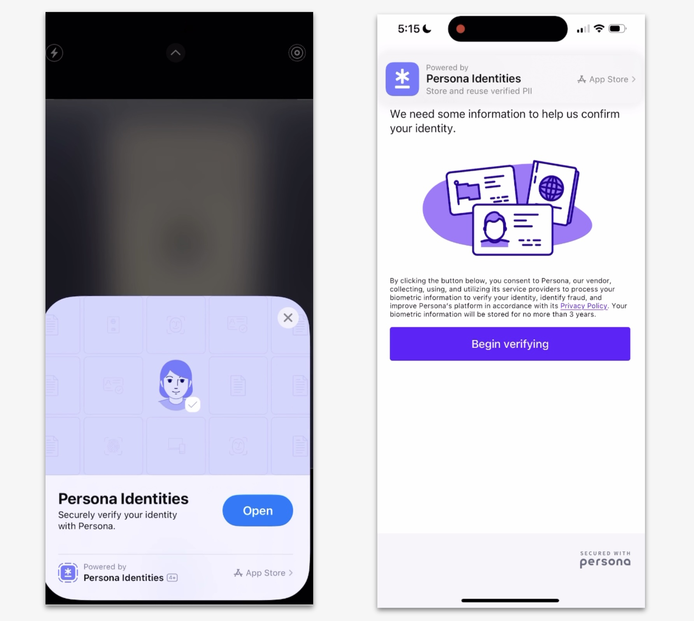

# Utilizing the Mini App integration method

# Mini App

Mini apps is an integration type offered by Persona that let you offer a fast, seamless identity verification experience on mobile—without requiring users to download your full app or integrate a mobile SDK.

They’re available on iOS (known as App Clips). Mini app is currently in beta. For questions or support, please reach out to your Persona team.

## Why use a mini app?

Mini apps are a good option if:

-   You want to provide a mobile-native experience without embedding an SDK
-   You want to avoid increasing your app’s size
-   You don’t have a mobile app, but want a better experience than a mobile browser
-   You’ve run into issues with webviews or browser permissions (e.g., camera access)

Mini apps give you the benefits of a native flow—like smoother performance and better access to device features—without the complexity of a full mobile integration.

## How it works

1.  You send users a link or QR code.
2.  On supported devices:
    -   The mini app automatically opens.
    -   No installation is required.
3.  If the device doesn’t support mini apps:
    -   The link opens in the browser, like a standard hosted flow.

As of June 2025, Google has announced the deprecation of Android Instant Apps, effective December 2025. This means that after this date, Mini App functionality will no longer be supported on Android devices.

As a result, Mini App integration will continue to be available only on iOS via App Clips. Please contact your Persona account team to explore alternative solutions for supporting Android users.

---

## How mini apps compare to other integrations

| Integration type | User experience | Setup required |
| --- | --- | --- |
| **Hosted link** | Opens in mobile browser | Easiest to set up |
| **Mini app** | Opens as a lightweight native app | No app install or SDK needed |
| **Mobile SDK** | Fully embedded in your app | Requires mobile development |

## Things to keep in mind

-   Mini apps only work on newer devices (e.g., iOS 14+).
-   Some features, like [NFC verification](./1iu1Fak8y9RiOE2FddXrHJ.md), may require the use of our Mobile SDK.
-   Custom branding may need approval from Apple.

## Get started

You can find setup instructions and technical docs here: 👉 [Mini App Integration Guide](../../docs/docs/miniapp-integration.md)
