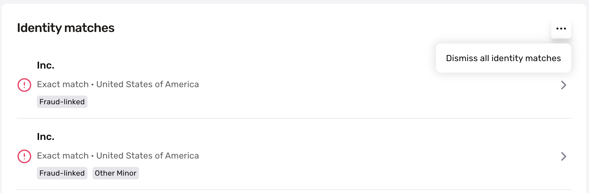

# Dismiss Report Hits

✍🏻 This feature only applies to Person Watchlist, PEP, and Person Adverse Media.

You can dismiss false positive hits through the Persona dashboard. If the hit that is dismissed is on a Report Template that is set to run on a [recurring basis](./7LRMBbxLshF7sCcLhfhwF4.md), once the hit is dismissed, the Report will resume its recurring cadence ensuring that no individual on the platform has a true positive without being reviewed.

This feature can be accessed everywhere a Report is displayed so long as it is toggled on via the permissions.

### **Permissions**

To dismiss Report hits, a user must have a role with the "dismiss report matches" permission.

To learn more about Permissions, see [Managing users and user permissions](./5isJzuUdTmFWiLehSDugUI.md).

## Related articles

[Continuous monitoring for Reports](./7LRMBbxLshF7sCcLhfhwF4.md)
