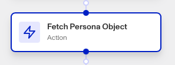

# Workflows: Fetch Persona Object step

# What is the Fetch Persona Object step?

**Fetch Persona Object** is a Workflow Action step that retrieves a specific Persona object, such as an Inquiry, Case, or Transaction, based on its unique ID.

Once the Fetch Persona Object step retrieves that object, you can access the current state and details of the object within your workflow, enabling you to make informed decisions or trigger subsequent actions based on the retrieved data.

This step is very useful for letting your workflow affect and access the rest of your organization’s data, and take informed actions as a result. It also allows you to modify an object’s state and details from within your workflow, even if the object was not created within the same workflow.

# How do you add a Fetch Persona Object step?

1.  Navigate to the Dashboard, and click on **Workflows** > **All Workflows**.
2.  Find and click on the workflow you want to edit, or **Create** a new workflow.
3.  Click on **+** when hovering over a circle to add an **Action**.

4.  Use the **Find Action** select box to click on **Compute > Fetch Persona Object**.
5.  Choose the **Object Type**.
6.  Add the unique **Object ID** corresponding to the object you want fetched.
7.  (Optional) In ‘Advanced Configuration’, click the **Continue on error** box if you want the workflow to continue running even if this step raises an error.
8.  **Close** the step. You’ll have to **Save** and **Publish** the workflow to begin using it.

# Plans Explained

## Fetch Persona Object step by plan

|  | Startup Program | Essential Plan | Growth Plan | Enterprise Plan |
| --- | --- | --- | --- | --- |
| Fetch Persona Object step | Not Available | Available | Available | Available |

[Learn more about pricing and plans.](./6oZbzp7jb7AWGClF5vpY3K.md)
