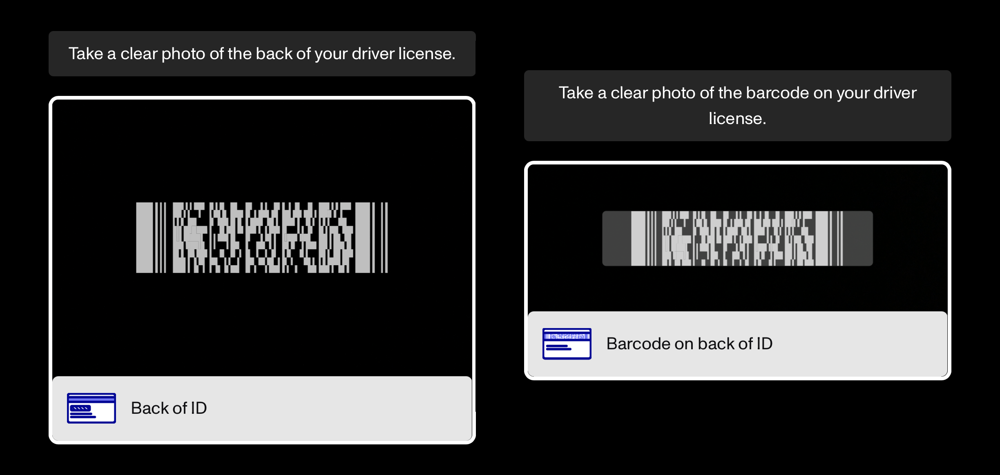
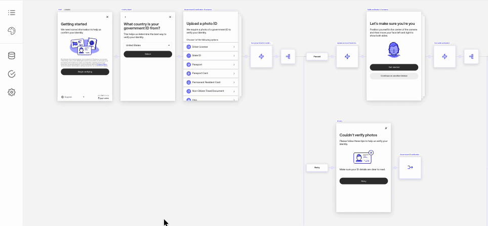

# Government ID Verification: Requiring Barcode vs Back of ID

# Overview

For the Government ID verification, you can configure if you want to require the Front of ID, Back of ID, and Barcode. Front of ID is required by default, but Back of ID and Barcode are optional. You can _not_ require both Back of ID & Barcode to be captured at the same time, so select the one that best fits your use case. Barcodes are usually placed on the back of IDs, but the overlay guidance for capturing one or the other has different priorities while both are capturing from the back of the ID.

## Difference in capture overlays

To improve the end user experience and help end users successfully capture the required images, Persona includes overlays to help visually guide the end user. Each overlay is specific to which verification and what is being captured. Below are examples of both overlays.  When attempting to capture barcode, the overlay guidance to end users will prioritize the barcode filling more of the image. The barcode overlay is only concerned with getting the barcode in the frame. This can lead to the edges of the identification getting cut off or not included.

When attempting to capture Back of ID, the overlay guidance to end users will prioritize capturing the entire back of the id in the frame of the camera.

## Why require Back of ID?

Many government ID types include additional relevant information on the back of the ID, and requiring that back of ID is captured allows you to capture that information.

## Why require Barcode?

Many government IDs include a barcode that contains all the information presented on the ID but encoded in some variation of a barcode. There are three Gov ID checks that require the barcode to be captured to work effectively.

### Relevant GovID checks

-   Barcode - Detects if there is a barcode on the ID.
-   Barcode Inconsistency - Detects for inconsistencies in the formatting of the barcode on the ID.
-   Extraction Inconsistency - Detects if the details extracted from the front of the ID are different than the details extracted from the barcode.

Requiring Back of ID or Barcode doesn’t mean that relevant check will be required by the verification. If you also want those checks to be required, you can configure them in the Checks section of the Gov ID.

## Camera quality matters

Newer high quality cameras will more successfully capture images from any part of an ID, which is why we recommend allowing Device Handoff. Device Handoff allows end users to switch to a device like a phone with better cameras.

## Navigate to required Gov ID settings

### Steps

1.  From an open Inquiry Template, click the Verifications icon in the left nav.
2.  Under the Government ID section, select “Countries and ID type”.
3.  Filter and select the particular county you want to configure.
4.  Select the particular ID type.
5.  In the settings window to the right, toggle the Back of ID or Barcode requirement.

## Related articles

[What is a Required Verification Check?](./3K8D1gIoUcAtYScf9nlrh7.md)

[Verification checks that improve other checks](./1r1p4vM8O6uJXbJw1hO8WP.md)
