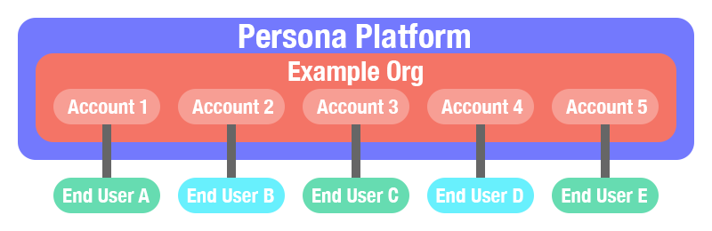
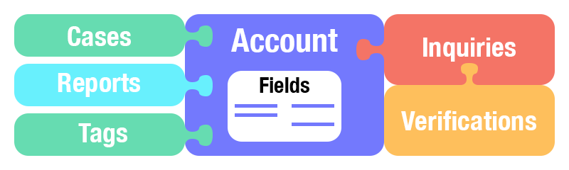
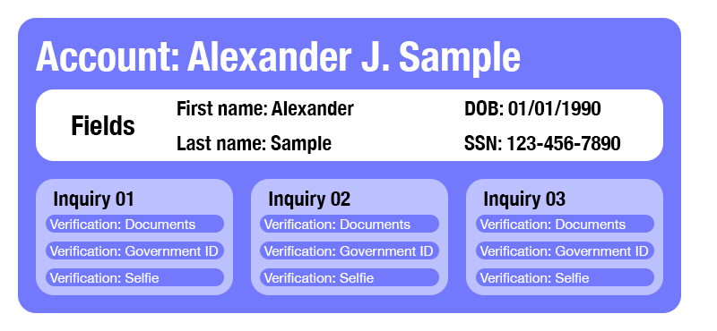
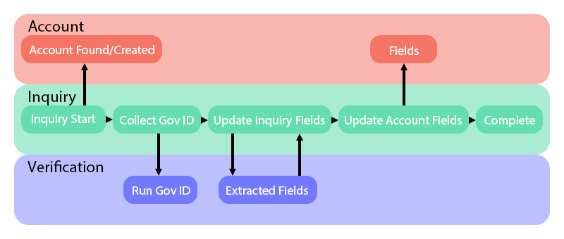
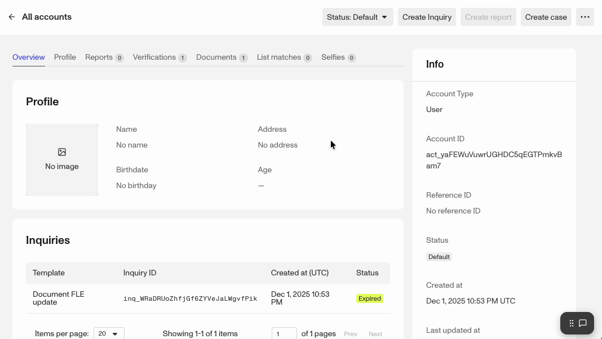
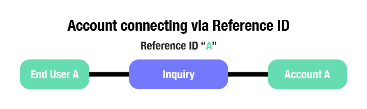
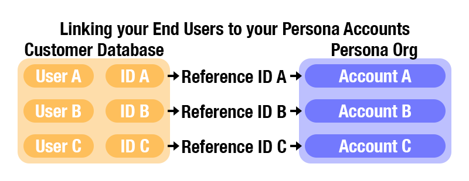

# Accounts overview

# What are Accounts?

 A Persona Account is a container object within an Organization for collecting and maintaining all objects and data related to an entity, whether an individual or a business. Accounts are unique to each organization. The particular PII & data collected in those separate accounts would be controlled by each Org’s configured settings and products.

### Accounts serve three main purposes:

1.  Easily manage user and businesses throughout the customer lifecycle.
2.  Find and fight fraud spanning multiple interactions or accounts.
3.  Keep data consistent across tools with one-to-one profile mapping.

## Collections and Connections

 Information can be attached to an account through a variety of Persona products. The most common is an Inquiry, which itself is a collection of one or more Verifications that collect and scrutinize an end user’s PII. Cases and Reports can be triggered & created as part of an Inquiry or Workflow and in the process be attached to an account to help to build decisioning context. Finally, Accounts Tags with custom values can be attached to an account as another type of meta data to inform and drive decisioning. Every one of these data objects are connected via their tokens in the form of Inquiry IDs, Verification IDs, Case IDs, etc, with even the Account ID being attached up to its parent Org. If you see an ID listed in the Dashboard, you can usually click it to navigate to a dashboard view of that item.

For example, fictitious end user Alexander J. Sample may go through multiple flows and complete multiple Inquiries while signing up for your company’s app or reverifying himself at various points of the user lifecycle. With Accounts, you can consolidate all Inquiries for Mr. Sample under a single Account. This is helpful for ensuring that collected information is consistent over time. In instances where there are discrepancies (e.g. selfie shows a different face), this may indicate fraud, such as account takeovers.

## **Methods to create an account in Persona**

-   Created via an Inquiry by default. Creating the account as part of the inquiry is optional.
    -   Inquiries can be created via the Dashboard or [API](../../docs/reference/create-a-report.md), in Embedded Flows and Hosted Flows.
-   In a workflow via the “Find or Create Account” action step.
-   When [creating a Report](../../docs/reference/create-a-report.md) via API.
-   Via the “+ Create account” button on [All Accounts page](../../landing/dashboard/accounts.md).
-   Via [API](../../docs/docs/accounts-tutorials.md#account-creation).
-   Via an [Importer](./2fpD7Bwb7OrzAS4g7XWoMG.md).

### Updating Account Fields

Most PII, your name, birthday, address, etc, can be captured as a string or as numbers and stored in the form of Fields. Accounts have standard fields ready to be updated with information collected with Persona products, via automation or manually.

In the example graphic above we can see that as the Inquiry is created, an account is either found or created by default. As the Verification runs and passes, extracted fields from the verification are updated on the Inquiry’s fields. And later the inquiry updates the account’s fields from the inquiry’s own fields. The inquiry itself and its verifications are still attached to the account, but via inquiry steps like Update Account Fields or Update Object step, you can control which fields get updated on the account and when. This gives you flexibility on when to update all the fields on an account versus just one or two fields, all depending on the use case for that inquiry or workflow.

Account Fields can also be updated manually, either in the dashboard or via API call, allowing you to either fix incorrect information or add information you don’t otherwise have an automated process to handle.

### Updating an Account via the Dashboard

#### Steps

1.  While viewing an Account in the Dashboard, you can click the 3 dot icon at the top right and select "Update Account".
2.  In the Update Fields window you can update any fields on the account.
3.  Scroll down and lick the "Confirm" button when done.

### Updating an Account via API

For full details on using API calls to update an account, review our Dev Docs article [here](../../docs/2025-12-08/api-reference/accounts/update-an-account.md).

## Connecting to an Account

When you create an inquiry for an individual or business, you want a clear way to tie the inquiry to that entity and to an account. Ideally end user A completes an inquiry which updates to Account A. This is vital if you want to reverify that end user later, so you can check them against that same account A. If a returning end user is going through another of your inquires, they will not automatically be linked back to the same account based on their PII, like their first and last name. Instead Inquiries use a Reference ID to identify an end user and link them with an account.

If an inquiry is created without a Reference ID, then Persona has no way of linking that inquiry to an existing Account and will create a new Account instead. This unfortunately prevents re-verifications against an existing Account and clutters your account list with duplicate accounts of the same person or business.

## Using Reference IDs mitigates fraud

Fraudsters will attempt to spam fake accounts, ie trying to bypass fraud detection by rapidly cycling through fake identities. And you can mitigate account spamming by avoiding two behaviors: Not using a Reference ID and posting generic Inquiry links.

Without a Reference ID, the inquiry will not be able to find an existing account to attach to and it will instead create a new account to attach to. Even legitimate end users will be creating new accounts every time they are put through an inquiry, with you losing the ability to reverify them later against an original account.

Sometimes Persona customers using the hosted implementation will post a generic inquiry link with no Reference ID, allowing anyone with that link to start an inquiry flow. But bad actors can then spam that inquiry with as many fraudulent identities as they have at hand. This is one of the many reasons we strongly recommend using Reference IDs linked to an end user with your inquires.

### Account IDs

**Generated by Persona**

When an account is created in Persona, Persona will assign it an Account ID. This unique ID can be used to identify a specific Account and will appear on all associated inquiries. Each Account ID is unique across Persona.

### Identifiers & Reference ID

**Not generated by Persona**

Account identifiers are additional unique IDs for Accounts that Persona does **not** define. This is typically an identifier that you use to separate users in your own system. Identifiers are set per Account Type and can be configured to be unique/not unique and case-sensitive/case-insensitive. Read more about Identifiers [here](./6Iz6sufWpRG5uVSEwoOPJT.md). The Reference ID is one of an account’s identifiers. It is a system-generated, unique, case-insensitive identifier assigned per account type. While it functions like other identifiers, it has a few distinct characteristics:

-   **Non-editable name:** You cannot set or customize a Reference ID, whereas other identifiers can be named.
-   **Automatic inquiry linking:** When a Reference ID is provided while creating inquiries, those inquiries are automatically attached to the associated account. Other identifiers do not trigger this behavior - you must use the **Attach Object** action step in Workflows instead.
-   **Filtering support:** When listing accounts via API, filtering is currently only supported by [a set of Reference IDs](../../docs/api-reference/accounts/list-all-accounts.md#request.query.filter.filter).

## Add custom properties to Account Types

### **Statuses**

Use Statuses and Tags to easily classify and filter for Accounts.

You can define and assign account statuses to represent the lifecycle stages of an account. For example, common statuses include Pending Review, Confirmed Fraud, Frozen, etc. An Account will only have one status associated with it at any given time.

[Learn more about creating and using ~s~tatuses →](./6W3ySuKOa8ez3CEbZYHdcj.md)

## Tags

🚨 For now, tags can only be created in the Dashboard.

Tag reflects a characteristic of the account that is unlikely to change in the context of the verification process. For example, “Under 21 years old,” “Non-eligible geo,” “Watchlist match,” etc.

**Create a tag**

-   In the [Accounts](../../landing/dashboard/accounts.md) page of the Dashboard, find an individual Account to tag.
-   Find the Tags section at the bottom right section of the account, under Custom Properties.

**Edit a Tag**

-   In the [Accounts](../../landing/dashboard/accounts.md) page of the Dashboard, find an individual Account to tag.
-   Click the **•• More** dropdown on the top right side of an individual account page.

# **FAQs**

## **How is information populated in an Account?**

Information can be populated in an Account in three ways:

1.  If you create an Account via Dashboard or API, you can populate it with specific fields. Learn more about storing data in fields.
2.  If you do not populate an Account, information from the very first completed Inquiry under that Account will automatically populate the Account.
3.  During any follow up inquiry flows linked to the account, configured account fields will be updated after a verification is passed.

## **Can I merge or consolidate Accounts?**

Yes, you can consolidate multiple Accounts into one via API. By doing so, you will move all inquiries and reports from the "merged" Accounts into a single destination account. Please see our [technical documentation](../../docs/reference.md#consolidate-into-an-account) to get started.

## **Can I edit an existing Account?**

Yes. Any field in an Account can be edited. Once you edit the Account, all future inquiries under this Account will compare their information against the updated Account.

### **How do I edit the fields in an existing Account?**

To update the Account information from Dashboard:

1.  Go to the [**Accounts**](../../landing/dashboard/accounts.md) page of the Dashboard and find the individual account you want to edit
2.  Click the **•• More** dropdown on the top right hand side of the Dashboard
3.  Click **Update Account**
4.  Update any information you would like, and click **Save**

### **Why would I want to edit an Account?**

It's possible that the information on an Account has either changed or was inputted incorrectly. A common example of this would be the first and last name being switched around, or a user incorrectly typing in their date of birth. If the Account information is incorrect and you require information from future inquiries to match against Account information, future inquiries will mismatch and fail.

### **Can I change how Account information is displayed or organized?**

Yes. The layout for each account type can be modified using our layout editor.

⚠️ This feature is still in Beta.

### **Can I link two or more accounts together if they’re part of a group?**

Yes. Organizations with multiple account types often need to link accounts together, which can be done by creating a [**Relation**](./1aMbe1XEyhiAHgFz1oOjDj.md).

For example, a travel company may need to tie individual travel bookings under one group booking ID, so it would create a Relation between the booking Transaction and the user Account type.

### **What can I do with an Account?**

You can make the most of Accounts by setting up and using **custom account actions**. [This guide](../account-actions_.md) will teach you how to can run a report, update fields, or add information to a list, using our one-click macros.

### **How do I redact information from an Account?**

 Note that your organization's retention policy is also applied to Accounts. This means that Accounts are redacted on a regular interval, according to your specific retention policy.

You can [redact PII from an Account or Inquiry](./3vORXCrOmS8bXovzfS5Tie.md) without deleting the account itself, allowing it to continue collecting new information from future inquiries. Please note that once you've redacted information, you **cannot** reverse this action.

You can also redact a subset of information on an account through the Redact Object action in Workflows. More details on redaction can be found [here](./42ubXB5lJPWNaITI0uJfrI.md).

### **Can I delete or archive an Account?**

Yes. When an Account is deleted, it is deleted from Persona’s system and can no longer be used. If you would like to delete an Account, please reach out to us at [support@withpersona.com](mailto:support@withpersona.com).

## How do I access Account-related information in Workflows?

In Workflows, you may want to access and condition off of Account-related information for a given account. You can access using the following attributes

-   Type - `account.account_type`
-   Fields - `account.fields.<key>`
-   Status - `account.account_status`
-   Relations - `account.relations.<key>`
-   Identifier - `account.identifiers.<key>`
    -   Note that Reference ID can be accessed through `account.reference_id`
