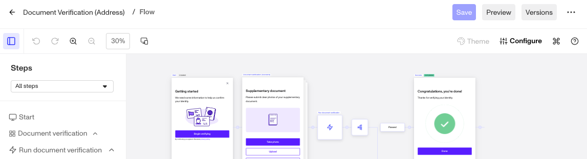
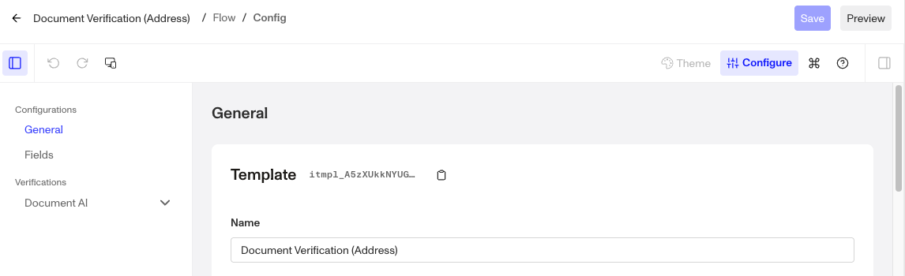
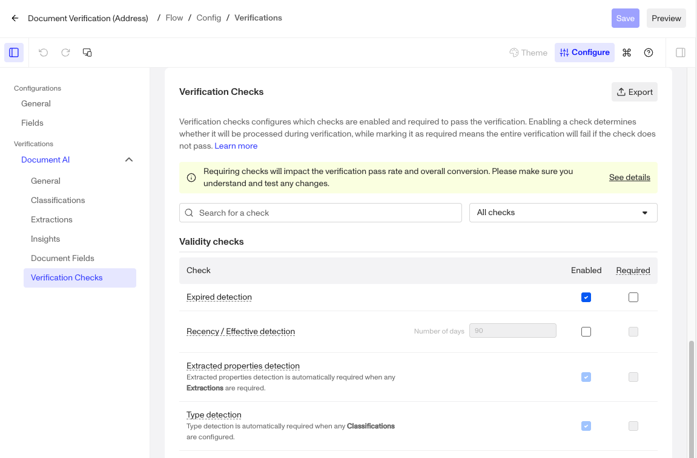
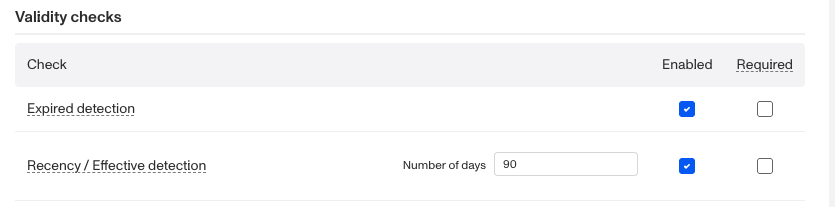

# Documents AI/Verification: Expired Detection Check

# Overview

**Expired Detection Check** in Document Verification Templates helps determine whether a submitted document has passed its expiration date. This is especially useful for time-sensitive document types, such as government IDs, such as passports and driver’s licenses, where expired documents are no longer valid and should not be accepted.

This check is configurable, allowing you to automatically flag or reject expired documents based on your specific compliance and business requirements.

## Configure Expired Check

1.  Navigate to the Dashboard, and click on **Inquiries > Templates** (or **Verifications > Templates**).
2.  Find and select an Inquiry template with Document AI, or **Create** a new template.
3.  In the top right, click **Configure**.

4.  In the left navigation, click **Document AI**.

5.  Scroll down to **Verification Checks**, or click **Verification Checks** in the left navigation to locate **Expired Detection**.

6.  Check the box under **Enable**.

7.  Check the box under **Required** if the entire verification should fail when this check is not passed.

Required Verification checks affect whether a Verification attempt passes or fails. Every required check must pass in order for a Verification attempt to pass.  
Non-required Verification checks do not affect whether a Verification attempt passes or fails.  
Learn more about Enabling and Disabling Verification check [here](./MBqBUj2HlXY34i5SJIRaz.md).

8.  Click **Save** on the top right.

## Why Expired Checks are important

Expired Checks are critical when you need to ensure that:

-   Documents are still valid and have not passed their expiration date.
-   You meet regulatory requirements that mandate acceptance of only current, unexpired documents.
-   Fraud risk is reduced by rejecting expired documents that may have been tampered with or recycled.

With configurable settings, Persona gives you control over how expired documents are handled based on your organizational needs.

## Plans Explained

We're here to chat through your specific needs. Feel free to reach out to your Customer Success Manager or [contact the Persona support team](https://app.withpersona.com/dashboard/contact-us).

|  | **Startup Program** | **Essential Plan** | **Growth Plan** | **Enterprise Plan** |
| --- | --- | --- | --- | --- |
| Expired Detection Check | Not Available | Available | Available | Available |
