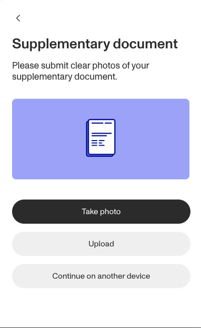
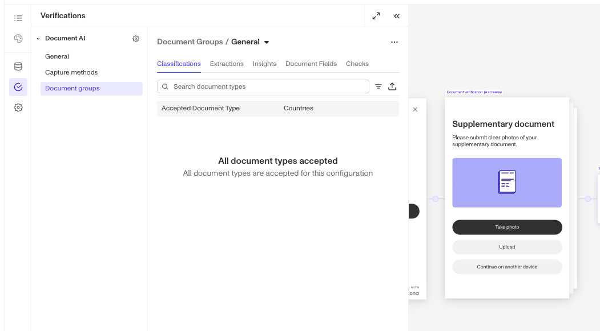
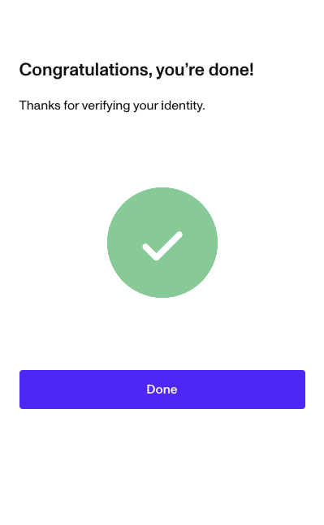
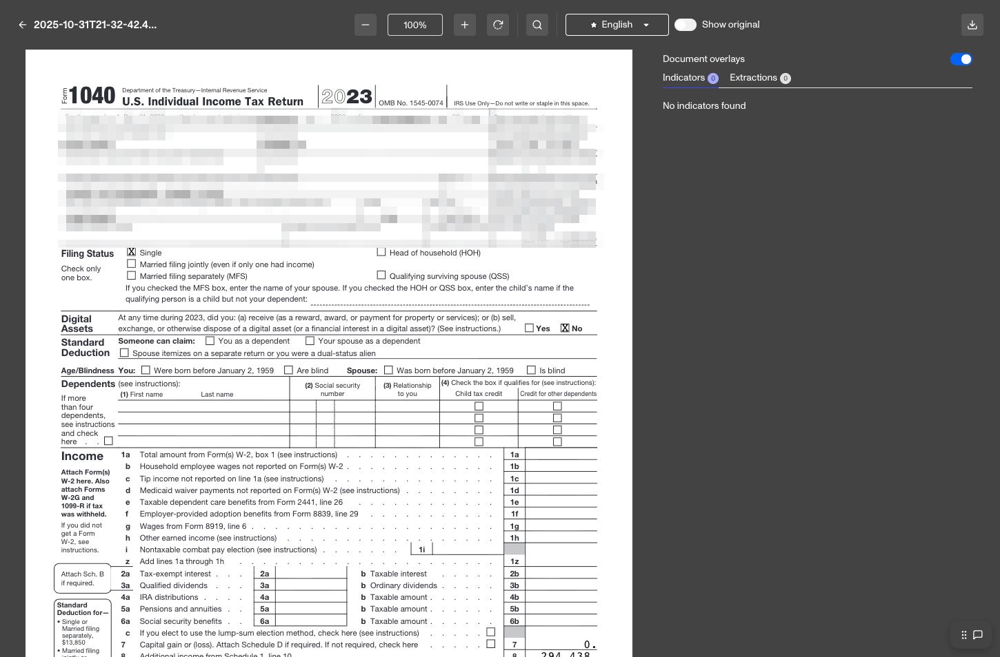
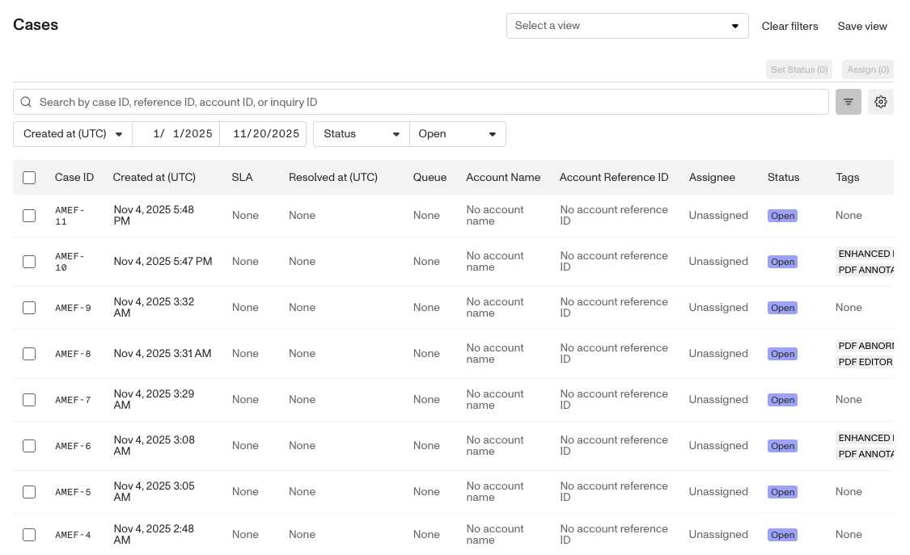
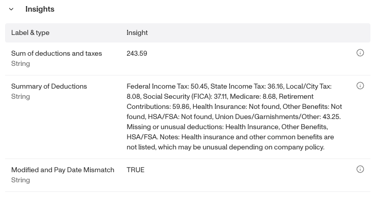

# Document AI

## About Document AI

Document AI automates the manual work of processing non–government ID documents—such as SSN cards, W-2s, IRS notices, and utility bills—from individuals or companies.

Instead of manual review, you get:

-   **Automated classification:** Identify document types with AI-powered recognition
-   **Intelligent extraction:** Pull key information and cross-reference it against existing data (e.g., Government ID information)
-   **Validity checks and fraud risk indicators:** Assess recency, expiration, tampering, and other risks
-   **AI-powered insights:** Generate contextual summaries (e.g. “What type of corporations is this business?”) for faster decision-making
-   **Real-time user guidance:** Re-prompt users when documents don’t meet your criteria (wrong type, expired, too old, missing fields)

Document AI integrates with existing Persona flows or works as a standalone API.

 

## How it works

1.  **Collect:** Request documents via Persona’s hosted or embedded flow, or the API.
2.  **Classify, extract, and validate:** Auto-classify the document type, extract fields with OCR and AI, and run validity checks (required fields, classification match, recency/expiration). If criteria aren’t met, the flow can **re-prompt the user in real time** to upload a compliant document.
3.  **Decide:** Approve, reject, or route to manual review using [Workflows](./1EJCOF8bL5KRx4pQESw7VB.md), [Cases](./1EJCOF8bL5KRx4pQESw7VB.md), and configured criteria.
4.  **Enrich (optional):** Add AI Insights and risk indicators (e.g., company type, number of UBOs; tampering and compromise signals).

## Use cases

Collect and process documents in any region around the world for use cases such as:

-   **KYC compliance:** Automatically verify proof of address or supplementary proof of identity (e.g. SSN) for faster individual onboarding.
-   **KYB compliance:** Process ownership documents, articles of incorporation, and company registrations; optionally check against supported business registries, when configured.
-   **Driver onboarding:** Process and verify proof of insurance at scale for rideshare and delivery platforms.
-   **Financial services:** Process bank statements, tax documents, and proof of income for loan applications and account opening.
-   **And more:** With custom document types and AI-powered extraction, Document AI adapts to your unique workflows and compliance needs.

## Deployment flexibility

-   **Automated decisioning:** Auto-approve/reject/re-prompt using classification, extraction, validity checks, and configured thresholds.

-   **Manual review enhancement:** Pre-process documents and surface extracted fields, insights, and fraud risk indicators to analysts with full audit trails.

-   **Hybrid:** Auto-decide high-confidence cases; route edge cases to review via Workflows/Cases and your existing queues.

## Get started

If you’re interested in Document AI, contact your customer success manager or the Persona support team: [https://app.withpersona.com/dashboard/contact-us](https://app.withpersona.com/dashboard/contact-us)

## Securely collect and auto-classify documents

Collect documents as part of your existing Persona identity verification flow or as a standalone request.

Popular Persona flows include:

-   Document only (request one or more documents)
-   Government ID Verification + Selfie Verification + document
-   Database Verification with a fallback to Government ID Verification + Selfie Verification + document

Integrate via API or Persona’s hosted/embedded UI. When using our UI, customize on-screen copy to specify required and acceptable document types.

Link collected documents back to an [Account](./2gE7mjjLCIGJPnK6mTyjU9.md) within Persona via an Account Identifier to see all documents alongside the rest of the user’s Persona record—including Verifications, Reports, and more.

## Automatically classify document type

For most standard documents, Persona automatically classifies the type using machine learning, machine vision, and rules.

Out-of-the-box types include:

-   Government forms (e.g., W-2, W-9, 1040)
-   Business documents (e.g. articles of formation, articles of organization)
-   Statements from financial institutions (e.g., bank statements, credit card statements)
-   Vehicle-related documents (e.g., insurance card, title, registration)

For less common documents, [AI custom documents](./4yXLA2Hk27xfNbyrMazcfW.md#custom-document-types) help cover the long tail. Contact your customer success manager or support to discuss your use case.

## Automatically extract fields

Persona extracts specific information with OCR and AI. Accuracy depends on image quality.

Extractions can be configured to either match against previously collected information or populate verification results.

### Extract exact values or field types

AI extraction is recommended. You configure extraction keys and instructions (a search prompt) for large language models—useful when:

-   Document layouts lack consistency
-   Documents don’t include consistent search keys

Examples of fields we can extract:

-   Address
-   Business name
-   Date
-   EIN
-   Individual name
-   Phone number
-   Price/amount
-   SSN

### Take action based on extraction

Use [Workflows](./1EJCOF8bL5KRx4pQESw7VB.md) and [Cases](./1EJCOF8bL5KRx4pQESw7VB.md) to approve, decline, or route to manual review based on extraction results.

## Run validity and fraud checks

Persona can check whether expected information is present and analyze content/metadata to flag risk. Examples include:

-   **Detect compromised documents:** Compare the submitted document against sets of known compromised documents.
-   **Flag document modification:** Detect whether a document was altered by an editing tool after creation.
-   **Verify extracted information:** Check fields (e.g., EIN) against supported third-party and government data sources, when configured.
-   **Check recency and expiration:** Ensure documents (e.g., utility bills, insurance) meet your age and expiry thresholds.

## Synthesize insights

The AI Insights feature reasons across document content to provide context—such as company type (sole proprietor, S-corp, C-corp, partnership) and number of UBOs (ultimate beneficial owners). For bank statements, it can summarize debit vs. credit transactions. 

## Review collected documents

Via the Document Viewer in the Persona dashboard you can review extractions, classifications, insights, validity checks, and fraud signals. The Document Viewer shows the submitted document alongside extracted values; select a value to jump to its location in the document. It also also supports transliteration, by presenting text extracted from non-Latin alphabets into the closest corresponding letter of the Latin alphabet.

## FAQ

**How does Document AI work?**

Your user uploads a document. Within seconds, Persona analyzes it and—based on your criteria—accepts it, fails it, or sends it to manual review.

**What types of documents can Persona accept?**

A wide range of documents. Contact your customer success manager or support to confirm your types.

**Can I require certain properties for acceptance?**

Yes. For example, require an address to be present; if not detected, re-prompt the user to upload a compliant document.

**What file types are supported?**

PDF, JPG/JPEG, PNG, HEIC/HEIF, and TIF/TIFF. You can further configure accepted types in an Inquiry flow.

**Is there a size limit per file?**

Up to 10 MB per file.

**Is there a page limit for PDFs?**

Yes—20 pages total across all files uploaded for the request.

-   If one file is uploaded, it can have up to 20 pages.
-   If 20 files are uploaded, each can have 1 page.
-   Any combination is allowed, up to a combined limit of 20 pages.

**Why use Document AI instead of building in-house?**

-   **One vendor to do it all:** Document processing is rarely isolated. Persona unifies Government ID, supplementary documents, database checks, and identity graph/risk signals in a single flow and review experience—fewer vendors, fewer handoffs, holistic decisions.
-   **Fast time to value with broad coverage:** Launch collection, classification, extraction, validation, and re-prompt flows—with built-in validity and fraud checks—without building models or tooling; supports common documents out of the box and the long tail via custom types.
-   **Enterprise-grade pipeline:** Enterprise-grade customization, scales to very large volumes, and delivers speed optimizations for complex processing.
-   **Best-in-class manual review experience:** Faster, more accurate reviews in a workspace that pairs documents with extracted fields and fraud risk indicators, lets analysts jump to source, supports transliteration, and seamless integration with Cases.

**Do you support international documents and languages?**

Yes. Document AI supports multiple languages and scripts, offers transliteration in the Document Viewer, and provides geo-specialized extraction packs for specific markets—availability varies by language and region. Contact your customer success manager to confirm coverage for your use case.

# Document AI access by plan

|  | Startup Program | Essential Plan | Growth Plan | Enterprise Plan |
| --- | --- | --- | --- | --- |
| Document AI | Not Available | Available with limited configurations | Available | Available |
