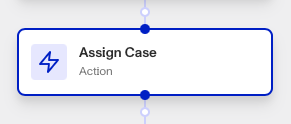

# Workflows: Assign Case step

# What is the Assign Case step?

**Assign Case** is a Workflow Action step that assigns a particular case to an organization staff member or team for review.

Cases are Persona products that collect together data on an end user to allow for manual investigation and decisioning on. Your organization may need to investigate this user for a variety of reasons:

-   **Onboarding**: Should this user be allowed to onboard to the platform?
-   **Account takeover investigation**: If a user is claiming that their account has been taken over, is there enough information to validate their claim?
-   **Fraudulent activity**: Are there suspicious signals associated with this user that require further action (e.g. account freezing, sending a follow-up inquiry for verification, etc.)?
-   **Transaction monitoring review**: Are there suspicious transactions associated with this user that require further investigation?

When a Case is created, it needs to be assigned to someone to reviewing and decisioning on. The Assign Case step lets you automate this, so that certain cases are always processed by the same individuals or teams within your organization. This ensures cases are always handled by the appropriate people and do not get lost.

# How do you add an Assign Case step?

1.  Navigate to the Dashboard, and click on **Workflows** > **All Workflows**.
2.  Find and click on the workflow you want to edit, or **Create** a new workflow.
3.  Click on **+** when hovering over a circle to add an **Action**.

4.  Use the **Find Action** select box to click on **Case** > **Assign Case**.
5.  Click the **Case** box to choose the target case.
6.  Click the **Assignee Type** box to set whether the case is being assigned to an individual or group of individuals.
7.  Click the **Assignee** box to select who will be assigned to this case. They will receive a notification when this step is triggered that they’ve had a case assigned to them.
8.  (Optional) In ‘Advanced Configuration’, click the **Continue on error** box if you want the workflow to continue running even if this step raises an error.
9.  **Close** the step. You’ll have to **Save** and **Publish** the workflow to begin using it.

# Plans Explained

## Assign Case step by plan

|  | Startup Program | Essential Plan | Growth Plan | Enterprise Plan |
| --- | --- | --- | --- | --- |
| Assign Case step | Limited | Available | Available | Available |

[Learn more about pricing and plans](./6oZbzp7jb7AWGClF5vpY3K.md).

# Learn more

Learn more about Cases [here](../../docs/v2022-09-01/docs/cases.md).
