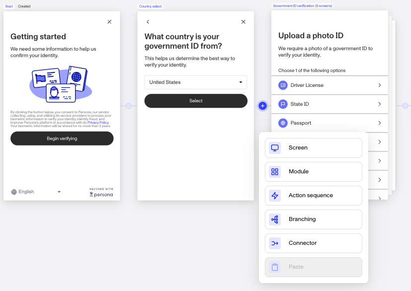
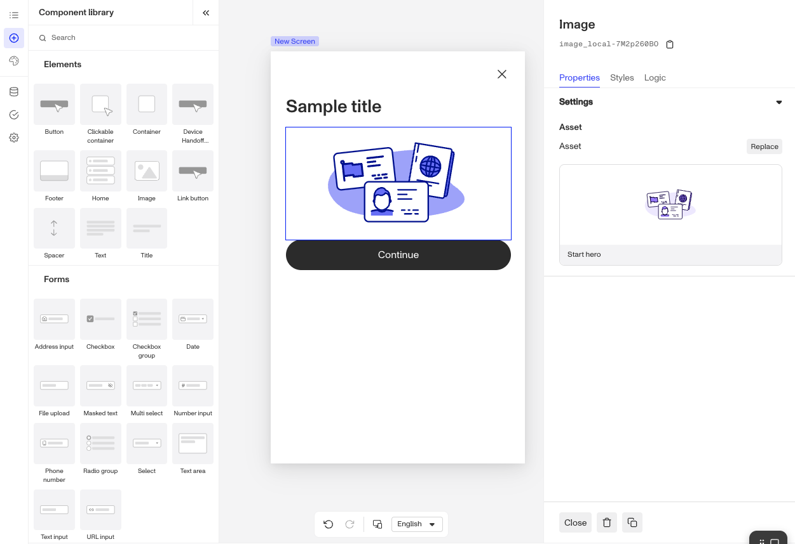
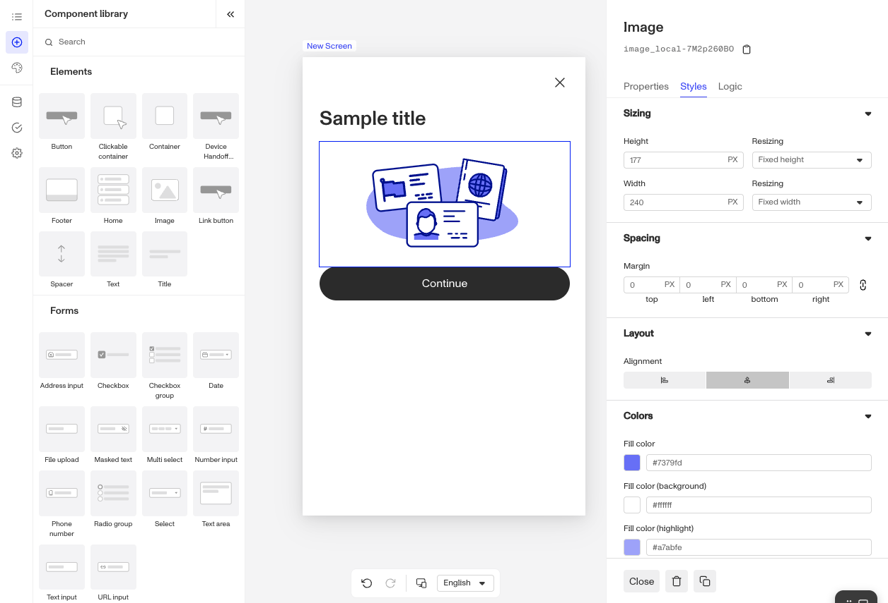
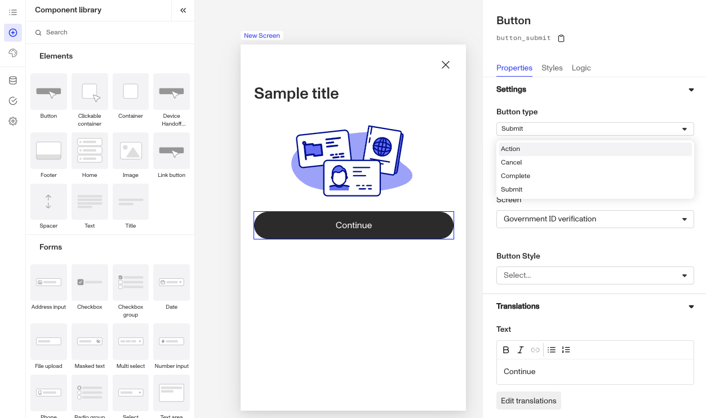

# Design and editing screens with Flow Editor

## Overview

You can use the Flow Editor to create, design, and edit screens inside your Inquiry Flow.

In this tutorial, you'll learn how to:

-   **Add screens**: Create new screens
-   **Use components**: Drag and drop components to design your flow.
-   **Style components**: Set the relevant style for a component like padding, font size, and color.
-   **Change component properties**: Set the text of a component and the translations

## 1\. Add a screen

1.1. Open the [Flow Editor](./ETA0GIS8K60DSoiFRpA9z.md) for your desired Inquiry Template.

1.2. Click any of the nodes in between screens and you'll then see options to add Screens, Modules, or other actions to your flow in this particular spot. Add a new screen

## 2\. Adding and using components

Add a set of components for your screen to match your intended design.

2.1. Select the Pencil icon beneath each screen to edit the screen.

2.2. Select a component from the Component Library and drag and drop it on your screen. More details about available components can be found here.

2.3. Drag additional components like a text box or button onto your screen and arrange in your desired hierarchy.

2.4. Click **Save**

If you need to delete components, you can use the Trash icon found at the bottom right of the screen.

## 3\. Style Components

In this tutorial, we'll style a button component. You can style and edit properties for any component.

3.1. Click your desired component to style. Select the **Style** tabs in the lefthand sidebar.

3.2. Under **Sizing**, add your desired Height or Width in PX. You can also set the Resizing settings.

3.3. Under **Spacing**, adjust the Margins around the component as well as Padding. Use the Lock icon to fix the inputs.

3.4. Under **Text**, select the font family and other typography attributes,

3.5. Pick the color you want for the button. (If you don't want to choose, copy/paste this hex code for a dark gray: #585656)

3.7. Click **Save**.

## 4\. Update component properties

Configure the Settings and Translations for your component. In this tutorial, we'll configure the Button component to be an Submit button that transitions the end-user to another screen

6.1. Click your desired component to style. Select the **Properties** tabs in the lefthand sidebar.

6.2. Under **Button types**, select Submit and set the Transition type to be Screen. Select the appropriate transition screen from your flow.

6.3. Under **Translations**, edit the text of the Button.

6.4. Click **Save**.

## 5\. (Optional) Publish

Your end users will not see your changes until you publish them.

Since this is a tutorial, you may not want your end users to see your changes! If and when you _do_ want to deploy changes to your end users, hit **Publish** at the top right of the window.
