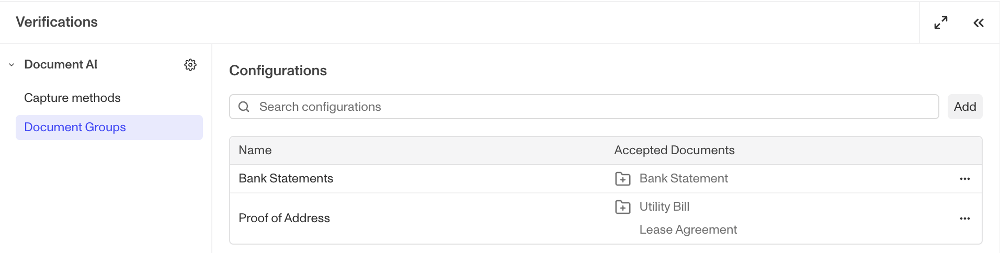

# Document Groups

## Configuring Document Groups for Document Verification

Document Groups allow you to apply different verification logic to different types of documents, all within a single Document Verification Template. Instead of creating separate templates for each document you want to process, you can use Document Groups to vary the extractions, verification checks, and insights based on a document's classified type.

## How Document Groups Work

Every Document Verification Template comes with a built-in **General Document Group**. You can also add more Document Groups to handle specific document types.

### The General Configuration

The purpose of the General Configuration is to process documents with a set of configurations if the document type does not matter.

This configuration is included in every template by default. It:

-   Accepts any document type automatically.
-   Can be renamed but cannot be deleted.
-   Cannot have specific Classifications added to it (since it already accepts all document types).

### Added Document Groups

You can create additional Document Groups in a template to target:

-   **A single document type**: Configure specific logic for one document type (e.g., only Bank Statements).
-   **A group of document types**: Configure shared logic for related documents (e.g., all proof-of-address documents like utility bills and rental agreements).

### Document Group Application Logic

When a document is submitted, Persona classifies it to determine its most likely Document Type. The system then applies the specific Document Group that contains this Document Type in its Classifications section. If the classified type does not match any of the added Document Groups, the **General configuration** is applied as a fallback.

### Type Detection Check Logic

If a Document Group has been added, the type detection check will pass if a submitted document is one of the accepted document types. Type detection check will fail if the submitted document is one of the rejected document types.

If no Document Group has been added (meaning only the general configuration is present), then documents will be classified as Other and type detection will always pass.

Type detection is a required check for all document verifications, so if the type detection check fails, then the verification as a whole will fail.

## How to Create and Configure a Document Group

All configuration is done within a Document Verification Template.

1.  Navigate to **Verifications > Templates**.
2.  Select the Document Verification Template you wish to edit.
3.  Click **Add Document Group**.
4.  Enter a descriptive name for your Document Group (e.g., "Utility Bill").

Once a Document Group is created, you can configure its four main sections:

-   **Classifications**: Add the specific Persona Document Types or Custom Document Types that should trigger this Document Group. For each Document Type, you can set it to be **Accepted** or **Rejected**.
-   **Extractions**: Define the fields to be extracted when this Document Group is applied.
-   **Verification Checks**: Enable the specific validity and fraud checks to be run, and mark which are required to pass.
-   **Insights**: Enable any high-level analyses to be performed for documents matching this Document Group.

## Common Use Cases for Document Groups

### Different Extraction Requirements

-   **Example:** Accept both bank statements and utility bills in one template, but require different values to be extracted depending on the document type.
    -   Create a Document Group for Bank Statements that extracts: `bank_account_number`, `bank_name`, `name_full`, and `statement_end_date`.
    -   Create a second Document Group for Utility Bills that extracts: `utility_provider`, `name_full`, and `issue_date`.

### Region-Specific Requirements

-   **Example:** You create a document group to accept business licenses around the world, but find that it's not working well for Chinese business licenses, so you create a specific Document Group to extract address subfields (e.g., district, city, province) specific to Chinese addresses.

## How to Use the General Document Group

You can use the built-in General Document Group in several ways:

-   **As a catch-all when classification doesn't matter**: If you do not need to accept or reject submissions based on their document type and want to apply the same processing logic to every document, simply use the General Document Group and do not add any others.
-   **As a fallback**: Create specific Document Groups for the documents you care most about, and let the General Document Group handle all other document types with a different set of configurations.

## Best Practices

-   **Use descriptive names**: Name your Document Groups clearly (e.g., "Turkish Proof of Business Ownership" instead of "Document Group 2").
-   **Start with the General Document Group**: Configure your most common, baseline requirements in the General Document Group first, then add other Document Groups for exceptions and specific document types.
-   **Test your logic**: Use sample documents to validate that they are being routed to the correct Document Group and that the configurations are working as expected before deploying to production.

## Related articles

[Document AI](./2ipL09vsPcus5OXuOXdeO9.md)
