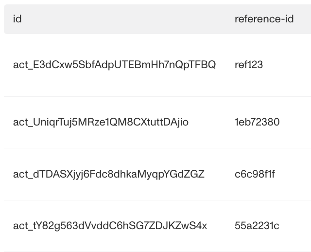
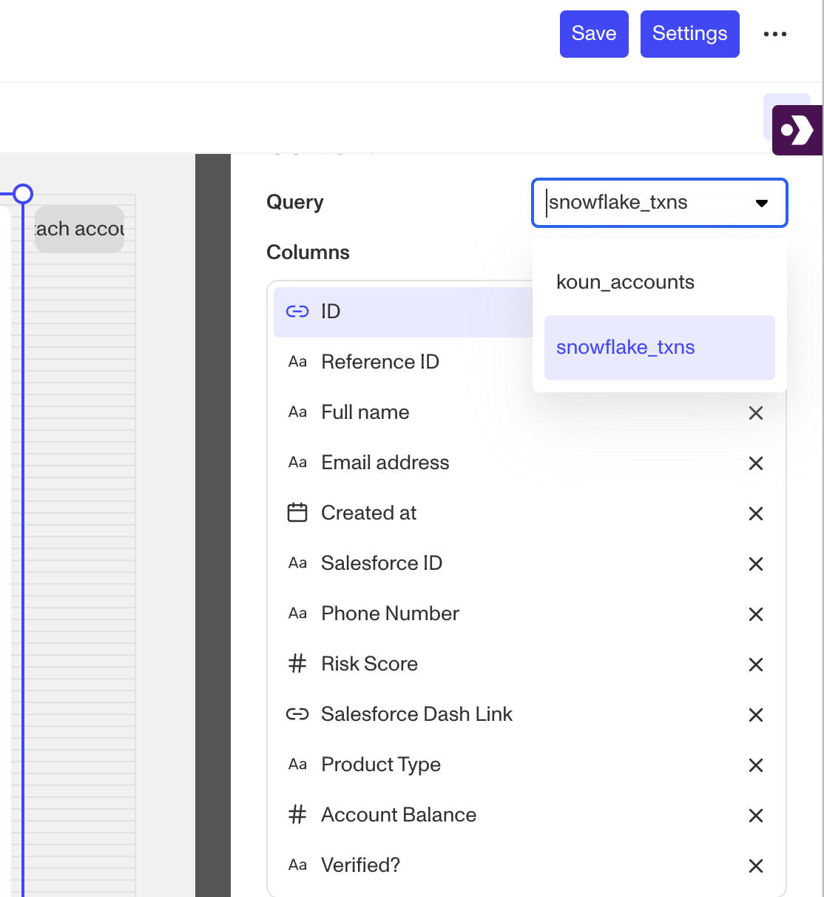
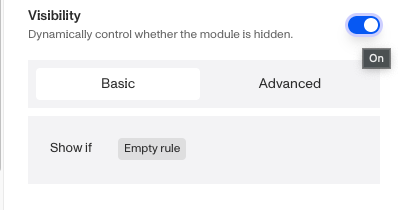
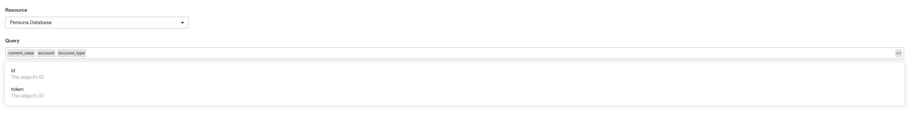
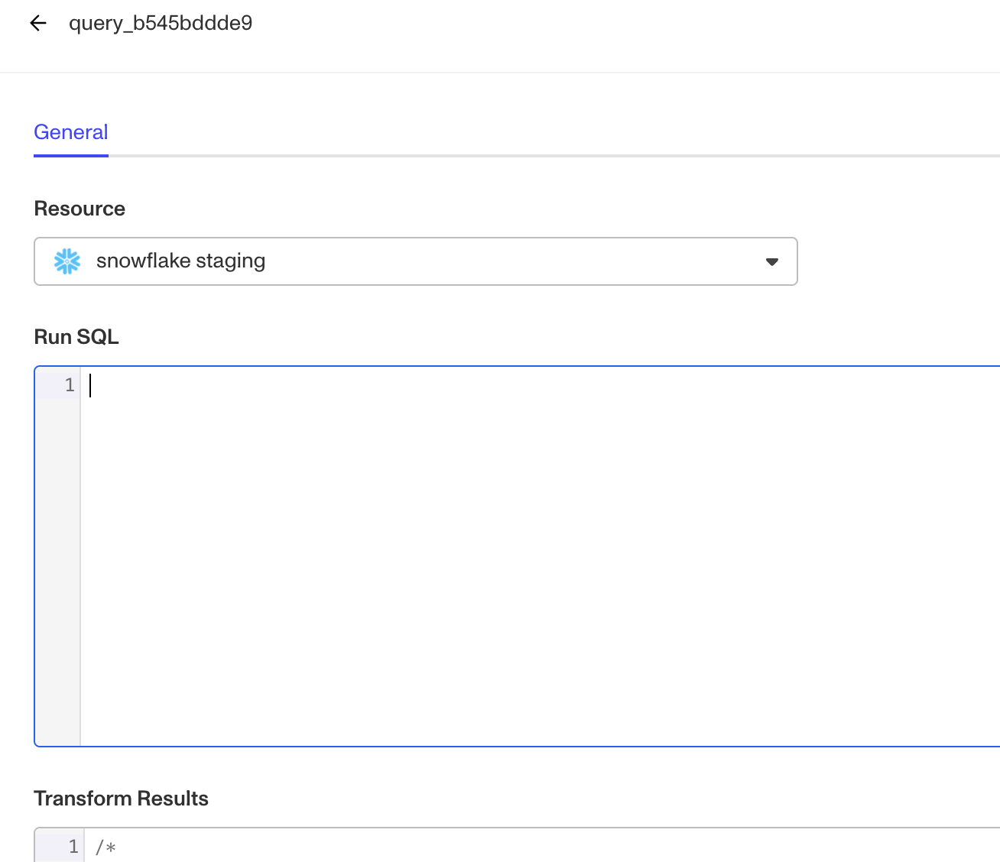
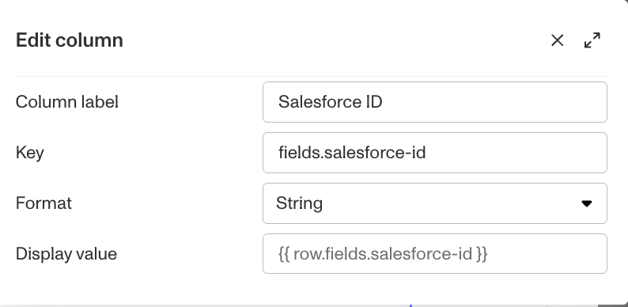

# Cases: Data Table module

# What is the Cases Data Table module?

_This feature is in beta status. Please reach out for more information._

**Data Table** is a module that can be added to a Case Template. Cases that are created from this Case template allows reviewers to see data based on a query configurable on the template.

_This is an example of a Data Table module displayed within a Case. It contains columns indicating the Case’s related Account Ids and the Reference IDs of each of those Accounts._

_The Data Table module allows you to configure specific columns to display from available data. The module is often used to enrich a reviewers understanding of a specific Case to conduct more robust and in-depth reviews._

# How do you add a Data Table module?

⚠️ Data Table module is fully available on specific plans and may have limited functionality on others. Please review availability by plan below for further access details.

1.  Navigate to the Dashboard, and click on **Cases** > **Templates**.
2.  Find and click on the Case template you want to edit, or **Create** a new template.
3.  Navigate to the **Tab** you want to add a Case component to. Click an empty space to view the Component Library.
4.  In the right toolbar, search for ‘Data Table\*\*.\*\*’
5.  Drag and drop the Data Table component into your Case UI and reposition it by dragging it around.
6.  Click on the Data Table module. On the right toolbar, you can change the settings:
    1.  Under **Settings > Field key,** you can define the fields accepted for selection.
    2.  Under **Settings > Label,** you can change the text displayed above the Select component.
    3.  Under **Module Layout**, you can change:
        1.  Dynamic height: Module will grow or shrink to fit its contents.
        2.  Visibility: Dynamically control whether the module is hidden. This is a toggle button that lets you set conditions for when the Data Table module should be displayed or hidden from view based on your case requirements. If you toggle this on you will have two options to customize visibility. **Basic** visibility allows you to set rules on the Data Table component to determine when it will be visible. You can read more about **Visibility Configuration** below. **Advanced** visibility allows you to set logic to control when the Data Table module is enabled or disabled based on custom conditions. Click on the Code block to add more conditions.

 4. Under **Advanced Options** > **Module Enablement**, you can control when the Data Table module is enabled or disabled based on custom conditions. Click on the Code block to add more conditions.  
5\. Click the **“Delete”** button if you want to remove the module from the Case UI.

# Available data

The data that can be shown in this module can be queried from objects within Persona or 3rd party data from your Snowflake instance via [Importers](./2fpD7Bwb7OrzAS4g7XWoMG.md).

_Using data from your Persona instance, you can select which columns of information are relevant as available data within the module._

_Using Snowflake data within the Data Table module allow you to query using SQL for the desired data._

Data can be additionally customized based on the specific Case being viewed. For example, the module can be configured to show only the Case’s related Accounts or the relevant records from your Snowflake instance that may be related to the value of a field on the Case being viewed.

## Display Value

Data is often stored in a manner that may not be perfectly aligned to what should be displayed to a Case reviewer, and the Cases Data Table module also offers the ability to transform or normalize values before being displayed in a Case through the **Display value** feature. Data can be transformed using Javascript within Handlebars.

## Visibility Configuration

Visibility configuration consist of three main components:

1.  **Field**: The object that will have a condition linked to it.
2.  **Condition**: How the field is compared to the value (e.g., equals, does not equal).
3.  **Value**: The value to test against.

### Creating Visibility Configuration

-   **AND Statements**: Combine multiple conditions that must all be true for the rule to pass. Add these using the **"Add"** button.
-   **OR Groups**: Combine conditions where only one needs to be true for the rule to pass. Create these by clicking **"Add OR Group"**.

## How to Use Visibility Configuration

1.  Click on the Select component, and go to **Module Layout** and toggle the button next to **Visibility** in the right toolbar.
    1.  Click on “**Empty rule**” to see **Visibility Configuration**.
    2.  Create a logical rule by filling in the three boxes following **Show if**, which correspond to an object, its condition, and its value being assessed, respectively. When that logical rule passes, the **Button** is shown.
    3.  (Optional) Add additional logical rules by clicking either ”**Add”** (if you want to add 'AND' rules, where all must be passed to continue) or ”**Or group”** (if you can also nest a group of OR statements within an AND statement).

# Plans Explained

### Data Table module by plan

|  | Startup Program | Essential Plan | Growth Plan | Enterprise Plan |
| --- | --- | --- | --- | --- |
| Data Table module | Limited | Limited | Limited | Available |

[Learn more about pricing and plans](./6oZbzp7jb7AWGClF5vpY3K.md).
