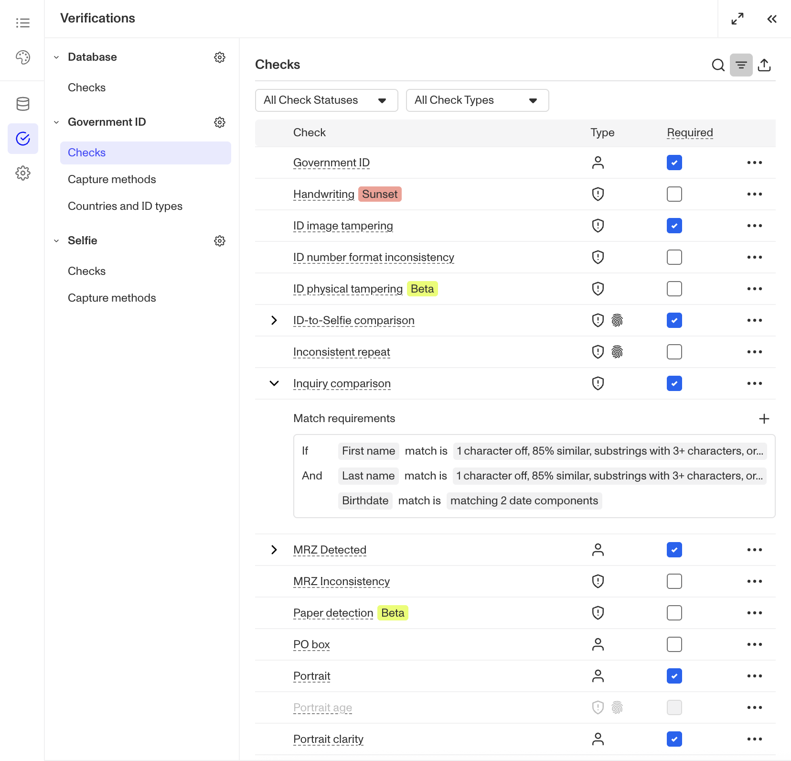
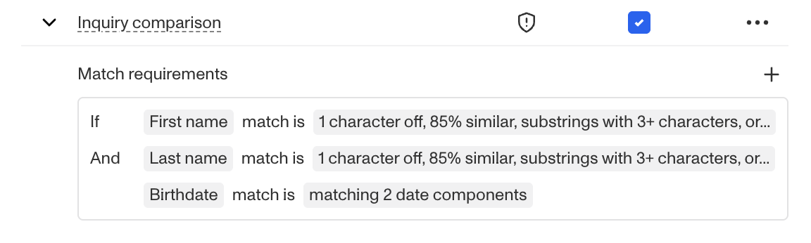
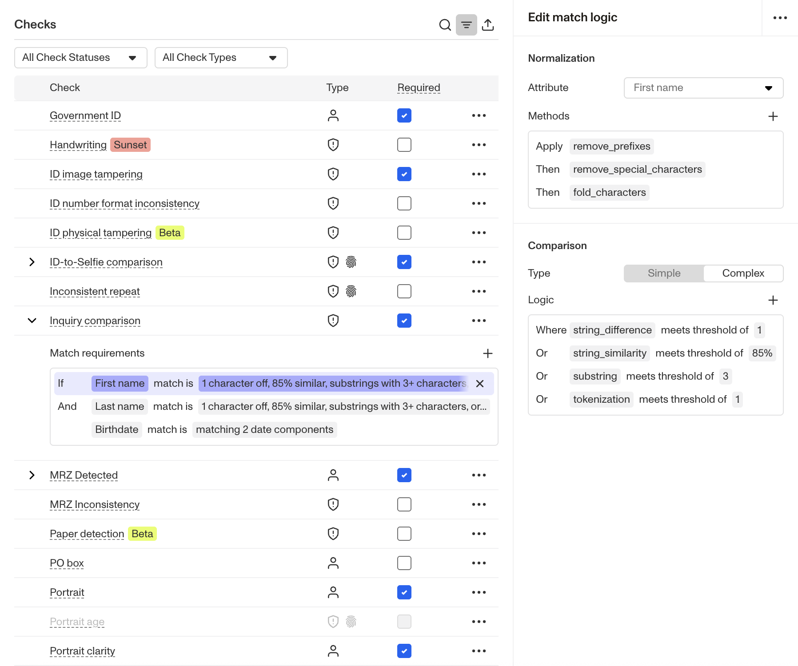

# Configuring the Inquiry Comparison Check for Government ID Verification

# Overview

## What is the Inquiry Comparison check?

Persona’s Inquiry Comparison check is used to verify that attributes extracted from the Government ID match what what you already know about the user.

### How this check can be used

-   If you know the user’s name is “John Smith” and the birthdate is “January 1, 1990”, you can prefill that information when creating the inquiry. The Inquiry Comparison check can then be configured to ensure that the name and birthdate extracted from the Government ID are “John Smith” and “January 1, 1990” respectively.
-   If you’re having the user submit two forms of ID, you can utilize the Inquiry Comparison check on the second ID submission to ensure its attributes match the first.

 _An example of a a Government ID Verification’s Inquiry Comparison Check configuration. The configuration includes Match Requirements for three attributes: First name, Last name, and Birthdate with distinct conditions for what is considered a match for each attribute._

# Requiring the check

Requiring the Inquiry Comparison check means that any submission that does not meet the match requirements will fail the verification attempt. If the check is not required, the verification will pass even if the check itself fails.

⚠️ There are some situations in which you may choose to have a check not required. Some examples include flagging Verifications that have passed but have failed this particular check. This can be considered an alerting mechanism as opposed to a blocking mechanism.

# Configuring Match Requirements

When comparing attributes within Persona, we define them as:

-   `Claimed attributes` are values you already know about the user
-   `Extracted attributes` are the values you will be extracting off a Government ID

The Inquiry Comparison check allows you to set Match Requirements for how the `Claimed attributes` and `Extracted attributes` are compared and at what level of fuzziness is considered a match. One `condition` is used for each attribute you want to compare. And for a specific Verification attempt, all conditions must be met for the Inquiry Comparison check to pass.

 _In the example above, you can see that there are three check conditions: on First name, Last name, and Birthdate._

## Conditions per attribute

Each line of logic within the match requirements can have two components:

-   **Normalization** standardizes the claimed and extracted attributes before they are used for comparison. You can add normalization methods to specify how to standardize the attributes.
-   **Comparison** defines how claimed and extracted attributes are evaluated to determine whether they match or not. Comparison can be simple (involves a single condition like exact matching) or complex (involving multiple conditions that provide more flexibility in matching).

 _In the example, the First name attribute is selected for configuration. With this setup, when comparing first names, several Normalization Methods would be applied to both the Claimed and Extracted attributes. Under Comparison, a set of conditions defines what would constitute a match._

### Normalization Methods

⚠️ Applying a normalization method will not change the returned value— the method is only applied temporarily for comparison purposes.

A normalization method standardizes both the extracted and claimed values before the comparison is performed. Normalization methods are useful to ensure a consistent format between values so that accurate comparisons can be made.

**Some examples of the most common normalization methods for First names and Last names:**

| **Method** | **Function** |
| --- | --- |
| remove\_prefixes | Removes name prefixes like "Dr.", "Mr.", and "Ms." |
| remove\_suffixes | Removes name suffixes like "Jr.", "Sr.", or "III". |
| remove\_special\_characters | Removes characters that may have been accidentally typed into the name (punctuation, quotes, and symbols) |
| fold\_characters | Strips any accents off characters for comparison— i.e "àéïøû" would be normalized into "aeiou". |

### Comparison Methods

Comparison is used to specify what level of matching you’ll accept between two values to consider the verification check passed.

-   For example, you might allow more tolerance on first names (because users often use shortened names or nicknames) and need stricter matching on last names.

**These are all the comparison methods available:**

_Note: Adjusting or changing the Match Level dropdown offers an alternative way to easily apply a comparison method._

| **Method** | **Function** |
| --- | --- |
| string\_similarity | Applies word matching algorithms to determine the similarity between two strings. |
| string\_difference | Measures the edit distance between two strings. e.g. "Tony" and "Tiny" have an edit distance of 1. By default a partial match is 1 character. |
| nickname | Checks if one string is a nickname of the other string e.g. “Jim” is a nickname for “James”. Note that we don't recommend using Nickname matching if you're running reports on the user, as reports will generally use the full name |
| substring | Passes as partial match if one string is a substring of the other string, for example "John" is a substring of "Johnny". The minimum length for either name is 3 characters. |
| tokenization | Splits strings with whitespaces or hyphens into tokens and considers a partial match of at least one token match. For example, if a value is "Mary-Anne" and the threshold is set to 1 for tokenization then "Mary", "Anne", or "Mary Anne" would be considered a match. |
| date\_similarity | Specifies how many attributes in a Date field (year, month, day) need to match. |
| date\_difference\_{x} | Specifies how much tolerance any specific Date field (year, month, day) can have. |

### Where else will I see normalization and comparison methods?

All of Persona’s “Comparison” checks leverage the same match requirements, normalization, and comparison infrastructure. The Inquiry Comparison check is also available within Persona’s Database verification.

## Related articles

[Government ID Verification: Inquiry comparison check](./1qEE7AZz4NfDuCFqCBF7ZE.md)

[Government ID Verification](./5vXD7S7pQCq8Q9Z4RztxLw.md)
