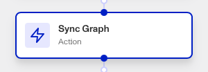

# Workflows: Sync Graph step

# What is the Sync Graph step?

**Sync Graph** is a Workflow Action step that syncs an Account’s information with the Graph tool. This step is crucial for ensuring any new or updated information is reflected in the Graph for accurate analysis and decision-making.

Graph is a link analysis tool that lets you visualize, explore, and uncover patterns in your customer network. You can use Graph to find patterns in your network that may indicate fraud.

💡 For example, you can identify clusters of customers that share the same IP address, device fingerprint, or browser fingerprint.

You can then leverage other Persona objects, such as Cases, to take action based on Graph-identified patterns.

Persona recommends you sync the Graph regularly to ensure its data is up to date. The specific frequency depends on your organization’s specific needs and the nature of the data being synced: this could mean syncing daily, weekly, or in real-time, depending on how critical up-to-date information is for your decision-making processes.

# How do you add a Sync Graph step?

1.  Navigate to the Dashboard, and click on **Workflows** > **All Workflows**.
2.  Find and click on the workflow you want to edit, or **Create** a new workflow.
3.  Click on **+** when hovering over a circle to add an **Action**.

4.  Use the **Find Action** select box to click on **Graph** > **Sync Graph**.
5.  Choose which **Account** to sync to the Graph.
6.  (Optional) Click **Selective Sync** to only sync specific data or criteria with the Graph tool, rather than all available data.
    1.  This is useful for focusing on specific datasets or conditions that are relevant to your current analysis or investigation needs.
    2.  If using **Selective Sync**, choose a **Template** to act as a reference for which datasets or conditions are going to be synced.
7.  (Optional) In ‘Advanced Configuration’, click the **Continue on error** box if you want the workflow to continue running even if this step raises an error.
8.  **Close** the step. You’ll have to **Save** and **Publish** the workflow to begin using it.

# Plans Explained

## Sync Graph step by plan

|  | Startup Program | Essential Plan | Growth Plan | Enterprise Plan |
| --- | --- | --- | --- | --- |
| Sync Graph step | Not Available | Not Available | Available | Available |

[Learn more about pricing and plans.](./6oZbzp7jb7AWGClF5vpY3K.md)

# Learn more

[Learn more about Graphs.](./6atsHmQOjAswNrwMR8NY0R/index.html.md)
