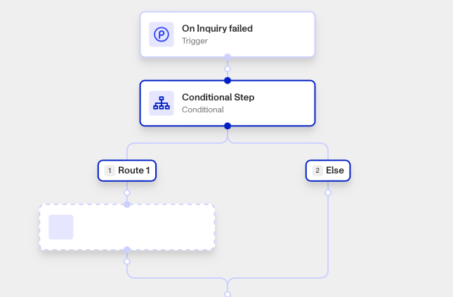
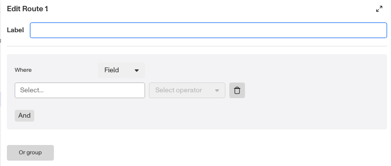
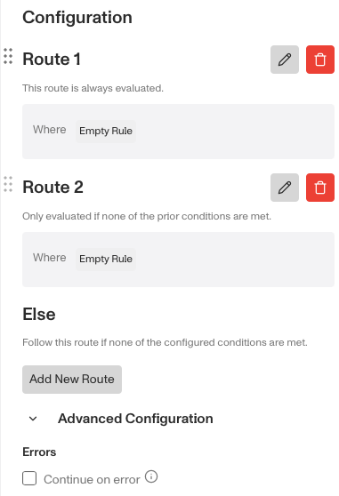

# Workflows: Conditional step

# What is the Conditional step?

**Conditional** is a Workflow step that allows you to split your Workflow into two parallel routes, then execute one or the other depending on whether a certain condition is met. Essentially, the Conditional step lets you add route logic to your Workflow.

The Conditional step is useful when dealing with steps that may produce different outcomes, such as verifying a type of information.

For example, you may have an Inquiry, and want to check if its user is on a watchlist using the Run Report step. Depending on whether Run Report results in a ‘hit’, you’ll want to update Inquiry information accordingly. In this example, your Workflow would include a Conditional step after the Run Report step, with a route for a hit, and a route for no hit (’else’). Each route would path into steps to update the Inquiry accordingly, then would recombine to continue the Workflow.

⚠️ The Conditional step’s routes are evaluated sequentially (from left to right or from route 1 onward). This means that the first evaluated route where the conditions are met is the only route that proceeds and is executed. To make all routes occur within a Workflow at once, use a Parallel step instead.

## How Conditional step logic works

When the Conditional step is run, it evaluates which route to execute depending on its logic, which follows standard ‘if/else’ behavior.

It begins with the first possible route, and checks to see if certain conditions are met. If so, it executes that route and does not check any others. If not, it continues on to checking the next route.

The final route of the Conditional step is always an ‘Else’ branch, which executes if no other route conditions were successfully met.

## What conditions are possible?

When the Conditional step evaluates a route, you can set different conditions to be checked, such as checking if a certain Persona object’s data field contains any information.

You can optionally set multiple conditions to be evaluated simultaneously, then decide whether they must all be met to proceed with that route (using the ‘and’ function) or whether one of them must be met to proceed with that route (using ‘or’ groups). This lets you build more complex logic into the Conditional step’s choice of route.

You can also apply Operators to transform or evaluate values as part of your condition logic. Operators allow you to work with arrays, strings, and relationships when building conditions. [Learn more about Conditional step Operators here.](./5HnQvtkzFUkUSo9gdgECnX.md)

# How do you add a Conditional step?

1.  Navigate to the Dashboard, and click on **Workflows** > **All Workflows**.
2.  Find and click on the workflow you want to edit, or **Create** a new workflow.
3.  Click on **+** when hovering over a circle to add a **Conditional** step.

4.  For Route 1, click **Edit**. Within the edit window, you can:
    1.  (Optional) Change the route **Label** to a more intuitive name.
    2.  Add an evaluation condition. Choose the type of information to be evaluated (set to **Field** by default), the specific information to be evaluated, and the criteria (either **is blank** or **is not blank**).
    3.  (Optional) Click **And** to add another evaluation condition to be evaluated in addition to the first, where both must pass for the group of conditions to pass. You can add as many And conditions as you want.
    4.  (Optional) Click **Or group** to add another group of evaluation conditions to be evaluated in parallel to the first group, where either group must pass for the Route to execute. You can add as many Or groups as you want.

5.  (Optional) Click **Add New Route** to add another possible route to your Workflow, then edit its evaluation conditions accordingly.
    1.  You can add as many possible routes as you want.
    2.  Hold-click the **six dots** beside a Route title to drag it into a new order. Remember that the Conditional step will execute the first route that passes its evaluation criteria, and to order your route options with this in mind.

6.  (Optional) In ‘Advanced Configuration’, click the **Continue on error** box if you want the Workflow to continue running even if this Step raises an error.
7.  **Close** the Step, then add further steps to each conditional route by clicking on the dashed-outline boxes in your Workflow. You’ll have to **Save** and **Publish** the workflow to begin using it.

## Plans Explained

## Conditional step by plan

|  | Startup Program | Essential Plan | Growth Plan | Enterprise Plan |
| --- | --- | --- | --- | --- |
| Conditional step | Limited | Available | Available | Available |

[Learn more about pricing and plans.](./6oZbzp7jb7AWGClF5vpY3K.md)

## Related articles

[Using Conditional step Operators](./5HnQvtkzFUkUSo9gdgECnX.md)
