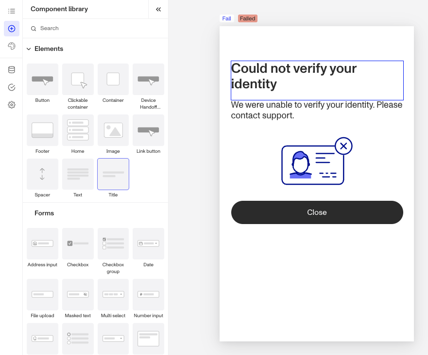
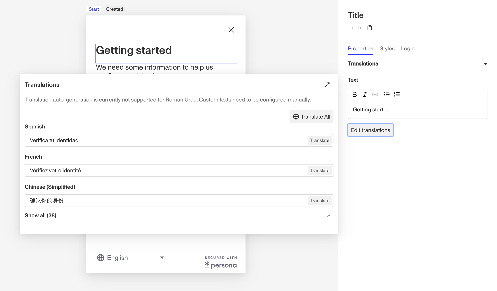

# Inquiries: Title component

# What is the Inquiry Title component?

**Title** is an Inquiry screen component that adds a title to the screen. You can customize its appearance, set translations, and define logic that governs when it appears.

Every screen should have a clear, descriptive title to guide users. Examples include a greeting (”Welcome!”), clarifying actions (”Complete Your Profile”), setting expectations (”Upload an Image”), or even a branding message.

Since the Component Library does not include subtitles, you can add a subtitle by adding a Title component and reducing its font size.

# How do you add an Inquiry Title component?

1.  Navigate to the Dashboard, and click on **Inquiries > Templates**.
2.  Find and click on the Inquiry template you want to edit, or **Create** a new template.
3.  Hover over a screen and click the **Pencil** icon, or double-click the screen to open it in the Screen Editing View.

4.  In the Left panel, click the **+** icon to open then Component Library and search for ‘**Title**’.
5.  Drag and drop the Title component into your screen, and reposition it by dragging it around.
6.  Click on the Title component, and go to **Properties** in the Right panel. Add **text** and **translations**:
    1.  Edit the text in the **Text** box. Highlight part of the text to format it as a list, bold or italicize the text, or add a hyperlink.
    2.  Add translations for the text by clicking the **Edit translations** button to open the **Translations Panel**. This panel displays the Text component translated in all supported languages. You can **Translate All** or **Translate** individual languages, manually or automatically. If you don’t set translations, you’ll be prompted to do so upon **Publishing** the template.

7.  (Optional) In the **Styles** tab of the Right Panel, you can edit the text’s margins, font, size, and color. You can read more about **Styles** below.
8.  (Optional) In the **Logic** tab of the Right Panel, you can add rules that govern when the component appears, and when it does not. You can read more about **Logic** below.
9.  **Close** the step. You’ll have to **Save** and **Publish** the template to begin using it.

# Translations

Persona can automatically translate new text into other languages in the component’s **Properties** tab. You can also customize the translation for any particular language.

To configure available languages for your template, click the **Gear** icon in the Left Panel to access **Settings**, then select languages under the **General** tab.

# Styles

You can customize how your component appears to users in the **Styles** tab, modifying elements like text spacing, font, and color to align with your branding and enhance usability.

## Spacing

Margins can be adjusted on all four sides of the Title component (top, left, bottom, right) to control the spacing between it and other elements on the screen. For instance, increasing the top margin can create more breathing room above the title, while adjusting the bottom margin can ensure consistent spacing with subsequent elements, reinforcing a clean and organized layout.

## Text

-   **Font customization**: Choose the font family and weight to match your design typography. For example, use a sleek, modern font for a tech-focused design or a serif font for a more traditional or elegant feel.
-   **Size and spacing**: Adjust font size, line height (space between lines), and letter spacing for optimal readability. Larger fonts with generous spacing can make headings more prominent, while tighter spacing. might suit a minimalist design approach.
-   **Alignment**: Control how text is positioned within the component—center alignment for a balanced, symmetrical look or left alignment for a traditional easy-to-read format.
-   **Colors**: Set both the main text color and specific colors for any links. Match these colors to your design palette to ensure consistency; for example, use your primary design color for titles and a complementary color for linked text to draw attention subtly.

These styling options help ensure your Title components are visually consistent with your design while maintaining readability for users.

# Logic

Persona provides you with the ability to add logic to a Title component. For example, a component may only become visible to a user if certain conditions are met. There are two options for logic rules:

-   **On screen load**: Logic rules are evaluated only when the screen loads. They can reference any field configured on the template.
-   **On screen update**: Logic rules are evaluated in real time. They can only reference inputs on the current screen.

## Logic Rules

Logic rules consist of three main components:

1.  **Field**: The object that will have a condition linked to it.
2.  **Condition**: How the field is compared to the value (e.g., equals, does not equal).
3.  **Value**: The value to test against.

### Creating Logic Rules

-   **AND Statements**: Combine multiple conditions that must all be true for the rule to pass. Add these using the **"Add"** button.
-   **OR Groups**: Combine conditions where only one needs to be true for the rule to pass. Create these by clicking **"Add OR Group"**.

## How to use Logic Rules

1.  Click on the Title component, and go to **Logic** in the Right Panel.
    1.  Choose either “**On screen load**” or “**On screen update**” and click **Add.**
    2.  Choose what **Component Update to apply**. This determines what happens to the component when the logical rules are met.
    3.  Create a logical rule by filling in the three boxes following **When**, which correspond to an object, its condition, and its value being assessed, respectively. When that logical rule passes, the component update is applied.
    4.  (Optional) Add additional logical rules by clicking either **\+ Add** (if you want to add 'AND' rules, where all must be passed to continue) or **\+ Or** (if you want to add 'OR' rules, where one must be passed to continue). You can also nest a group of OR statements within an AND statement by clicking **\+ Add Group**.
    5.  (Optional) To edit the logic directly, you can open the **code editor**.

# Plans Explained

## Title component by plan

|  | Startup Program | Essential Plan | Growth Plan | Enterprise Plan |
| --- | --- | --- | --- | --- |
| Title component | Available | Available | Available | Available |
| Translations for Title component | Available | Available | Available | Available |
| Styles for Title component | Available | Available | Available as part of Inquiries Enhanced | Available as part of Inquiries Enhanced |
| Logic for Title component | Not Available | Not Available | Available as part of Inquiries Enhanced | Available as part of Inquiries Enhanced |

[Learn more about pricing and plans](./6oZbzp7jb7AWGClF5vpY3K.md).

# Learn more

[Learn more about Inquiries.](../../docs/docs/inquiries.md)
