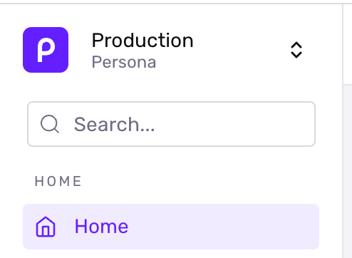
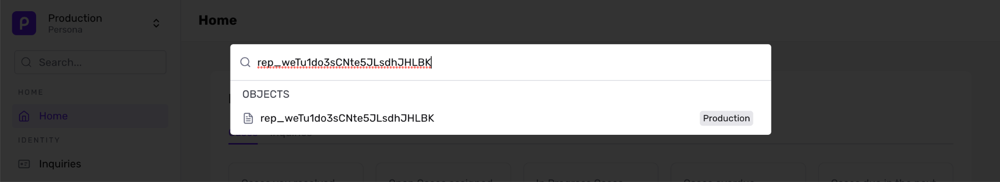
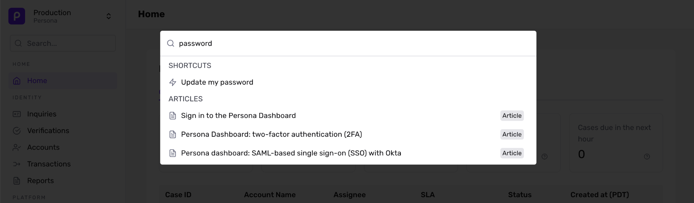
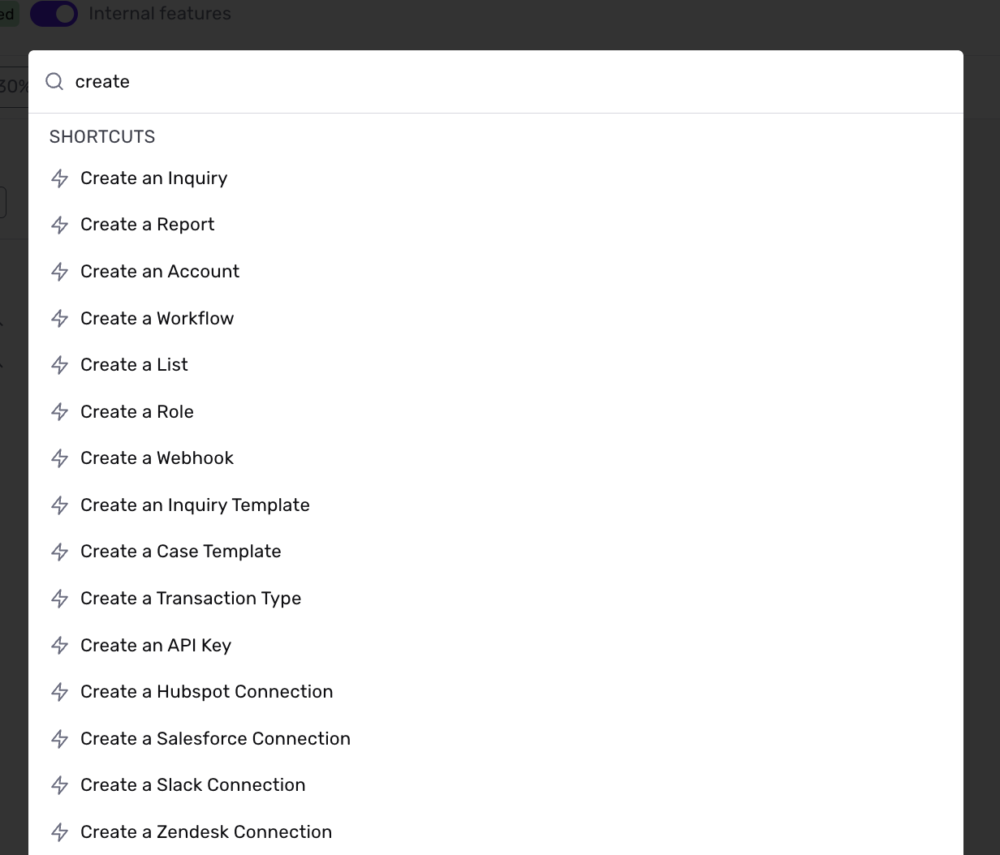

# Using Omnisearch

## Overview

Persona's Omnisearch is the built-in search functionality inside the Persona dashboard. With Omnisearch, you can find key Persona objects like inquiries or verifications and find support resources.

## Where is Omnisearch

Omnisearch is located in the top left navigation bar of your Persona Dashboard, above Home.

## Using Omnisearch

Use Omnisearch to find specific Persona objects, quickly jump to specific view, take action, and access useful resources.

### Find and look up Persona objects

You can use Omnisearch to look up specific Persona objects by searching for the object ID, Reference ID (if applicable), or Identifier (if configured) to review results or identity data.

 _In this example, a user is searching for a specific Report_

When searching by object ID, the search query must be an exact match for one of those values to return desired results. **The types of supported objects include:**

#### Product run-related objects

Search these objects to quickly access dashboard views to review results, PII, or take action on a specific identity. **These objects include the following and their IDs also look like:**

| Object | Object ID Pattern for use in Omnisearch | Example of Object ID |
| --- | --- | --- |
| Accounts | Starts with **`act_`** | `act_pqHZGEVAAmum2BU2MpaEJQ1sJL7K` |
| Inquiries | Starts with **`inq_`** | `inq_4QPsukzCWXvkQTXuTz1Pqj7nSQR3` |
| Transactions | Starts with **`txn_`** | `txn_kZBH9tjFs8Gh4b78aVSaLihuRhH3` |
| Verifications | Starts with **`ver_`** | `ver_KLVJHFSQMhRPXpehF8Kaf6q4MDCr` |
| Workflow Runs | Starts with **`wfl_`** | `wfl_3YP6yYgUwhupHoSH5ptskNTt` |
| Cases | Starts with **`case_`** | `case_S5n16txg35DtZ9sytNCXsw14pnDT` |
| Reports | Starts with **`rep_`** | `rep_nm3pd5QsUYCa4Hp7GjGmzmWyAvG3` |

#### Product template-related objects

Searching for these objects can enable you to quickly get to dashboard views to update configurations for a solution or make changes to how Persona is integrated with your product or service. **These objects include the following and their IDs also look like:**

| Object | Object ID Pattern for use in Omnisearch | Example of Object ID |
| --- | --- | --- |
| Inquiry Templates | Starts with **`itmpl_`** | `itmpl_Dw4eVNEyZfBsDkBabtfnMeQj` |
| Verification Templates | Starts with **`vtmpl_`** | `vtmpl_aLdVonYwsQWbgg5z56JdgdZzNmSs` |
| Transaction Types | Starts with **`txntp_`** | `txntp_RFUdnxwF9c3AL2ydGVPr1TrVeyVf` |
| Workflows | Starts with **`wfl_`** | `wfl_ark7GDAH8hqDQSb1y6eZfh3sFVxs` |
| Case Templates | Starts with **`ctmpl_`** | `ctmpl_Rg8pvF4o2mc4vUjjWXXKC9Aj` |
| Report Templates | Starts with **`rptp_`** | `rptp_yA6Hyb3CQ9YDRuDpWkfyYmhSYcE3` |

#### Developer and integration-related log objects

Searching for these objects can enable you to quickly get to dashboard views to debug issues with API calls or webhooks, review marketplace or 3rd party integration-related logs, and look at chronologically-ordered timelines for events occurring within Persona. **These objects include the following and their IDs also look like:**

| Object | Object ID Pattern for use in Omnisearch | Example of Object ID |
| --- | --- | --- |
| API Log | Starts with **`req_`** | `req_kfeLQBUxYNKA6AQdsDxtJAX897zi` |
| Events | Starts with **`evt_`** | `evt_3CDJnQ4d5xHaigAnXQ53b1RytSXt` |
| Webhook Events | Starts with **`wbhe_`** | `wbhe_EUedR6aR6FBDd3UFVgH9npKA1ffK` |
| External Integration Log | Starts with **`eil_`** | `eil_gPmh4nm1dwqec1sKmGye97rz8s2M` |

### Find helpful articles and resources from the Help Center that are related to your query

You can use Omnisearch to look up terms or questions that you may have while you are navigating the Persona Dashboard. Omnisearch will return relevant Resource Center articles and materials that relate to your query.

 _In this example, a user is searching for "password" and multiple Help Center articles are returned in Omnisearch_

📣 Recommendation: For a more conversational or chat-based help experience, you can also use the Ask AI chat found at the bottom right of your Persona dashboard.

### Find and use Shortcuts for common actions within Persona

Use Omnisearch to execute common actions within Persona such as creating an Inquiry. Using Omnisearch's Shortcuts allow you to streamline processes by reducing clicks and navigation when you're a power user of Persona or need to conduct the same action multiple times.

 _In this example, a user is searching for create and Omnisearch returns multiple Shortcut results as the user continues to type_

## Omnisearch keyboard hot keys

You can also use common keyboard shortcuts with Omnisearch:

-   `ctrl`/`cmd+K` to open Omnisearch on any page
-   `up`/`down` arrow keys to highlight a result
-   `Enter` to open a result

## Related articles

[Copilot and AI-based Chat features](./7MVBDz7vujOdASqRwUl5VY.md)

[Customer Support](./35IhNdm2YmA9COh1yWoxfm.md)
