# Building a confirmation screen

# Confirmation Use Case

Occasionally our customers want their end users to be able to confirm if the information extracted from a Gov ID is correct. For example, with long names on passports the format limitations of the Machine Readable Zone (MRZ) might lead to their full first name being shortened in the MRZ. Having a confirmation screen where the end user can flag the incorrect name and provide the correct name, allows corrections to be flagged for manual review.

This guide covers two ways to modify an inquiry flow with a confirmation screen without affecting verification results.

## Goals

Create a confirmation page that will:

-   Display extracted PII
-   Allow end users to flag the PII as incorrect
-   Allow end users to input the correct PII
-   Preserve extracted PII

⚠️ Note: This walkthrough uses the Checkbox component within the new screen, and the Checkbox component is an Enhanced feature. Unlocking the Enhanced features of an Inquiry template add $100/month charge for that individual template.

## Starting Point - Gov ID (front side) Solution

For this walkthrough our shared starting point is the Gov ID (front side) solution. We’ll be making some quick additions to this solution in the form of 1 new confirmation screen step and 1 branching logic step.

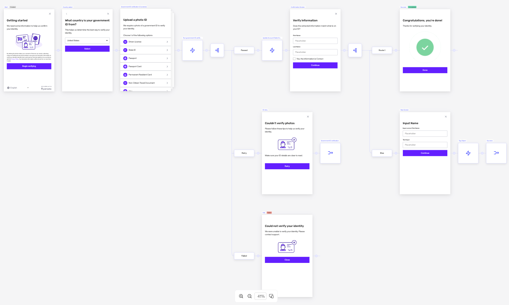

### Creating the new Screen

By the end you’ll have a new confirmation screen that will ask the end user if their extracted first and last names are correct. If incorrect, it will provide fields to input the corrected versions.

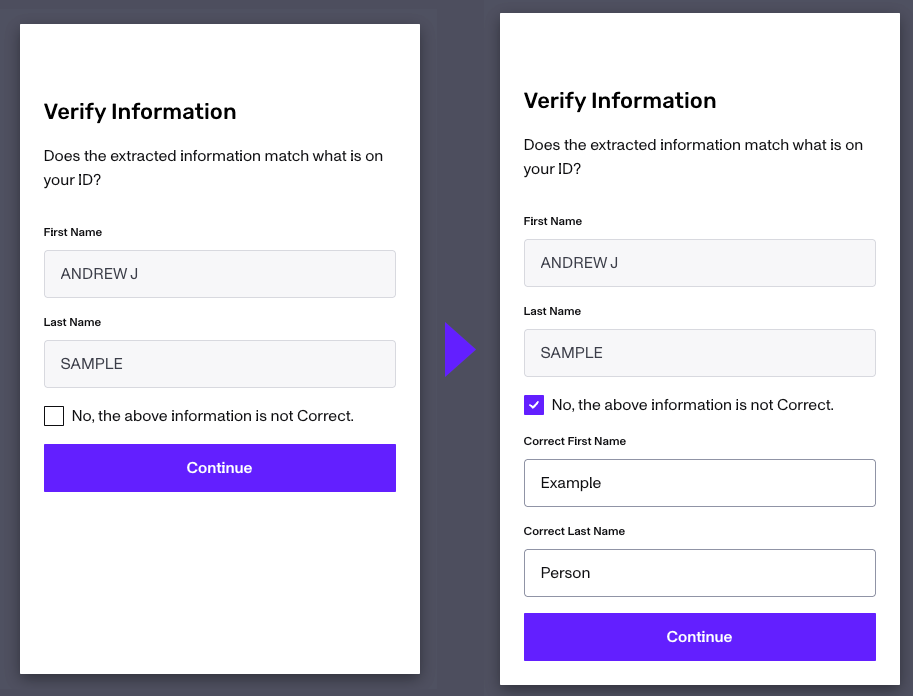

## Steps

1.  Add new Step. Click the **Add Step node** button in between the Update Account Fields step and the Success screen.

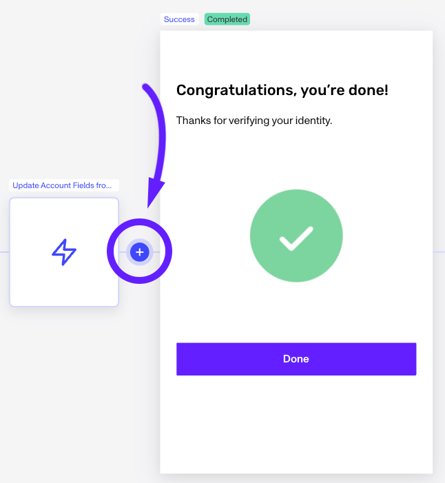

3.  From the available Steps, select **Screen**.
    
4.  A new Screen will be populated. Mouse over it and when the **Edit** button appears at the bottom left, click it.
    

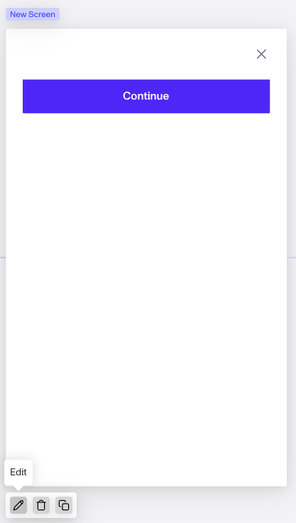

5.  This will open the Screen Editor. At the top right, where is says New Screen, click the **Edit** icon and rename the screen to something more descriptive like “Name Confirmation”.

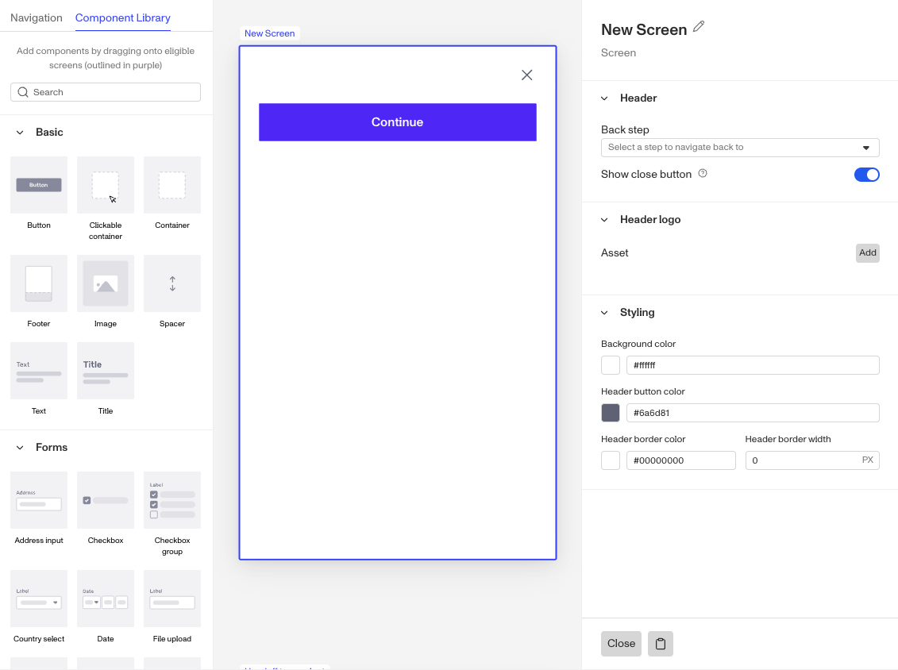

6.  On the left is the Component Library. In the Basic section, note the Tile and Text components. Click and drag out the Title component and place it above the Continue button, and then place a Text component between them. When you have Title component selected, the properties window on the right will show the editable text window. Update it to something like “Verify Data”.

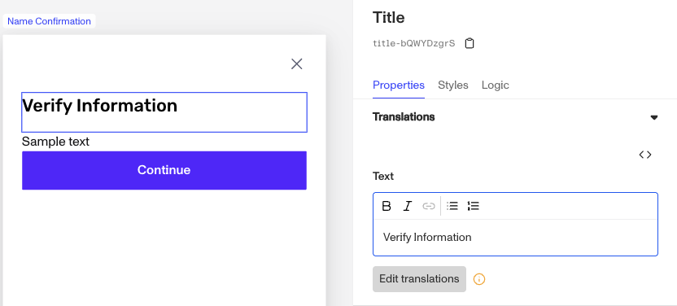

7.  Note that any time you modify the test field, the Edit translations button below it will flag an alert. Click the **Edit translations** button. Within the widget, you can manually update the test in a variety of languages and/or click **Translate All** for the system to handle those updates for you.
    
8.  Repeat **step 6** for the Text component between the Title and Continue button. Enter a message / instruction to your end users like “Does the extracted information match what is on you ID?”. The question you ask should reflect your specific use case. In the use case of a Passport MRZ shortening the first name, the question might be “Is your first name longer than what is displayed?”.
    
9.  To display the extracted PII from the Gov ID, we’ll go back to the Component Library and scroll to the bottom of the Forms section for the Text input component. Drag two of them above the Continue button.
    

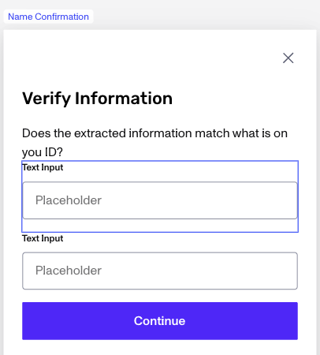

10.  Select the top Text input. We’re going to modify it to display the extracted First Name. On the right in the Properties, scroll down to the Translations and update the Label from “Text Input” to “First Name”. Then edit the translations as we did previously.
     
11.  Since we want this input to populate with data from the `Name First` field, we next need to navigate to the Fields section on the right.
     

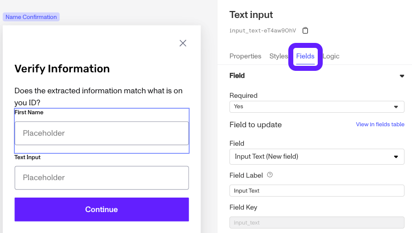

12.  For the Fields section, first set Required to No so we don’t force the end user to make any changes. Then we want to update the Field, via the drop down, to the existing field of `Name First`.

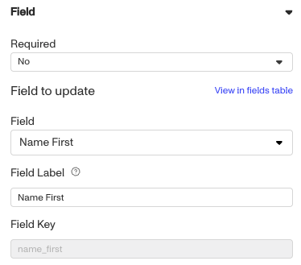

13.  For the Logic section, you'll want to disable the test component "On Screen Load". Disabling the component keeps it and it's content visible, but prevents the end user from editing it.

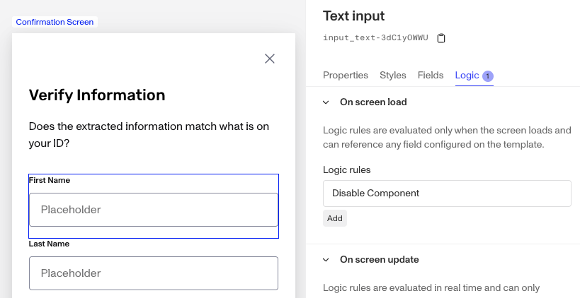

14.  The set the logic rule for when to disable the component, click in the Logic rules. Then in the Logic Rule screen, set the `when` to the relevent field name and the operator to `is not blank`.

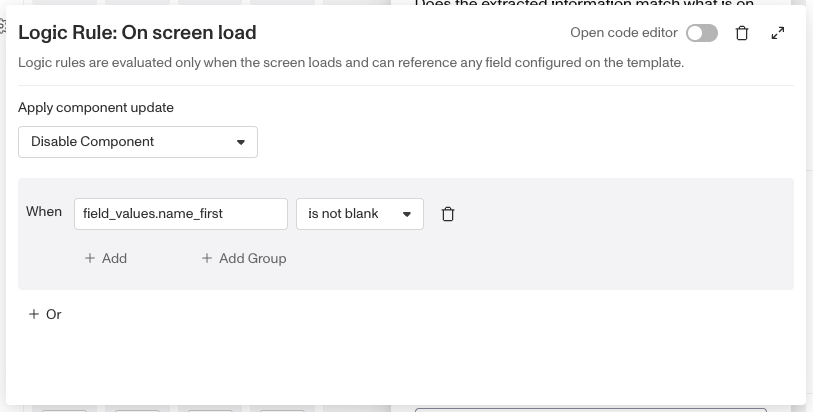

15.  Repeat the same process for the second Text Input component, updating it’s Label, Required, Field, & Logic.

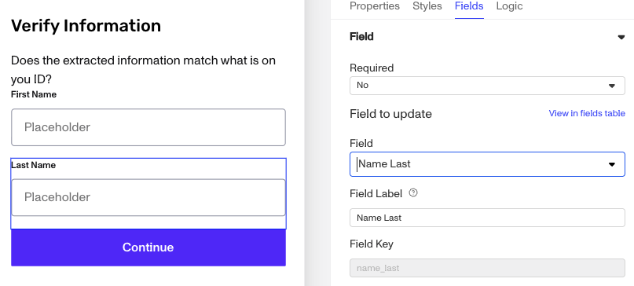

16.  Since the end user needs to be able to respond to your prompt / question, we’ll next add a Checkbox component from the Forms section. Place it above the Continue Button. For clarity, you should update the checkbox’s label, under Properties, to specify what they are checking off. We can then build logic for other components on the screen and for after the inquiry.
     
17.  In the case that the information is incorrect and you want the end user to provide the correct names, we’ll next add two additional input fields, link them to new inquiry fields and make the input only appear when the checkbox is selected. Start by dragging out two new Text input components and placing them between the checkbox and the Continue button.
     
18.  For the first Text input, update the Label to something like “Correct First Name”.
     
19.  In the Fields, we’re going to set the Required to Conditional. If the checkbox isn’t checked, we don’t want to require it. Then click in the Required Rule below to open the Logic Rule editor. Configure the rule as below:
     

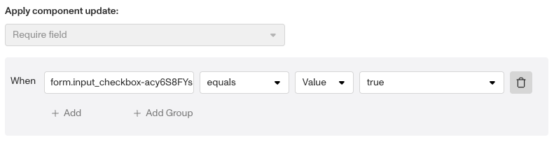

20.  For the Field, go to the Field Label and enter a new field name like `CorrectFirstName`. This will also update the field dropdown above to `CorrectFirstName (New Field)` indicating its is creating an new inquiry field. This is important as we don’t want to update the existing `Name First` inquiry field with the extracted first name.

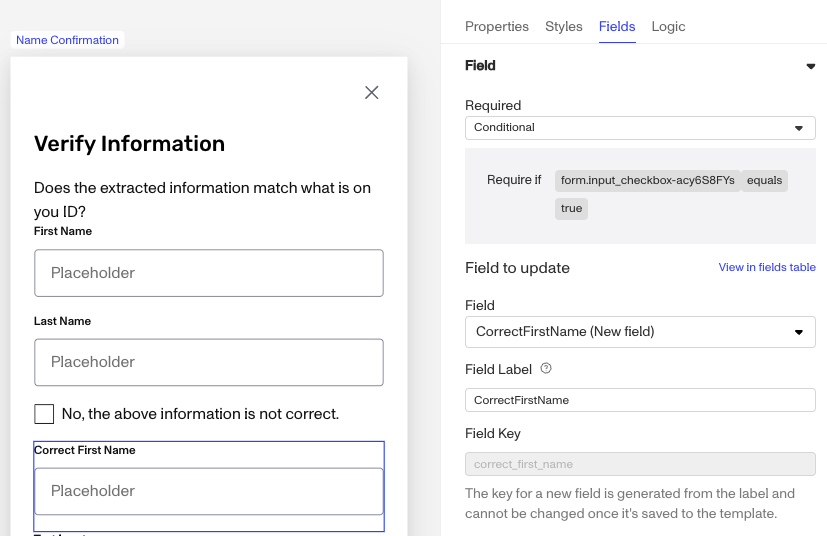

21.  To start with this field hidden, and then to reveal it after checking the checkbox, switch from Fields to Logic on the right. On Screen Load we want to Hide the component. Click in the On Screen Load logic rules to add a rule.

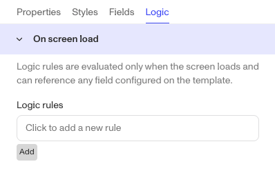

22.  In the Logic Rule editor, in the Apply Component Update select **Hide Component**.

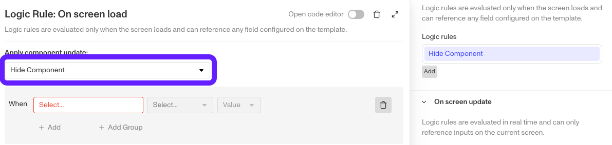

23.  For the Rule, select the `field_values` object. Then type `in` to search for `input_checkbox`. Then set the Value to `true`.

24.  To make the Component appear when the checkbox is check, we next need to move down to the On Screen Update, and place a near identical rule. The key difference is that the value needs to be set to `true` instead of `false`.

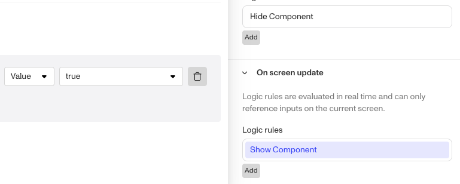

25.  For the other Text input component for the Correct Last Name, repeat **steps 15-21**, making sure to switch the Label and Field to reference Last Name instead of First.
     
26.  Within your screen editor your new screen should look like this:
     

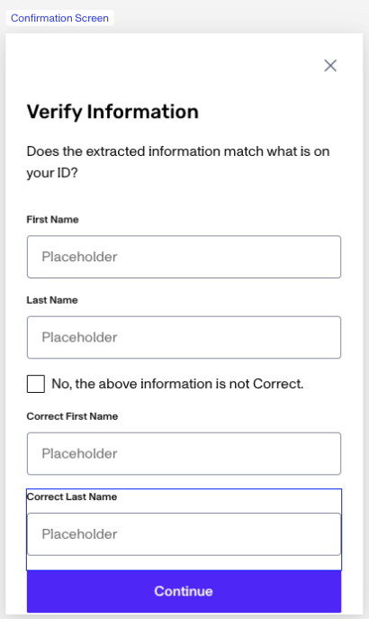

27.  Nav back to the flow. Next we need to add some branching logic that will use that checkbox from the Confirmation screen and will Tag the inquiry. Click in the Node between the Name Confirmation screen and the Success screen.

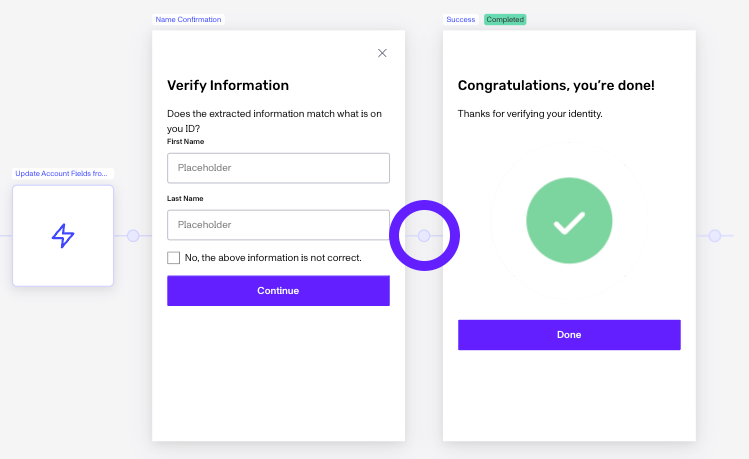

28.  Select Branching. And then click into “Route 1”.

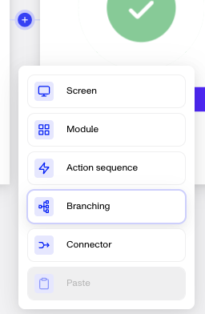

29.  Rename route 1 to “Correct” or “Name Correct”. Set the logic to `trigger.fields.input_checkbox` equals `false`.

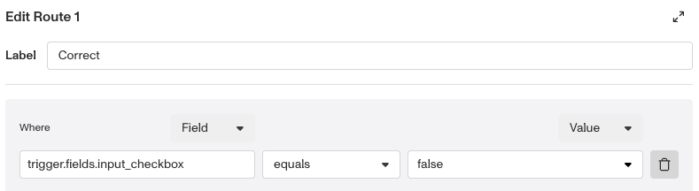

30.  Along the `Else` branch, click the Node to the right of it.

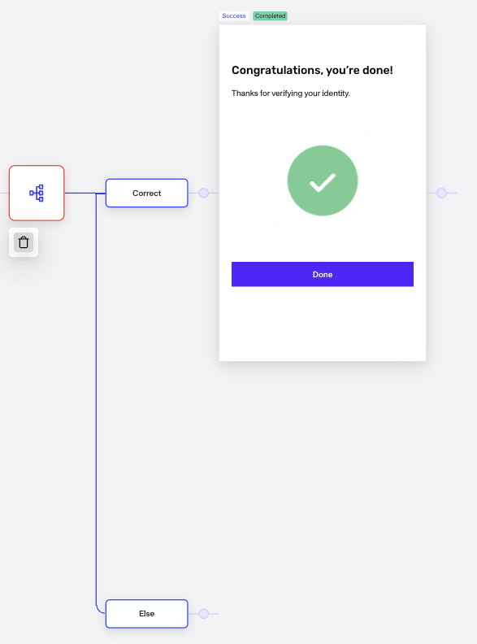

31.  Select “Action Sequence”.

32.  Click the edit icon on the Placeholder Action.
     
33.  In the Action configuration, in the Action field type `Tag Object`.
     
34.  You’ll then be prompted to select an existing Tag or create a new one. When creating new Tags make them descriptive like “NameCorrected”. Close the Action and nav back to the Flow.
     

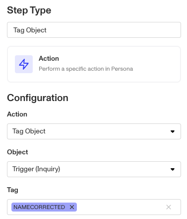

35.  Click the node to the right of the Tag Object Step. Select Connector. Then Select the Success screen. Now this else branch will Tag the inquiry and then move to the Success screen to finish the Inquiry.

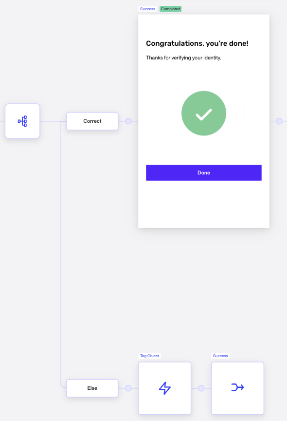

36.  Save and Publish the Inquiry.

### Testing with Preview

To ensure your template is providing the experience you want for your end users, you can switch to your Sandbox environment and Preview your inquiry flow.

### Tagging for Manual Review with Workflows

After the inquiry is complete how can you efficiently process the inquiries with corrected names? With a workflow, you can create branch that checks for the Tag you applied to the Inquiry. Then within the branch, you can [update the status of the inquiry from Completed to Needs Review](./1bYtJbqmu4UZJ4DXg0BXng.md). And if you have Cases enabled, you can create a case to help facilitate that manual review process.

## Related articles

[Inquiries: Checkbox component](./5DMsxCdKVryx13GympSIwM.md)
