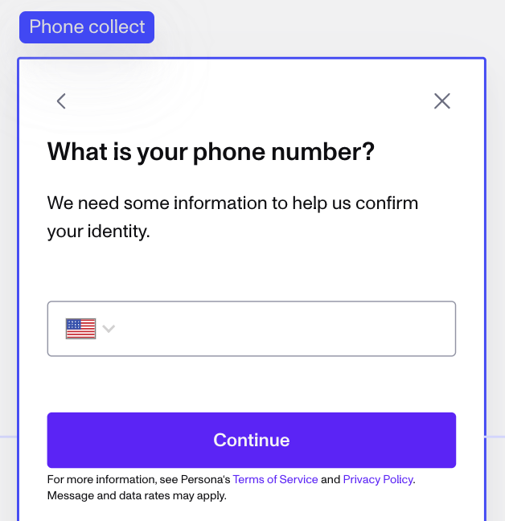
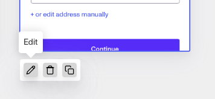
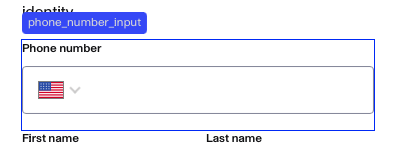
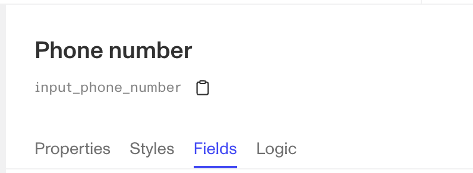
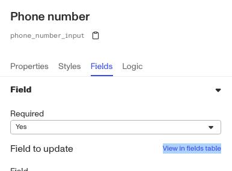
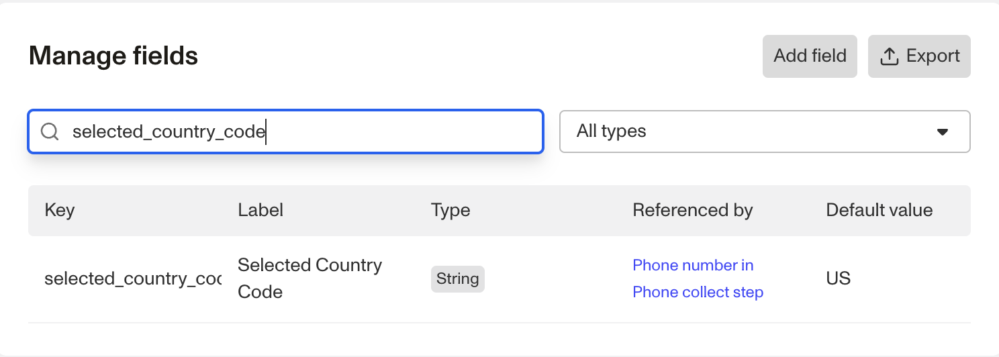

# How do I configure the default country for the phone number component in flow editor?

❓ This question came from a member of the Persona community - a developer who wanted to change the default phone number country for device handoff to Canada.

By default, the country code for an Inquiry’s phone number component is set to the United States.

You can change the default country code for an Inquiry template by following these steps:

1.  Open the **Dashboard**.
2.  Click on **Inquiries > Templates**.
3.  Click on the Template you want to edit.
4.  In the flow editor, find or add a Module that collects a user’s phone number.

5.  Click the **Edit** button.

6.  Click on the **Phone Number** field, where a user would enter their phone number.

7.  In the popup panel on the right, click **Fields** in the toolbar.

8.  Next to the "Field to update" text, click **View in fields table**.

9.  Search for the `selected_country_code` field. Click on the field.

10.  In its menu, change the **Default value** to the two-letter country ISO code that corresponds to your desired default country choice. For example, Canada is represented by CA.

11.  In the top right corner, **Save** the Template, then **Publish** it.

The default country code will now be changed in that module’s phone number field. In the template preview, the Module will still display a US flag, but the property has been updated.
