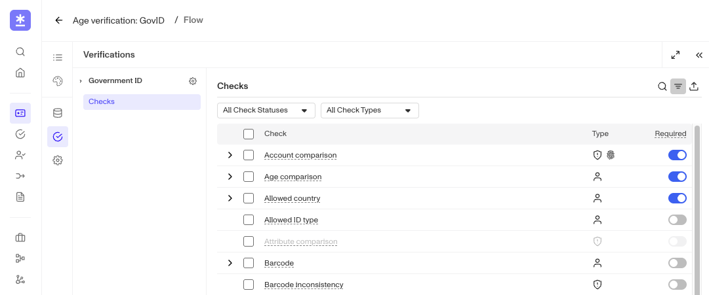

# Why did an Inquiry pass if it failed a few verification checks?

❓ This question came from a member of the Persona community - a developer who wanted to understand the role of verification checks in Inquiry verification. This question is useful for those who want to understand Inquiry verification check requirements.

An Inquiry can pass even if it failed a few verification checks as long as the failed checks were not Required. If any Required verification checks fail, the overall inquiry will fail.

You can customize which checks are required or not based on your organization’s goals for balancing risk and conversion.

-   For example, a greater number of required checks could add additional security, but could also bog down users and decrease efficiency.
-   Adding fields which are not required for validation can help get useful information without impacting authentication.

You can learn how to configure verification checks for your Inquiry templates [here](../../docs/docs/verification-checks.md).
